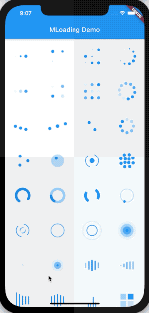

开源不易，点个赞可不可以😊

## Flutter Widgets 及组件继承关系图

**[【Flutter Widgets 大全】](https://github.com/781238222/flutter-do/tree/master/md)** 为 [**Flutter 老孟**](http://laomengit.com/) 网站项目，共收录 **330** 多个 Widgets，此电子书并不适合入门（一个一个组件学习），适合当作手册，需要的时候进行查阅。

为了方便对比学习，我将相近或相反功能的组件整理到一个文件中，比如所有的 **Button** 类组件、弹出类组件等。

如果想系统的学习入门知识，请到 [**Flutter 老孟 实战**](http://laomengit.com/guide/introduction/mobile_system.html) 查看。

- Flutter 老孟博客（在线阅读地址）：[http://laomengit.com/flutter/widgets/widgets_structure.html](http://laomengit.com/flutter/widgets/widgets_structure.html)
- Github 地址：[https://github.com/781238222/flutter-do](https://github.com/781238222/flutter-do)

### Loading 组件

地址：[https://github.com/781238222/flutter-do/tree/master/m_loading_sample](https://github.com/781238222/flutter-do/tree/master/m_loading_sample)

### Flutter App升级
地址：[https://github.com/LaoMengFlutter/flutter-app-upgrade](https://github.com/LaoMengFlutter/flutter-app-upgrade)

### 验证码输入框
地址：[https://github.com/781238222/flutter-do/tree/master/flutter_verification_box](https://github.com/781238222/flutter-do/tree/master/flutter_verification_box)

### 弹幕
地址：[https://github.com/781238222/flutter-do/tree/master/flutter_barrage_sample](https://github.com/781238222/flutter-do/tree/master/flutter_barrage_sample)

### 字幕
地址：[https://github.com/781238222/flutter-do/tree/master/flutter_subtitle_example](https://github.com/781238222/flutter-do/tree/master/flutter_subtitle_example)

###  Flutter Fly

地址：[https://github.com/781238222/flutter-do/tree/master/flutter_fly](https://github.com/781238222/flutter-do/tree/master/flutter_fly)

 

### 

### Flutter 交流群

欢迎关注老孟公众号，微信搜索公众号： **老孟Flutter**，或者扫描下面二维码：

欢迎大家加入 **【Flutter 交流群】**，搜索微信号：**laomengit**，或者扫描下方二维码：

### 喝杯咖啡

创作不易，如果这些知识对您有所帮助且您手头比较宽裕，欢迎微信扫描下方二维码（或者直接发送红包）进行打赏，喝杯咖啡即可，当然如果您最近不方便也可以免费阅读，如果能帮忙宣传一下，老孟非常感谢。

对老孟的打赏的用户可以加入**【Flutter VIP交流群】**😊（添加老孟微信，回复：打赏。），VIP交流群有如下优势：

- 群内讨论氛围更加活跃。
- 老孟会优先回答大家的问题。
- 发布有偿问题或者项目，有很多小伙伴会有偿请我完成一些功能或者解决问题，大部分都发布到了VIP交流群，同时也欢迎能接完整项目的个人和公司可以联系我，完整的项目我是没有精力接的，最近半年已经放弃了2个，希望可以把这些资源分享给大家。
- 共同学习，提高技术。

## 版权说明

所有内容文字、图片和音视频资料，版权均属作者（老孟）所有，任何媒体、网站或个人作者未经授权不得转载、链接、转贴或以其他方式复制发布/发表。已经授权的媒体、网站，在下载使用时必须注明"稿件来源：“老孟Flutter"，违者将依法追究责任。

