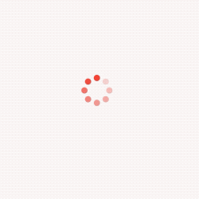
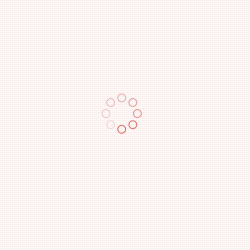
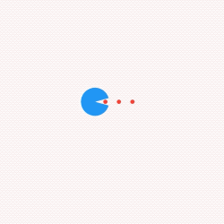
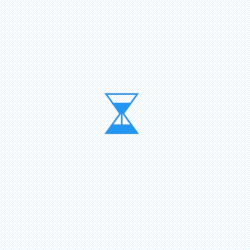

所有动画组件的效果及对应的组件名称：

|            |          |          |           |
| ----------------------------------------- | -------------------------------------- | ----------------------------------------- | -------------------------------------------- |
| BallPulseLoading                          | Ball4ScaleLoading                      | BallGridPulseLoading                      | BallCirclePulseLoading                       |
|         |      |      |        |
| Ball3OpacityLoading                       | Ball4OpacityLoading                    | BallGridOpacityLoading                    | BallCircleRotateLoading                      |
|           |   |    |       |
| BallBounceLoading                         | BallRotateScaleLoading                 | Ball2TrianglePathLoading                  | BallCircleOpacityLoading                     |
|    |    |  |  |
| Ball3TrianglePathLoading                  | BallInsideBallLoading                  | BallClipRotatePulseLoading                | BallCircleInsideRotateLoading                |
|                  |       |        |          |
| RingRotate                                | Ring2InsideLoading                     | Ring2SymmetryLoading                      | RingBallRotateLoading                        |
|      |       |         |                    |
| RingClipRotateMultiple                    | WaterCircleLoading                     | Water2CircleLoading                       | WaterRipple                                  |
|  |        |             |                |
| WaterMultipleCircleLoading                | WaterPulseLoading                      | BarPulseLoading                           | BarScaleLoading                              |
|            |  |             |          |
| BarScale1Loading                          | BarScalePulseOutLoading                | BarMusicLoading                           | Square4OpacityLoading                        |
|         |      |      |            |
| SquareFadingLoading                       | SquareRotateLoading                    | SquareGridScaleLoading                    | CircleRotateLoading                          |
|          |      |   |        |
| CirclePulseLoading                        | CircleSquareLoading                    | Circle2InsideScaleLoading                 | PouringHourGlassLoading                      |
|               |                                        |                                           |                                              |
| PacmanLoading                             |                                        |                                           |                                              |


在项目的 `pubspec.yaml` 文件中添加依赖：

最新版本号请到pub查看：[https://pub.dev/packages/m_loading](https://pub.dev/packages/m_loading)

```dart
dependencies:
  m_loading: ^lastversion
```

执行命令：

```text
flutter pub get
```

导入：

```dart
import 'package:m_loading/m_loading.dart';
```


所有 loading 动画组件的用法大同小异，都有 duration（动画时长） 和 curve（动画曲线）参数，以及外观样式的设置，下面是一些 loading 动画组件的用法。


小球类的动画组件中有 **BallStyle** 类型的参数，此参数表示小球样式，用法如下：

```dart
BallCircleOpacityLoading(
  ballStyle: BallStyle(
    size: 5,
    color: Colors.red,
    ballType: BallType.solid,
  ),
)
```





- size：小球大小
- color：小球颜色
- ballType：小球类型，hollow：空心，solid：实心
- borderWidth：边框宽
- borderColor：边框颜色


设置空心球：

```
BallCircleOpacityLoading(
  ballStyle: BallStyle(
    size: 5,
    ballType: BallType.hollow,
    borderWidth: 1,
    borderColor: Colors.red
  ),
)
```



设置动画时长和动画曲线：

```
Ring2InsideLoading(
  color: Colors.blue,
  duration: Duration(milliseconds: 1200),
  curve: Curves.bounceInOut,
)
```


非小球类的组件使用：

```dart
PacmanLoading(
  mouthColor: Colors.blue,
  ballColor: Colors.red,
)
```




```dart
PouringHourGlassLoading(
  color: Colors.blue,
)
```




