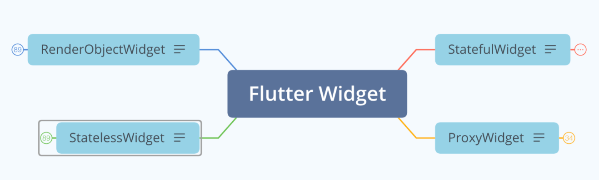
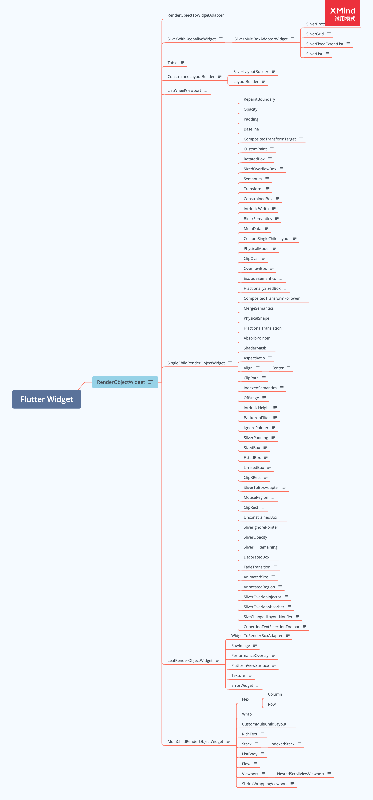
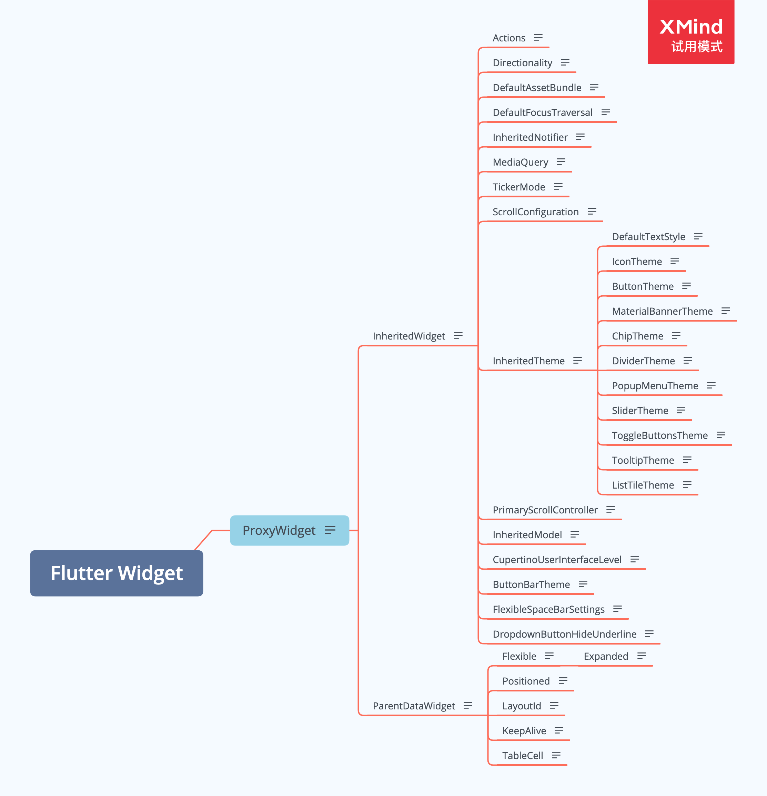
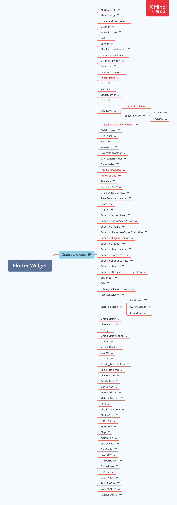

## Flutter Widgets

**【Flutter Widgets 大全】** 为 [**Flutter 老孟**](http://laomengit.com/) 网站项目，共收录 **330** 多个 Widgets，此电子书并不适合入门（一个一个组件学习），适合当作手册，需要的时候进行查阅。

为了方便对比学习，我将相近或相反功能的组件整理到一个文件中，比如所有的 **Button** 类组件、弹出类组件等。

如果想系统的学习入门知识，请到 [**Flutter 老孟 实战**](http://laomengit.com/guide/introduction/mobile_system.html) 查看。

- Flutter 老孟博客（在线阅读地址）：[http://laomengit.com/flutter/widgets/widgets_structure.html](http://laomengit.com/flutter/widgets/widgets_structure.html)
- Github 地址：[https://github.com/781238222/flutter-do](https://github.com/781238222/flutter-do)

### Flutter Widgets 目录

- [AboutDialog](md/widgets/md/AboutDialog.md) [在线查看](http:laomengit.com/flutter/widgets/AboutDialog.html)
- [AboutListTile](md/widgets/md/AboutListTile.md) [在线查看](http:laomengit.com/flutter/widgets/AboutListTile.html)
- [AbsorbPointer](md/widgets/md/AbsorbPointer.md) [在线查看](http:laomengit.com/flutter/widgets/AbsorbPointer.html)
- [ActionChip](md/widgets/md/Chip.md) [在线查看](http:laomengit.com/flutter/widgets/Chip.html#ActionChip)
- [AlertDialog](md/widgets/md/Dialog.md) [在线查看](http:laomengit.com/flutter/widgets/Dialog.html#AlertDialog)
 - [Align](md/widgets/md/Align.md) [在线查看](http:laomengit.com/flutter/widgets/Align.html)
 - [AlignTransition](md/widgets/md/AlignTransition.md) [在线查看](http:laomengit.com/flutter/widgets/AlignTransition.html)
 - [AlwaysScrollableScrollPhysics](md/widgets/md/ScrollPhysics.md) [在线查看](http:laomengit.com/flutter/widgets/ScrollPhysics.html#AlwaysScrollableScrollPhysics)
 - [AnimatedAlign](md/widgets/md/AnimatedAlign.md) [在线查看](http:laomengit.com/flutter/widgets/AnimatedAlign.html)
 - [AnimatedBuilder](md/widgets/md/AnimatedBuilder.md) [在线查看](http:laomengit.com/flutter/widgets/AnimatedBuilder.html)
 - [AnimatedContainer](md/widgets/md/AnimatedContainer.md) [在线查看](http:laomengit.com/flutter/widgets/AnimatedContainer.html)
 - [AnimatedCrossFade](md/widgets/md/AnimatedCrossFade.md) [在线查看](http:laomengit.com/flutter/widgets/AnimatedCrossFade.html)
 - [AnimatedDefaultTextStyle](md/widgets/md/AnimatedDefaultTextStyle.md) [在线查看](http:laomengit.com/flutter/widgets/AnimatedDefaultTextStyle.html)
 - [AnimatedIcon](md/widgets/md/AnimatedIcon.md) [在线查看](http:laomengit.com/flutter/widgets/AnimatedIcon.html)
 - [AnimatedList](md/widgets/md/AnimatedList.md) [在线查看](http:laomengit.com/flutter/widgets/AnimatedList.html)
 - [AnimatedModalBarrier](md/widgets/md/AnimatedModalBarrier.md) [在线查看](http:laomengit.com/flutter/widgets/AnimatedModalBarrier.html)
 - [AnimatedOpacity](md/widgets/md/AnimatedOpacity.md) [在线查看](http:laomengit.com/flutter/widgets/AnimatedOpacity.html)
 - [AnimatedPadding](md/widgets/md/AnimatedPadding.md) [在线查看](http:laomengit.com/flutter/widgets/AnimatedPadding.html)
 - [AnimatedPhysicalModel](md/widgets/md/AnimatedPhysicalModel.md) [在线查看](http:laomengit.com/flutter/widgets/AnimatedPhysicalModel.html)
 - [AnimatedPositioned](md/widgets/md/AnimatedPositioned.md) [在线查看](http:laomengit.com/flutter/widgets/AnimatedPositioned.html)
 - [AnimatedPositionedDirectional](md/widgets/md/AnimatedPositionedDirectional.md) [在线查看](http:laomengit.com/flutter/widgets/AnimatedPositionedDirectional.html)
 - [AnimatedSize](md/widgets/md/AnimatedSize.md) [在线查看](http:laomengit.com/flutter/widgets/AnimatedSize.html)
 - [AnimatedSwitcher](md/widgets/md/AnimatedSwitcher.md) [在线查看](http:laomengit.com/flutter/widgets/AnimatedSwitcher.html)
 - [AppBar](md/widgets/md/AppBar.md) [在线查看](http:laomengit.com/flutter/widgets/AppBar.html)
 - [AspectRatio](md/widgets/md/ConstrainedBox.md) [在线查看](http:laomengit.com/flutter/widgets/ConstrainedBox.html#AspectRatio)
 - [AssetImage](md/widgets/md/Icon.md) [在线查看](http:laomengit.com/flutter/widgets/Icon.html#AssetImage)
 - [BackButton](md/widgets/md/Button.md) [在线查看](http:laomengit.com/flutter/widgets/Button.html#BackButton)
 - [BackButtonIcon](md/widgets/md/BackButtonIcon.md) [在线查看](http:laomengit.com/flutter/widgets/BackButtonIcon.html)
 - [BackdropFilter](md/widgets/md/BackdropFilter.md) [在线查看](http:laomengit.com/flutter/widgets/BackdropFilter.html)
 - [Banner](md/widgets/md/Banner.md) [在线查看](http:laomengit.com/flutter/widgets/Banner.html)
 - [Baseline](md/widgets/md/Baseline.md) [在线查看](http:laomengit.com/flutter/widgets/Baseline.html)
 - [BeveledRectangleBorder](md/widgets/md/ShapeBorder.md) [在线查看](http:laomengit.com/flutter/widgets/ShapeBorder.html#BeveledRectangleBorder)
 - [Border](md/widgets/md/ShapeBorder.md) [在线查看](http:laomengit.com/flutter/widgets/ShapeBorder.html#Border)
 - [BorderDirectional](md/widgets/md/ShapeBorder.md) [在线查看](http:laomengit.com/flutter/widgets/ShapeBorder.html#BorderDirectional)
 - [BottomAppBar](md/widgets/md/BottomAppBar.md) [在线查看](http:laomengit.com/flutter/widgets/BottomAppBar.html)
 - [BottomNavigationBar](md/widgets/md/BottomNavigationBar.md) [在线查看](http:laomengit.com/flutter/widgets/BottomNavigationBar.html)
 - [BottomNavigationBarItem](md/widgets/md/BottomNavigationBar.md) [在线查看](http:laomengit.com/flutter/widgets/BottomNavigationBar.html#BottomNavigationBarItem)
 - [BouncingScrollPhysics](md/widgets/md/ScrollPhysics.md) [在线查看](http:laomengit.com/flutter/widgets/ScrollPhysics.html#BouncingScrollPhysics)
 - [Builder](md/widgets/md/Builder.md) [在线查看](http:laomengit.com/flutter/widgets/Builder.html)
 - [ButtonBar](md/widgets/md/Button.md) [在线查看](http:laomengit.com/flutter/widgets/Button.html#ButtonBar)
 - [ButtonBarTheme](md/widgets/md/ButtonBarTheme.md) [在线查看](http:laomengit.com/flutter/widgets/ButtonBarTheme.html)
 - [ButtonBarThemeData](md/widgets/md/ButtonBarTheme.md) [在线查看](http:laomengit.com/flutter/widgets/ButtonBarTheme.html#ButtonBarThemeData)
 - [ButtonTheme](md/widgets/md/ButtonTheme.md) [在线查看](http:laomengit.com/flutter/widgets/ButtonTheme.html)
 - [Card](md/widgets/md/Card.md) [在线查看](http:laomengit.com/flutter/widgets/Card.html)
 - [Center](md/widgets/md/Align.md) [在线查看](http:laomengit.com/flutter/widgets/Align.html#Center)
 - [Checkbox](md/widgets/md/Checkbox.md) [在线查看](http:laomengit.com/flutter/widgets/Checkbox.html)
 - [CheckboxListTile](md/widgets/md/Checkbox.md) [在线查看](http:laomengit.com/flutter/widgets/Checkbox.html#CheckboxListTile)
 - [CheckedModeBanner](md/widgets/md/Banner.md) [在线查看](http:laomengit.com/flutter/widgets/Banner.html#CheckedModeBanner)
 - [CheckedPopupMenuItem](md/widgets/md/Menu.md) [在线查看](http:laomengit.com/flutter/widgets/Menu.html#CheckedPopupMenuItem)
 - [Chip](md/widgets/md/Chip.md) [在线查看](http:laomengit.com/flutter/widgets/Chip.html)
 - [ChipTheme](md/widgets/md/ChipTheme.md) [在线查看](http:laomengit.com/flutter/widgets/ChipTheme.html)
 - [ChipThemeData](md/widgets/md/ChipTheme.md) [在线查看](http:laomengit.com/flutter/widgets/ChipTheme.html#ChipThemeData)
 - [ChoiceChip](md/widgets/md/Chip.md) [在线查看](http:laomengit.com/flutter/widgets/Chip.html#ChoiceChip)
 - [CircleAvatar](md/widgets/md/CircleAvatar.md) [在线查看](http:laomengit.com/flutter/widgets/CircleAvatar.html)
 - [CircleBorder](md/widgets/md/ShapeBorder.md) [在线查看](http:laomengit.com/flutter/widgets/ShapeBorder.html#CircleBorder)
 - [CircularProgressIndicator](md/widgets/md/ProgressIndicator.md) [在线查看](http:laomengit.com/flutter/widgets/ProgressIndicator.html#CircularProgressIndicator)
 - [ClampingScrollPhysics](md/widgets/md/ScrollPhysics.md) [在线查看](http:laomengit.com/flutter/widgets/ScrollPhysics.html#ClampingScrollPhysics)
 - [ClipOval](md/widgets/md/Clip.md) [在线查看](http:laomengit.com/flutter/widgets/Clip.html#ClipOval)
 - [ClipPath](md/widgets/md/Clip.md) [在线查看](http:laomengit.com/flutter/widgets/Clip.html#ClipPath)
 - [ClipRRect](md/widgets/md/Clip.md) [在线查看](http:laomengit.com/flutter/widgets/Clip.html#ClipRRect)
 - [ClipRect](md/widgets/md/Clip.md) [在线查看](http:laomengit.com/flutter/widgets/Clip.html#ClipRect)
 - [CloseButton](md/widgets/md/Button.md) [在线查看](http:laomengit.com/flutter/widgets/Button.html#CloseButton)
 - [ColorFiltered](md/widgets/md/ColorFiltered.md) [在线查看](http:laomengit.com/flutter/widgets/ColorFiltered.html)
 - [Column](md/widgets/md/Column.md) [在线查看](http:laomengit.com/flutter/widgets/Column.html)
 - [ConstrainedBox](md/widgets/md/ConstrainedBox.md) [在线查看](http:laomengit.com/flutter/widgets/ConstrainedBox.html)
 - [Container](md/widgets/md/Container.md) [在线查看](http:laomengit.com/flutter/widgets/Container.html)
 - [ContinuousRectangleBorder](md/widgets/md/ShapeBorder.md) [在线查看](http:laomengit.com/flutter/widgets/ShapeBorder.html#ContinuousRectangleBorder)
 - [CupertinoActionSheet](md/widgets/md/CupertinoActionSheet.md) [在线查看](http:laomengit.com/flutter/widgets/CupertinoActionSheet.html)
 - [CupertinoActionSheetAction](md/widgets/md/CupertinoActionSheet.md) [在线查看](http:laomengit.com/flutter/widgets/CupertinoActionSheet.html#CupertinoActionSheetAction)
 - [CupertinoActivityIndicator](md/widgets/md/ProgressIndicator.md) [在线查看](http:laomengit.com/flutter/widgets/ProgressIndicator.html#CupertinoActivityIndicator)
 - [CupertinoAlertDialog](md/widgets/md/Dialog.md) [在线查看](http:laomengit.com/flutter/widgets/Dialog.html#CupertinoAlertDialog)
 - [CupertinoApp](md/widgets/md/MaterialApp.md) [在线查看](http:laomengit.com/flutter/widgets/MaterialApp.html#CupertinoApp)
 - [CupertinoButton](md/widgets/md/Button.md) [在线查看](http:laomengit.com/flutter/widgets/Button.html#CupertinoButton)
 - [CupertinoContextMenu](md/widgets/md/CupertinoContextMenu.md) [在线查看](http:laomengit.com/flutter/widgets/CupertinoContextMenu.html)
 - [CupertinoContextMenuAction](md/widgets/md/CupertinoContextMenu.md) [在线查看](http:laomengit.com/flutter/widgets/CupertinoContextMenu.html#CupertinoContextMenuAction)
 - [CupertinoDatePicker](md/widgets/md/DatePicker.md) [在线查看](http:laomengit.com/flutter/widgets/DatePicker.html#CupertinoDatePicker)
 - [CupertinoFullscreenDialogTransition](md/widgets/md/CupertinoFullscreenDialogTransition.md) [在线查看](http:laomengit.com/flutter/widgets/CupertinoFullscreenDialogTransition.html)
 - [CupertinoNavigationBar](md/widgets/md/CupertinoNavigationBar.md) [在线查看](http:laomengit.com/flutter/widgets/CupertinoNavigationBar.html)
 - [CupertinoNavigationBarBackButton](md/widgets/md/CupertinoNavigationBarBackButton.md) [在线查看](http:laomengit.com/flutter/widgets/CupertinoNavigationBarBackButton.html)
 - [CupertinoPageScaffold](md/widgets/md/CupertinoPageScaffold.md) [在线查看](http:laomengit.com/flutter/widgets/CupertinoPageScaffold.html)
 - [CupertinoPicker](md/widgets/md/CupertinoPicker.md) [在线查看](http:laomengit.com/flutter/widgets/CupertinoPicker.html)
 - [CupertinoScrollbar](md/widgets/md/Scrollbar.md) [在线查看](http:laomengit.com/flutter/widgets/Scrollbar.html#CupertinoScrollbar)
 - [CupertinoSegmentedControl](md/widgets/md/CupertinoSegmentedControl.md) [在线查看](http:laomengit.com/flutter/widgets/CupertinoSegmentedControl.html)
 - [CupertinoSlider](md/widgets/md/Slider.md) [在线查看](http:laomengit.com/flutter/widgets/Slider.html#CupertinoSlider)
 - [CupertinoSlidingSegmentedControl](md/widgets/md/CupertinoSlidingSegmentedControl.md) [在线查看](http:laomengit.com/flutter/widgets/CupertinoSlidingSegmentedControl.html)
 - [CupertinoSliverNavigationBar](md/widgets/md/CupertinoNavigationBar.md) [在线查看](http:laomengit.com/flutter/widgets/CupertinoNavigationBar.html#CupertinoSliverNavigationBar)
 - [CupertinoSliverRefreshControl](md/widgets/md/RefreshIndicator.md) [在线查看](http:laomengit.com/flutter/widgets/RefreshIndicator.html#CupertinoSliverRefreshControl)
 - [CupertinoSwitch](md/widgets/md/Switch.md) [在线查看](http:laomengit.com/flutter/widgets/Switch.html#CupertinoSwitch)
 - [CupertinoTabBar](md/widgets/md/CupertinoTabBar.md) [在线查看](http:laomengit.com/flutter/widgets/CupertinoTabBar.html)
 - [CupertinoTabScaffold](md/widgets/md/CupertinoTabScaffold.md) [在线查看](http:laomengit.com/flutter/widgets/CupertinoTabScaffold.html)
 - [CupertinoTabView](md/widgets/md/CupertinoTabBar.md) [在线查看](http:laomengit.com/flutter/widgets/CupertinoTabBar.html#CupertinoTabView)
 - [CupertinoTextField](md/widgets/md/TextField.md) [在线查看](http:laomengit.com/flutter/widgets/TextField.html#CupertinoTextField)
 - [CupertinoTextSelectionToolbar](md/widgets/md/CupertinoTextSelectionToolbar.md) [在线查看](http:laomengit.com/flutter/widgets/CupertinoTextSelectionToolbar.html)
 - [CupertinoTheme](md/widgets/md/Theme.md) [在线查看](http:laomengit.com/flutter/widgets/Theme.html#CupertinoTheme)
 - [CupertinoTimerPicker](md/widgets/md/DatePicker.md) [在线查看](http:laomengit.com/flutter/widgets/DatePicker.html#CupertinoTimerPicker)
 - [CustomClipper](md/widgets/md/Clip.md) [在线查看](http:laomengit.com/flutter/widgets/Clip.html#CustomClipper)
 - [CustomMultiChildLayout](md/widgets/md/CustomMultiChildLayout.md) [在线查看](http:laomengit.com/flutter/widgets/CustomMultiChildLayout.html)
 - [CustomPaint](md/widgets/md/CustomPaint.md) [在线查看](http:laomengit.com/flutter/widgets/CustomPaint.html)
 - [CustomScrollView](md/widgets/md/CustomScrollView.md) [在线查看](http:laomengit.com/flutter/widgets/CustomScrollView.html)
 - [CustomSingleChildLayout](md/widgets/md/CustomSingleChildLayout.md) [在线查看](http:laomengit.com/flutter/widgets/CustomSingleChildLayout.html)
 - [DataCell](md/widgets/md/DataTable.md) [在线查看](http:laomengit.com/flutter/widgets/DataTable.html#DataCell)
 - [DataColumn](md/widgets/md/DataTable.md) [在线查看](http:laomengit.com/flutter/widgets/DataTable.html#DataColumn)
 - [DataColumn](md/widgets/md/DataTable.md) [在线查看](http:laomengit.com/flutter/widgets/DataTable.html#DataColumn)
 - [DataRow](md/widgets/md/DataTable.md) [在线查看](http:laomengit.com/flutter/widgets/DataTable.html#DataRow)
 - [DataTable](md/widgets/md/DataTable.md) [在线查看](http:laomengit.com/flutter/widgets/DataTable.html)
 - [DayPicker](md/widgets/md/DatePicker.md) [在线查看](http:laomengit.com/flutter/widgets/DatePicker.html#DayPicker)
 - [DecoratedBox](md/widgets/md/DecoratedBox.md) [在线查看](http:laomengit.com/flutter/widgets/DecoratedBox.html)
 - [DecoratedBoxTransition](md/widgets/md/DecoratedBoxTransition.md) [在线查看](http:laomengit.com/flutter/widgets/DecoratedBoxTransition.html)
 - [DefaultAssetBundle](md/widgets/md/DefaultAssetBundle.md) [在线查看](http:laomengit.com/flutter/widgets/DefaultAssetBundle.html)
 - [DefaultTextStyle](md/widgets/md/DefaultTextStyle.md) [在线查看](http:laomengit.com/flutter/widgets/DefaultTextStyle.html)
 - [DefaultTextStyleTransition](md/widgets/md/DefaultTextStyleTransition.md) [在线查看](http:laomengit.com/flutter/widgets/DefaultTextStyleTransition.html)
 - [Dialog](md/widgets/md/Dialog.md) [在线查看](http:laomengit.com/flutter/widgets/Dialog.html)
 - [Directionality](md/widgets/md/Directionality.md) [在线查看](http:laomengit.com/flutter/widgets/Directionality.html)
 - [Dismissible](md/widgets/md/Dismissible.md) [在线查看](http:laomengit.com/flutter/widgets/Dismissible.html)
 - [Divider](md/widgets/md/Divider.md) [在线查看](http:laomengit.com/flutter/widgets/Divider.html)
 - [DividerTheme](md/widgets/md/DividerTheme.md) [在线查看](http:laomengit.com/flutter/widgets/DividerTheme.html)
 - [DividerThemeData](md/widgets/md/DividerTheme.md) [在线查看](http:laomengit.com/flutter/widgets/DividerTheme.html#DividerThemeData)
 - [DragTarget](md/widgets/md/Draggable.md) [在线查看](http:laomengit.com/flutter/widgets/Draggable.html#DragTarget)
 - [Draggable](md/widgets/md/Draggable.md) [在线查看](http:laomengit.com/flutter/widgets/Draggable.html)
 - [DraggableScrollableActuator](md/widgets/md/DraggableScrollableActuator.md) [在线查看](http:laomengit.com/flutter/widgets/DraggableScrollableActuator.html)
 - [DraggableScrollableSheet](md/widgets/md/DraggableScrollableSheet.md) [在线查看](http:laomengit.com/flutter/widgets/DraggableScrollableSheet.html)
 - [Drawer](md/widgets/md/Drawer.md) [在线查看](http:laomengit.com/flutter/widgets/Drawer.html)
 - [DrawerHeader](md/widgets/md/DrawerHeader.md) [在线查看](http:laomengit.com/flutter/widgets/DrawerHeader.html)
 - [DropdownButton](md/widgets/md/Button.md) [在线查看](http:laomengit.com/flutter/widgets/Button.html#DropdownButton)
 - [DropdownButtonFormField](md/widgets/md/DropdownButtonFormField.md) [在线查看](http:laomengit.com/flutter/widgets/DropdownButtonFormField.html)
 - [DropdownButtonHideUnderline](md/widgets/md/DropdownButtonHideUnderline.md) [在线查看](http:laomengit.com/flutter/widgets/DropdownButtonHideUnderline.html)
 - [ErrorWidget](md/widgets/md/ErrorWidget.md) [在线查看](http:laomengit.com/flutter/widgets/ErrorWidget.html)
 - [ExpandIcon](md/widgets/md/ExpandIcon.md) [在线查看](http:laomengit.com/flutter/widgets/ExpandIcon.html)
 - [Expanded](md/widgets/md/Flexible.md) [在线查看](http:laomengit.com/flutter/widgets/Flexible.html#Expanded)
 - [ExpansionPanelList](md/widgets/md/ExpansionPanelList.md) [在线查看](http:laomengit.com/flutter/widgets/ExpansionPanelList.html)
 - [ExpansionTile](md/widgets/md/ExpansionTile.md) [在线查看](http:laomengit.com/flutter/widgets/ExpansionTile.html)
 - [FadeInImage](md/widgets/md/FadeInImage.md) [在线查看](http:laomengit.com/flutter/widgets/FadeInImage.html)
 - [FadeTransition](md/widgets/md/FadeTransition.md) [在线查看](http:laomengit.com/flutter/widgets/FadeTransition.html)
 - [FilterChip](md/widgets/md/Chip.md) [在线查看](http:laomengit.com/flutter/widgets/Chip.html#FilterChip)
 - [FittedBox](md/widgets/md/FittedBox.md) [在线查看](http:laomengit.com/flutter/widgets/FittedBox.html)
 - [FixedExtentScrollPhysics](md/widgets/md/ScrollPhysics.md) [在线查看](http:laomengit.com/flutter/widgets/ScrollPhysics.html#FixedExtentScrollPhysics)
 - [FlatButton](md/widgets/md/Button.md) [在线查看](http:laomengit.com/flutter/widgets/Button.html#FlatButton)
 - [Flexible](md/widgets/md/Flexible.md) [在线查看](http:laomengit.com/flutter/widgets/Flexible.html)
 - [FlexibleSpaceBar](md/widgets/md/FlexibleSpaceBar.md) [在线查看](http:laomengit.com/flutter/widgets/FlexibleSpaceBar.html)
 - [FloatingActionButton](md/widgets/md/FloatingActionButton.md) [在线查看](http:laomengit.com/flutter/widgets/FloatingActionButton.html)
 - [Flow](md/widgets/md/Flow.md) [在线查看](http:laomengit.com/flutter/widgets/Flow.html)
 - [FlutterLogo](md/widgets/md/FlutterLogo.md) [在线查看](http:laomengit.com/flutter/widgets/FlutterLogo.html)
 - [Form](md/widgets/md/Form.md) [在线查看](http:laomengit.com/flutter/widgets/Form.html)
 - [FormField](md/widgets/md/Form.md) [在线查看](http:laomengit.com/flutter/widgets/Form.html#FormField)
 - [FractionalTranslation](md/widgets/md/FractionalTranslation.md) [在线查看](http:laomengit.com/flutter/widgets/FractionalTranslation.html)
 - [FractionallySizedBox](md/widgets/md/ConstrainedBox.md) [在线查看](http:laomengit.com/flutter/widgets/ConstrainedBox.html#FractionallySizedBox)
 - [FutureBuilder](md/widgets/md/FutureBuilder.md) [在线查看](http:laomengit.com/flutter/widgets/FutureBuilder.html)
 - [GestureDetector](md/widgets/md/GestureDetector.md) [在线查看](http:laomengit.com/flutter/widgets/GestureDetector.html)
 - [GlowingOverscrollIndicator](md/widgets/md/GlowingOverscrollIndicator.md) [在线查看](http:laomengit.com/flutter/widgets/GlowingOverscrollIndicator.html)
 - [GridPaper](md/widgets/md/GridPaper.md) [在线查看](http:laomengit.com/flutter/widgets/GridPaper.html)
 - [GridTile](md/widgets/md/GridTile.md) [在线查看](http:laomengit.com/flutter/widgets/GridTile.html)
 - [GridTileBar](md/widgets/md/GridTile.md) [在线查看](http:laomengit.com/flutter/widgets/GridTile.html#GridTileBar)
 - [GridView](md/widgets/md/GridView.md) [在线查看](http:laomengit.com/flutter/widgets/GridView.html)
 - [Hero](md/widgets/md/Hero.md) [在线查看](http:laomengit.com/flutter/widgets/Hero.html)
 - [HtmlElementView](md/widgets/md/HtmlElementView.md) [在线查看](http:laomengit.com/flutter/widgets/HtmlElementView.html)
 - [Icon](md/widgets/md/Icon.md) [在线查看](http:laomengit.com/flutter/widgets/Icon.html)
 - [IconButton](md/widgets/md/Button.md) [在线查看](http:laomengit.com/flutter/widgets/Button.html#IconButton)
 - [IconTheme](md/widgets/md/IconTheme.md) [在线查看](http:laomengit.com/flutter/widgets/IconTheme.html)
 - [IgnorePointer](md/widgets/md/AbsorbPointer.md) [在线查看](http:laomengit.com/flutter/widgets/AbsorbPointer.html#IgnorePointer)
 - [Image](md/widgets/md/Image.md) [在线查看](http:laomengit.com/flutter/widgets/Image.html)
 - [ImageIcon](md/widgets/md/ImageIcon.md) [在线查看](http:laomengit.com/flutter/widgets/ImageIcon.html)
 - [IndexedStack](md/widgets/md/Stack.md) [在线查看](http:laomengit.com/flutter/widgets/Stack.html#IndexedStack)
 - [Ink](md/widgets/md/InkWell.md) [在线查看](http:laomengit.com/flutter/widgets/InkWell.html#Ink)
 - [InkWell](md/widgets/md/InkWell.md) [在线查看](http:laomengit.com/flutter/widgets/InkWell.html)
 - [InputChip](md/widgets/md/Chip.md) [在线查看](http:laomengit.com/flutter/widgets/Chip.html#InputChip)
 - [InputDecoration](md/widgets/md/InputDecoration.md) [在线查看](http:laomengit.com/flutter/widgets/InputDecoration.html)
 - [InputDecorator](md/widgets/md/InputDecorator.md) [在线查看](http:laomengit.com/flutter/widgets/InputDecorator.html)
 - [IntrinsicHeight](md/widgets/md/IntrinsicHeight.md) [在线查看](http:laomengit.com/flutter/widgets/IntrinsicHeight.html)
 - [IntrinsicWidth](md/widgets/md/IntrinsicHeight.md) [在线查看](http:laomengit.com/flutter/widgets/IntrinsicHeight.html#IntrinsicWidth)
 - [KeyedSubtree](md/widgets/md/KeyedSubtree.md) [在线查看](http:laomengit.com/flutter/widgets/KeyedSubtree.html)
 - [LayoutBuilder](md/widgets/md/LayoutBuilder.md) [在线查看](http:laomengit.com/flutter/widgets/LayoutBuilder.html)
 - [LayoutId](md/widgets/md/CustomMultiChildLayout.md) [在线查看](http:laomengit.com/flutter/widgets/CustomMultiChildLayout.html#LayoutId)
 - [LicensePage](md/widgets/md/LicensePage.md) [在线查看](http:laomengit.com/flutter/widgets/LicensePage.html)
 - [LimitedBox](md/widgets/md/ConstrainedBox.md) [在线查看](http:laomengit.com/flutter/widgets/ConstrainedBox.html#LimitedBox)
 - [LinearProgressIndicator](md/widgets/md/ProgressIndicator.md) [在线查看](http:laomengit.com/flutter/widgets/ProgressIndicator.html#LinearProgressIndicator)
 - [ListBody](md/widgets/md/ListBody.md) [在线查看](http:laomengit.com/flutter/widgets/ListBody.html)
 - [ListTile](md/widgets/md/ListTile.md) [在线查看](http:laomengit.com/flutter/widgets/ListTile.html)
 - [ListTileTheme](md/widgets/md/ListTileTheme.md) [在线查看](http:laomengit.com/flutter/widgets/ListTileTheme.html)
 - [ListView](md/widgets/md/ListView.md) [在线查看](http:laomengit.com/flutter/widgets/ListView.html)
 - [ListWheelScrollView](md/widgets/md/ListWheelScrollView.md) [在线查看](http:laomengit.com/flutter/widgets/ListWheelScrollView.html)
 - [Listener](md/widgets/md/Listener.md) [在线查看](http:laomengit.com/flutter/widgets/Listener.html)
 - [Localizations](md/widgets/md/Localizations.md) [在线查看](http:laomengit.com/flutter/widgets/Localizations.html)
 - [LongPressDraggable](md/widgets/md/Draggable.md) [在线查看](http:laomengit.com/flutter/widgets/Draggable.html#LongPressDraggable)
 - [Material](md/widgets/md/Material.md) [在线查看](http:laomengit.com/flutter/widgets/Material.html)
 - [MaterialApp](md/widgets/md/MaterialApp.md) [在线查看](http:laomengit.com/flutter/widgets/MaterialApp.html)
 - [MaterialBanner](md/widgets/md/MaterialBanner.md) [在线查看](http:laomengit.com/flutter/widgets/MaterialBanner.html)
 - [MaterialBannerTheme](md/widgets/md/MaterialBannerTheme.md) [在线查看](http:laomengit.com/flutter/widgets/MaterialBannerTheme.html)
 - [MaterialBannerThemeData](md/widgets/md/MaterialBannerTheme.md) [在线查看](http:laomengit.com/flutter/widgets/MaterialBannerTheme.html#MaterialBannerThemeData)
 - [MaterialTapTargetSize](md/widgets/md/MaterialTapTargetSize.md) [在线查看](http:laomengit.com/flutter/widgets/MaterialTapTargetSize.html)
 - [MediaQuery](md/widgets/md/MediaQuery.md) [在线查看](http:laomengit.com/flutter/widgets/MediaQuery.html)
 - [MediaQueryData](md/widgets/md/MediaQuery.md) [在线查看](http:laomengit.com/flutter/widgets/MediaQuery.html#MediaQueryData)
 - [MergeableMaterial](md/widgets/md/MergeableMaterial.md) [在线查看](http:laomengit.com/flutter/widgets/MergeableMaterial.html)
 - [ModalBarrier](md/widgets/md/ModalBarrier.md) [在线查看](http:laomengit.com/flutter/widgets/ModalBarrier.html)
 - [MonthPicker](md/widgets/md/DatePicker.md) [在线查看](http:laomengit.com/flutter/widgets/DatePicker.html#MonthPicker)
 - [NavigationToolbar](md/widgets/md/NavigationToolbar.md) [在线查看](http:laomengit.com/flutter/widgets/NavigationToolbar.html)
 - [Navigator](md/widgets/md/Navigator.md) [在线查看](http:laomengit.com/flutter/widgets/Navigator.html)
 - [NestedScrollView](md/widgets/md/NestedScrollView.md) [在线查看](http:laomengit.com/flutter/widgets/NestedScrollView.html)
 - [NeverScrollableScrollPhysics](md/widgets/md/ScrollPhysics.md) [在线查看](http:laomengit.com/flutter/widgets/ScrollPhysics.html#NeverScrollableScrollPhysics)
 - [NotificationListener](md/widgets/md/NotificationListener.md) [在线查看](http:laomengit.com/flutter/widgets/NotificationListener.html)
 - [Offstage](md/widgets/md/Offstage.md) [在线查看](http:laomengit.com/flutter/widgets/Offstage.html)
 - [Opacity](md/widgets/md/Opacity.md) [在线查看](http:laomengit.com/flutter/widgets/Opacity.html)
 - [OrientationBuilder](md/widgets/md/OrientationBuilder.md) [在线查看](http:laomengit.com/flutter/widgets/OrientationBuilder.html)
 - [OutlineButton](md/widgets/md/Button.md) [在线查看](http:laomengit.com/flutter/widgets/Button.html#OutlineButton)
 - [OutlineInputBorder](md/widgets/md/ShapeBorder.md) [在线查看](http:laomengit.com/flutter/widgets/ShapeBorder.html#OutlineInputBorder)
 - [OverflowBox](md/widgets/md/OverflowBox.md) [在线查看](http:laomengit.com/flutter/widgets/OverflowBox.html)
 - [Overlay](md/widgets/md/Overlay.md) [在线查看](http:laomengit.com/flutter/widgets/Overlay.html)
 - [Padding](md/widgets/md/Padding.md) [在线查看](http:laomengit.com/flutter/widgets/Padding.html)
 - [PageScrollPhysics](md/widgets/md/ScrollPhysics.md) [在线查看](http:laomengit.com/flutter/widgets/ScrollPhysics.html#PageScrollPhysics)
 - [PageView](md/widgets/md/PageView.md) [在线查看](http:laomengit.com/flutter/widgets/PageView.html)
 - [PaginatedDataTable](md/widgets/md/PaginatedDataTable.md) [在线查看](http:laomengit.com/flutter/widgets/PaginatedDataTable.html)
 - [PhysicalModel](md/widgets/md/PhysicalModel.md) [在线查看](http:laomengit.com/flutter/widgets/PhysicalModel.html)
 - [PhysicalShape](md/widgets/md/PhysicalModel.md) [在线查看](http:laomengit.com/flutter/widgets/PhysicalModel.html#PhysicalShape)
 - [Placeholder](md/widgets/md/Placeholder.md) [在线查看](http:laomengit.com/flutter/widgets/Placeholder.html)
 - [PopupMenuButton](md/widgets/md/Menu.md) [在线查看](http:laomengit.com/flutter/widgets/Menu.html#PopupMenuButton)
 - [PopupMenuDivider](md/widgets/md/Menu.md) [在线查看](http:laomengit.com/flutter/widgets/Menu.html#PopupMenuDivider)
 - [PopupMenuItem](md/widgets/md/Menu.md) [在线查看](http:laomengit.com/flutter/widgets/Menu.html#PopupMenuItem)
 - [PopupMenuTheme](md/widgets/md/PopupMenuTheme.md) [在线查看](http:laomengit.com/flutter/widgets/PopupMenuTheme.html)
 - [PopupMenuThemeData](md/widgets/md/PopupMenuTheme.md) [在线查看](http:laomengit.com/flutter/widgets/PopupMenuTheme.html#PopupMenuThemeData)
 - [Positioned](md/widgets/md/Positioned.md) [在线查看](http:laomengit.com/flutter/widgets/Positioned.html)
 - [PositionedDirectional](md/widgets/md/PositionedDirectional.md) [在线查看](http:laomengit.com/flutter/widgets/PositionedDirectional.html)
 - [PositionedTransition](md/widgets/md/PositionedTransition.md) [在线查看](http:laomengit.com/flutter/widgets/PositionedTransition.html)
 - [PreferredSize](md/widgets/md/PreferredSize.md) [在线查看](http:laomengit.com/flutter/widgets/PreferredSize.html)
 - [Radio](md/widgets/md/Radio.md) [在线查看](http:laomengit.com/flutter/widgets/Radio.html)
 - [RaisedButton](md/widgets/md/Button.md) [在线查看](http:laomengit.com/flutter/widgets/Button.html#RaisedButton)
 - [RangeSlider](md/widgets/md/Slider.md) [在线查看](http:laomengit.com/flutter/widgets/Slider.html#RangeSlider)
 - [RawChip](md/widgets/md/Chip.md) [在线查看](http:laomengit.com/flutter/widgets/Chip.html#RawChip)
 - [RawGestureDetector](md/widgets/md/RawGestureDetector.md) [在线查看](http:laomengit.com/flutter/widgets/RawGestureDetector.html)
 - [RawKeyboardListener](md/widgets/md/RawKeyboardListener.md) [在线查看](http:laomengit.com/flutter/widgets/RawKeyboardListener.html)
 - [RawMaterialButton](md/widgets/md/Button.md) [在线查看](http:laomengit.com/flutter/widgets/Button.html#RawMaterialButton)
 - [RefreshIndicator](md/widgets/md/RefreshIndicator.md) [在线查看](http:laomengit.com/flutter/widgets/RefreshIndicator.html)
 - [RefreshProgressIndicator](md/widgets/md/ProgressIndicator.md) [在线查看](http:laomengit.com/flutter/widgets/ProgressIndicator.html#RefreshProgressIndicator)
 - [RelativePositionedTransition](md/widgets/md/RelativePositionedTransition.md) [在线查看](http:laomengit.com/flutter/widgets/RelativePositionedTransition.html)
 - [ReorderableListView](md/widgets/md/ReorderableListView.md) [在线查看](http:laomengit.com/flutter/widgets/ReorderableListView.html)
 - [RichText](md/widgets/md/RichText.md) [在线查看](http:laomengit.com/flutter/widgets/RichText.html)
 - [RotatedBox](md/widgets/md/RotatedBox.md) [在线查看](http:laomengit.com/flutter/widgets/RotatedBox.html)
 - [RotationTransition](md/widgets/md/RotationTransition.md) [在线查看](http:laomengit.com/flutter/widgets/RotationTransition.html)
 - [RoundedRectangleBorder](md/widgets/md/ShapeBorder.md) [在线查看](http:laomengit.com/flutter/widgets/ShapeBorder.html#RoundedRectangleBorder)
 - [Row](md/widgets/md/Column.md) [在线查看](http:laomengit.com/flutter/widgets/Column.html)
 - [SafeArea](md/widgets/md/SafeArea.md) [在线查看](http:laomengit.com/flutter/widgets/SafeArea.html)
 - [Scaffold](md/widgets/md/Scaffold.md) [在线查看](http:laomengit.com/flutter/widgets/Scaffold.html)
 - [ScaleTransition](md/widgets/md/ScaleTransition.md) [在线查看](http:laomengit.com/flutter/widgets/ScaleTransition.html)
 - [ScrollConfiguration](md/widgets/md/ScrollConfiguration.md) [在线查看](http:laomengit.com/flutter/widgets/ScrollConfiguration.html)
 - [ScrollPhysics](md/widgets/md/ScrollPhysics.md) [在线查看](http:laomengit.com/flutter/widgets/ScrollPhysics.html)
 - [Scrollable](md/widgets/md/Scrollable.md) [在线查看](http:laomengit.com/flutter/widgets/Scrollable.html)
 - [Scrollbar](md/widgets/md/Scrollbar.md) [在线查看](http:laomengit.com/flutter/widgets/Scrollbar.html)
 - [SelectableText](md/widgets/md/SelectableText.md) [在线查看](http:laomengit.com/flutter/widgets/SelectableText.html)
 - [Semantics](md/widgets/md/Semantics.md) [在线查看](http:laomengit.com/flutter/widgets/Semantics.html)
 - [ShaderMask](md/widgets/md/ShaderMask.md) [在线查看](http:laomengit.com/flutter/widgets/ShaderMask.html)
 - [ShapeBorder](md/widgets/md/ShapeBorder.md) [在线查看](http:laomengit.com/flutter/widgets/ShapeBorder.html#ShapeBorder)
 - [SimpleDialog](md/widgets/md/Dialog.md) [在线查看](http:laomengit.com/flutter/widgets/Dialog.html#SimpleDialog)
 - [SingleChildScrollView](md/widgets/md/SingleChildScrollView.md) [在线查看](http:laomengit.com/flutter/widgets/SingleChildScrollView.html)
 - [SizeChangedLayoutNotification](md/widgets/md/SizeChangedLayoutNotifier.md) [在线查看](http:laomengit.com/flutter/widgets/SizeChangedLayoutNotifier.html#SizeChangedLayoutNotification)
 - [SizeChangedLayoutNotifier](md/widgets/md/SizeChangedLayoutNotifier.md) [在线查看](http:laomengit.com/flutter/widgets/SizeChangedLayoutNotifier.html)
 - [SizeTransition](md/widgets/md/SizeTransition.md) [在线查看](http:laomengit.com/flutter/widgets/SizeTransition.html)
 - [SizedBox](md/widgets/md/ConstrainedBox.md) [在线查看](http:laomengit.com/flutter/widgets/ConstrainedBox.html#SizedBox)
 - [SizedOverflowBox](md/widgets/md/SizedOverflowBox.md) [在线查看](http:laomengit.com/flutter/widgets/SizedOverflowBox.html)
 - [SlideTransition](md/widgets/md/SlideTransition.md) [在线查看](http:laomengit.com/flutter/widgets/SlideTransition.html)
 - [Slider](md/widgets/md/Slider.md) [在线查看](http:laomengit.com/flutter/widgets/Slider.html)
 - [SliderTheme](md/widgets/md/SliderTheme.md) [在线查看](http:laomengit.com/flutter/widgets/SliderTheme.html)
 - [SliderThemeData](md/widgets/md/SliderTheme.md) [在线查看](http:laomengit.com/flutter/widgets/SliderTheme.html#SliderThemeData)
 - [SliverAnimatedList](md/widgets/md/SliverAnimatedList.md) [在线查看](http:laomengit.com/flutter/widgets/SliverAnimatedList.html)
 - [SliverAppBar](md/widgets/md/SliverAppBar.md) [在线查看](http:laomengit.com/flutter/widgets/SliverAppBar.html)
 - [SliverFillRemaining](md/widgets/md/SliverFillRemaining.md) [在线查看](http:laomengit.com/flutter/widgets/SliverFillRemaining.html)
 - [SliverFillViewport](md/widgets/md/SliverFillViewport.md) [在线查看](http:laomengit.com/flutter/widgets/SliverFillViewport.html)
 - [SliverFixedExtentList](md/widgets/md/SliverFixedExtentList.md) [在线查看](http:laomengit.com/flutter/widgets/SliverFixedExtentList.html)
 - [SliverGrid](md/widgets/md/SliverList.md) [在线查看](http:laomengit.com/flutter/widgets/SliverList.html#SliverGrid)
 - [SliverLayoutBuilder](md/widgets/md/SliverLayoutBuilder.md) [在线查看](http:laomengit.com/flutter/widgets/SliverLayoutBuilder.html)
 - [SliverList](md/widgets/md/SliverList.md) [在线查看](http:laomengit.com/flutter/widgets/SliverList.html)
 - [SliverOpacity](md/widgets/md/SliverOpacity.md) [在线查看](http:laomengit.com/flutter/widgets/SliverOpacity.html)
 - [SliverPadding](md/widgets/md/SliverPadding.md) [在线查看](http:laomengit.com/flutter/widgets/SliverPadding.html)
 - [SliverPersistentHeader](md/widgets/md/SliverPersistentHeader.md) [在线查看](http:laomengit.com/flutter/widgets/SliverPersistentHeader.html)
 - [SliverPrototypeExtentList](md/widgets/md/SliverPrototypeExtentList.md) [在线查看](http:laomengit.com/flutter/widgets/SliverPrototypeExtentList.html)
 - [SliverSafeArea](md/widgets/md/SafeArea.md) [在线查看](http:laomengit.com/flutter/widgets/SafeArea.html#SliverSafeArea)
 - [SliverToBoxAdapter](md/widgets/md/SliverToBoxAdapter.md) [在线查看](http:laomengit.com/flutter/widgets/SliverToBoxAdapter.html)
 - [SnackBar](md/widgets/md/SnackBar.md) [在线查看](http:laomengit.com/flutter/widgets/SnackBar.html)
 - [SnackBarAction](md/widgets/md/SnackBar.md) [在线查看](http:laomengit.com/flutter/widgets/SnackBar.html#SnackBarAction)
 - [Spacer](md/widgets/md/Flexible.md) [在线查看](http:laomengit.com/flutter/widgets/Flexible.html#Spacer)
 - [Stack](md/widgets/md/Stack.md) [在线查看](http:laomengit.com/flutter/widgets/Stack.html)
 - [StadiumBorder](md/widgets/md/ShapeBorder.md) [在线查看](http:laomengit.com/flutter/widgets/ShapeBorder.html#StadiumBorder)
 - [StatefulBuilder](md/widgets/md/StatefulBuilder.md) [在线查看](http:laomengit.com/flutter/widgets/StatefulBuilder.html)
 - [Stepper](md/widgets/md/Stepper.md) [在线查看](http:laomengit.com/flutter/widgets/Stepper.html)
 - [StreamBuilder](md/widgets/md/StreamBuilder.md) [在线查看](http:laomengit.com/flutter/widgets/StreamBuilder.html)
 - [Switch](md/widgets/md/Switch.md) [在线查看](http:laomengit.com/flutter/widgets/Switch.html)
 - [SwitchListTile](md/widgets/md/Switch.md) [在线查看](http:laomengit.com/flutter/widgets/Switch.html#SwitchListTile)
 - [Tab](md/widgets/md/Tab.md) [在线查看](http:laomengit.com/flutter/widgets/Tab.html)
 - [TabBar](md/widgets/md/TabBar.md) [在线查看](http:laomengit.com/flutter/widgets/TabBar.html)
 - [TabBarView](md/widgets/md/TabBar.md) [在线查看](http:laomengit.com/flutter/widgets/TabBar.html#TabBarView)
 - [TabPageSelector](md/widgets/md/TabPageSelector.md) [在线查看](http:laomengit.com/flutter/widgets/TabPageSelector.html)
 - [TabPageSelectorIndicator](md/widgets/md/TabPageSelectorIndicator.md) [在线查看](http:laomengit.com/flutter/widgets/TabPageSelectorIndicator.html)
 - [Table](md/widgets/md/Table.md) [在线查看](http:laomengit.com/flutter/widgets/Table.html)
 - [TableCell](md/widgets/md/Table.md) [在线查看](http:laomengit.com/flutter/widgets/Table.html#TableCell)
 - [TableRow](md/widgets/md/Table.md) [在线查看](http:laomengit.com/flutter/widgets/Table.html#TableRow)
 - [Text](md/widgets/md/Text.md) [在线查看](http:laomengit.com/flutter/widgets/Text.html)
 - [TextAlign](md/widgets/md/TextAlign.md) [在线查看](http:laomengit.com/flutter/widgets/TextAlign.html)
 - [TextField](md/widgets/md/TextField.md) [在线查看](http:laomengit.com/flutter/widgets/TextField.html)
 - [TextFormField](md/widgets/md/Form.md) [在线查看](http:laomengit.com/flutter/widgets/Form.html#TextFormField)
 - [TextSelectionGestureDetector](md/widgets/md/TextSelectionGestureDetector.md) [在线查看](http:laomengit.com/flutter/widgets/TextSelectionGestureDetector.html)
 - [TextSpan](md/widgets/md/TextSpan.md) [在线查看](http:laomengit.com/flutter/widgets/TextSpan.html)
 - [Theme](md/widgets/md/Theme.md) [在线查看](http:laomengit.com/flutter/widgets/Theme.html)
 - [Title](md/widgets/md/Title.md) [在线查看](http:laomengit.com/flutter/widgets/Title.html)
 - [ToggleButtons](md/widgets/md/ToggleButtons.md) [在线查看](http:laomengit.com/flutter/widgets/ToggleButtons.html)
 - [ToggleButtonsTheme](md/widgets/md/ToggleButtonsTheme.md) [在线查看](http:laomengit.com/flutter/widgets/ToggleButtonsTheme.html)
 - [ToggleButtonsThemeData](md/widgets/md/ToggleButtonsTheme.md) [在线查看](http:laomengit.com/flutter/widgets/ToggleButtonsTheme.html#ToggleButtonsThemeData)
 - [Tooltip](md/widgets/md/Tooltip.md) [在线查看](http:laomengit.com/flutter/widgets/Tooltip.html)
 - [TooltipTheme](md/widgets/md/TooltipTheme.md) [在线查看](http:laomengit.com/flutter/widgets/TooltipTheme.html)
 - [TooltipThemeData](md/widgets/md/TooltipTheme.md) [在线查看](http:laomengit.com/flutter/widgets/TooltipTheme.html#TooltipThemeData)
 - [Transform](md/widgets/md/Transform.md) [在线查看](http:laomengit.com/flutter/widgets/Transform.html)
 - [TweenAnimationBuilder](md/widgets/md/TweenAnimationBuilder.md) [在线查看](http:laomengit.com/flutter/widgets/TweenAnimationBuilder.html)
 - [UnconstrainedBox](md/widgets/md/ConstrainedBox.md) [在线查看](http:laomengit.com/flutter/widgets/ConstrainedBox.html#UnconstrainedBox)
 - [UnderlineInputBorder](md/widgets/md/ShapeBorder.md) [在线查看](http:laomengit.com/flutter/widgets/ShapeBorder.html#UnderlineInputBorder)
 - [UserAccountsDrawerHeader](md/widgets/md/UserAccountsDrawerHeader.md) [在线查看](http:laomengit.com/flutter/widgets/UserAccountsDrawerHeader.html)
 - [ValueListenableBuilder](md/widgets/md/ValueListenableBuilder.md) [在线查看](http:laomengit.com/flutter/widgets/ValueListenableBuilder.html)
 - [ValueNotifier](md/widgets/md/ValueListenableBuilder.md) [在线查看](http:laomengit.com/flutter/widgets/ValueListenableBuilder.html)
 - [VerticalDivider](md/widgets/md/Divider.md) [在线查看](http:laomengit.com/flutter/widgets/Divider.html#VerticalDivider)
 - [Visibility](md/widgets/md/Visibility.md) [在线查看](http:laomengit.com/flutter/widgets/Visibility.html)
 - [WidgetSpan](md/widgets/md/WidgetSpan.md) [在线查看](http:laomengit.com/flutter/widgets/WidgetSpan.html)
 - [WidgetsApp](md/widgets/md/WidgetsApp.md) [在线查看](http:laomengit.com/flutter/widgets/WidgetsApp.html)
 - [WillPopScope](md/widgets/md/WillPopScope.md) [在线查看](http:laomengit.com/flutter/widgets/WillPopScope.html)
 - [Wrap](md/widgets/md/Wrap.md) [在线查看](http:laomengit.com/flutter/widgets/Wrap.html)
 - [YearPicker](md/widgets/md/DatePicker.md) [在线查看](http:laomengit.com/flutter/widgets/DatePicker.html#YearPicker)
 - [showAboutDialog](md/widgets/md/showDialog.md) [在线查看](http:laomengit.com/flutter/widgets/showDialog.html#showAboutDialog)
 - [showBottomSheet](md/widgets/md/showDialog.md) [在线查看](http:laomengit.com/flutter/widgets/showDialog.html#showBottomSheet)
 - [showCupertinoDialog](md/widgets/md/showDialog.md) [在线查看](http:laomengit.com/flutter/widgets/showDialog.html#showCupertinoDialog)
 - [showCupertinoModalPopup](md/widgets/md/showDialog.md) [在线查看](http:laomengit.com/flutter/widgets/showDialog.html#showCupertinoModalPopup)
 - [showDatePicker](md/widgets/md/DatePicker.md) [在线查看](http:laomengit.com/flutter/widgets/DatePicker.html#showDatePicker)
 - [showDialog](md/widgets/md/showDialog.md) [在线查看](http:laomengit.com/flutter/widgets/showDialog.html)
 - [showGeneralDialog](md/widgets/md/showDialog.md) [在线查看](http:laomengit.com/flutter/widgets/showDialog.html#showGeneralDialog)
 - [showLicensePage](md/widgets/md/showDialog.md) [在线查看](http:laomengit.com/flutter/widgets/showDialog.html#showLicensePage)
 - [showMenu](md/widgets/md/Menu.md) [在线查看](http:laomengit.com/flutter/widgets/Menu.html#showMenu)
 - [showModalBottomSheet](md/widgets/md/showDialog.md) [在线查看](http:laomengit.com/flutter/widgets/showDialog.html#showModalBottomSheet)
 - [showSearch](md/widgets/md/showDialog.md) [在线查看](http:laomengit.com/flutter/widgets/showDialog.html#showSearch)
 - [showTimePicker](md/widgets/md/DatePicker.md) [在线查看](http:laomengit.com/flutter/widgets/DatePicker.html#showTimePicker)

### Flutter Widgets PDF

开源文件为 **markdown** 格式，为了方便阅读老孟转换成了 PDF 格式，总计 658页，不知不觉已经整理了如此多的资料。

还整理了大量 Widgets 的继承关系图：

Widget的直接子类，仅仅4个（其实还有一个抽象类）

`RenderObjectWidget`及其子类共有89个：

`ProxyWidget`及其子类共有34个：

`StatelessWidget`及其子类共有89个：

`StatefulWidget`的子类最多，高达141个

### Flutter 交流群

欢迎关注老孟公众号，微信搜索公众号： **老孟Flutter**，或者扫描下面二维码：

欢迎大家加入 **【Flutter 交流群】**，搜索微信号：**laomengit**，或者扫描下方二维码：

