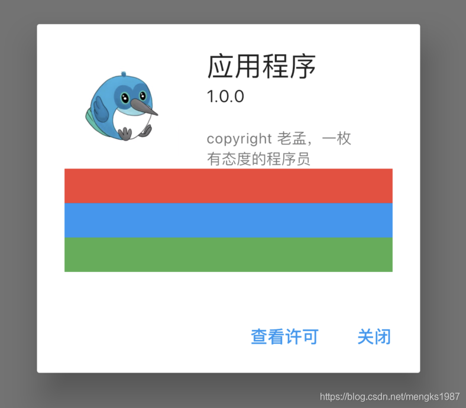
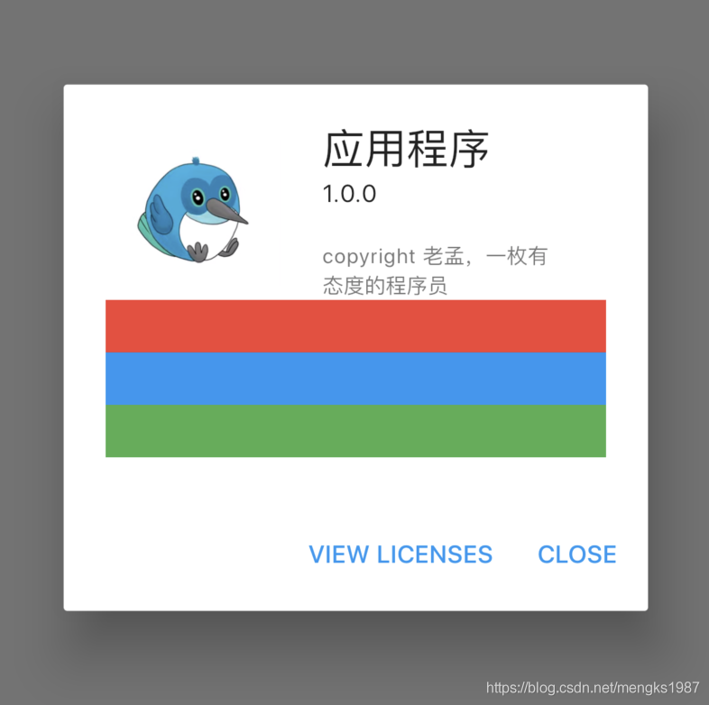

# AboutDialog

AboutDialog用于描述当前App信息，底部提供2个按钮：查看许可按钮和关闭按钮。AboutDialog需要和showAboutDialog配合使用，用法如下：

```dart
showAboutDialog(
  context: context,
  applicationIcon: Image.asset(
    'images/bird.png',
    height: 100,
    width: 100,
  ),
  applicationName: '应用程序',
  applicationVersion: '1.0.0',
  applicationLegalese: 'copyright 老孟，一枚有态度的程序员',
  children: <Widget>[
    Container(
      height: 30,
      color: Colors.red,
    ),
    Container(
      height: 30,
      color: Colors.blue,
    ),
    Container(
      height: 30,
      color: Colors.green,
    )
  ],
);
```

效果如下：




属性说明如下：

- `applicationIcon`：应用程序的图标。
- `applicationName`：应用程序名称。
- `applicationVersion`：应用程序版本。
- `applicationLegalese`：著作权（copyright）的提示。
- `children`：位置如上图的红蓝绿色的位置。

所有的属性都需要手动设置，不是自动获取的。

下面的2个按钮根据应用程序支持的语言显示相应的语言，比如显示中文方法如下：

1. 在`pubspec.yaml`中配置支持国际化：

```dart
dependencies:
  flutter:
    sdk: flutter
  flutter_localizations:
    sdk: flutter
```

2. 在MaterialApp中配置当前区域：

```dart
MaterialApp(
      title: 'Flutter Demo',
      localizationsDelegates: [
        GlobalMaterialLocalizations.delegate,
        GlobalWidgetsLocalizations.delegate,
      ],
      supportedLocales: [
        const Locale('zh', 'CH'),
        const Locale('en', 'US'),
      ],
      locale: Locale('zh'),
      ...
  )
```

此时效果：



此时点击查看许将会调用`showLicensePage`,相关效果可以查看`showLicensePage`。

