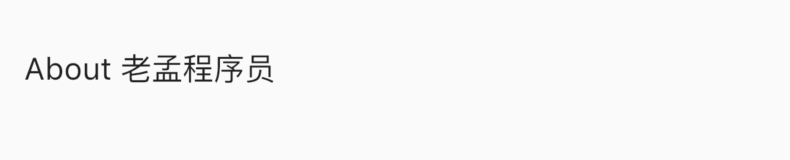
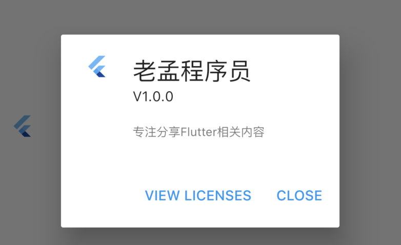
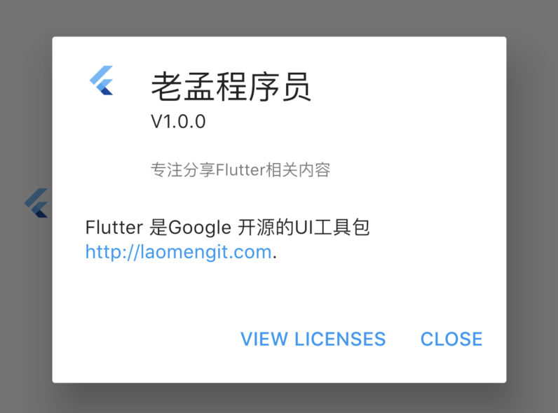

## AboutListTile

用法如下：

```dart
AboutListTile()
```

效果如下：


什么也没有设置，怎么会出现“About 老孟”？AboutListTile组件的`child`参数，默认显示About+应用程序的名称。

设置`child`参数：

```dart
AboutListTile(
  child: Text('About 老孟程序员'),
)
```

效果如下：



设置`icon`:

```dart
AboutListTile(
  icon: FlutterLogo(),
  child: Text('About 老孟程序员'),
)
```

效果如下：


设置应用程序属性：

```dart
AboutListTile(
    icon: FlutterLogo(),
    child: Text('About 老孟程序员'),
    applicationName: '老孟程序员',
    applicationVersion: 'V1.0.0',
    applicationIcon: FlutterLogo(),
    applicationLegalese: '专注分享Flutter相关内容')
```

刷新，控件并没有更新，`AboutListTile`控件是有点击属性的，点击弹出AboutDialog控件，这些属性出现在AboutDialog控件上，关于AboutDialog的详细内容请查看AboutDialog控件。



设置`aboutBoxChildren`：

```dart
final TextStyle textStyle = Theme.of(context).textTheme.body1;
final List<Widget> aboutBoxChildren = <Widget>[
  SizedBox(height: 24),
  RichText(
    text: TextSpan(
      children: <TextSpan>[
        TextSpan(
            style: textStyle,
            text: 'Flutter is Google’s UI toolkit for building beautiful, '
                'natively compiled applications for mobile, web, and desktop '
                'from a single codebase. Learn more about Flutter at '),
        TextSpan(
            style: textStyle.copyWith(color: Theme.of(context).accentColor),
            text: 'https://flutter.dev'),
        TextSpan(style: textStyle, text: '.'),
      ],
    ),
  ),
];

return AboutListTile(
  icon: FlutterLogo(),
  child: Text('About 老孟程序员'),
  applicationName: '老孟程序员',
  applicationVersion: 'V1.0.0',
  applicationIcon: FlutterLogo(),
  applicationLegalese: '专注分享Flutter相关内容',
  aboutBoxChildren: aboutBoxChildren,
  dense: false,
)
```

效果：




## 总结

此控件通常不会使用，通常会设置一个单独的“关于页面”

