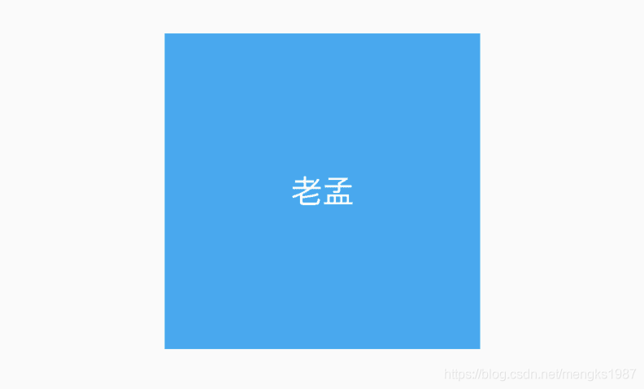
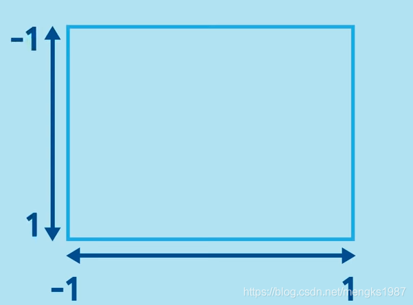
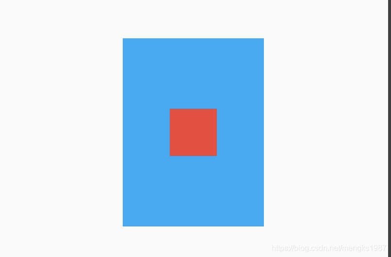

# Align

Align和Center控件都是控制子控件位置的控件。


## Align

基本用法：

```dart
Container(
  color: Colors.lightBlue,
  width: 200,
  height: 200,
  child: Align(
    child: Text('老孟',style: TextStyle(color: Colors.white,fontSize: 20),),
  ),
)
```

Align默认居中对齐，效果如下；



当然还可以设置其他对齐方法，比如`bottomRight`(右下角)等，用法如下：

```dart
Align(
  alignment: Alignment.bottomRight,
  child: Text('老孟',style: TextStyle(color: Colors.white,fontSize: 20),),
)
```

如果系统提供的位置都不是想要的，可以使用如下方式：

```dart
Align(
  alignment: Alignment(0.2,0.5),
  child: Text('老孟',style: TextStyle(color: Colors.white,fontSize: 20),),
)
```

Alignment参数x,y坐标系统如下，注意这个坐标系统和常见的不太一样：

·

`widthFactor`和`heightFactor`参数不为null且父组件没有限制大小，此时Align的宽度等于子控件的宽度乘以对应的`factor`，用法如下：

```dart
Container(
  color: Colors.lightBlue,
  child: Align(
    widthFactor: 3,
    heightFactor: 4,
    child: Container(
      height: 50,
      width: 50,
      color: Colors.red,
    ),
  ),
)
```

效果如下：




## Center

Center控件继承自Align，通过名字我们也知道Center是让子控件居中，用法如下：

```dart
Center(
  child: Text('老孟'),
)
```

