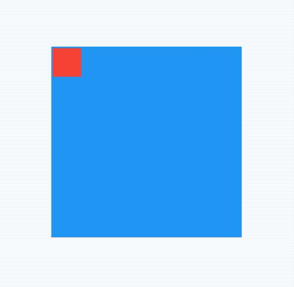

## AlignTransition

对Align子控件位置变换动画，用法如下：

```dart
@override
  void initState() {
    _animationController =
        AnimationController(duration: Duration(seconds: 2), vsync: this);
    _animation = Tween<AlignmentGeometry>(
            begin: Alignment.topLeft, end: Alignment.bottomRight)
        .animate(_animationController);

    //开始动画
    _animationController.forward();
    super.initState();
  }

  @override
  Widget build(BuildContext context) {
    return Container(
      height: 200,
      width: 200,
      color: Colors.blue,
      child: AlignTransition(
        alignment: _animation,
        child: Container(
          height: 30,
          width: 30,
          color: Colors.red,
        ),
      ),
    );
  }
```

效果如下：



