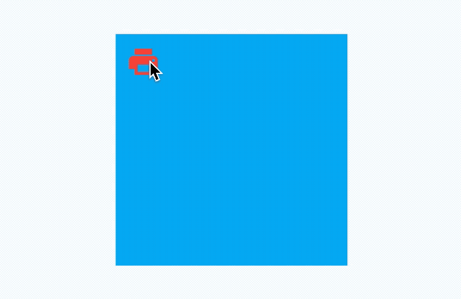

# AnimatedAlign

AnimatedAlign组件方便我们构建位置动画，基本用法如下：

```dart
var _alignment = Alignment.topLeft;

@override
  Widget build(BuildContext context) {
    return Container(
      width: 200,
      height: 200,
      color: Colors.lightBlue,
      child: AnimatedAlign(
        alignment: _alignment,
        duration: Duration(seconds: 2),
        child: IconButton(
          icon: Icon(Icons.print,color:Colors.red,size: 30,),
          onPressed: (){
            setState(() {
              _alignment = Alignment.bottomRight;
            });
          },
        ),
      ),
    );
  }
```

效果如下：



我们还可以通过`curve`设置动画曲线，用法如下：

```dart
AnimatedAlign(
  curve: Curves.bounceInOut,
  ...
)
```

`onEnd`是动画执行结束回调，用法如下：

```dart
AnimatedAlign(
  onEnd: (){
    print('onEnd');
  },
  ...
)
```

