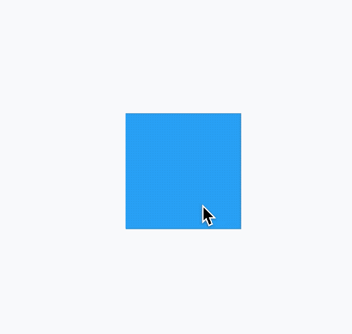
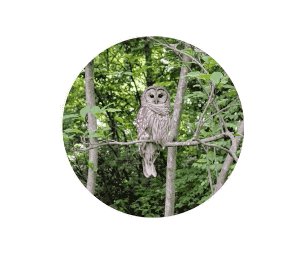

# AnimatedContainer

Flutter中很多用于动画的控件，这篇文章介绍动画控件`AnimatedContainer`，我们可以通俗的理解AnimatedContainer是带动画功能的Container，关于Container的详细介绍可以查看[Flutter Widgets 之 Container](https://blog.csdn.net/mengks1987/article/details/104388393)，这篇详细介绍了Container的用法。

AnimatedContainer只需要提供动画开始值和结束值，它就会动起来并不需要我们主动调用`setState`方法。
变化AnimatedContainer的宽高实现变大的效果，代码如下：​

```
bool click = false;

  @override
  Widget build(BuildContext context) {
    return Center(
      child: GestureDetector(
        onTap: () {
          setState(() {
            click = !click;
          });
        },
        child: AnimatedContainer(
          height: click ? 200 : 100,
          width: click ? 200 : 100,
          color: Colors.blue,
          duration: Duration(seconds: 3),

        ),
      ),
    );
  }
```

效果如下：


动画不仅可以作用在宽高上，还可以作用在颜色、边界、边界圆角半径、背景图片、形状等。

AnimatedContainer有2个必须的参数，一个时长`duration`，即动画执行的时长，另一个是动画曲线`curve`，默认是线性，系统为我们提供了很多动画曲线（加速、减速等）。
设置动画曲线代码如下：
```
AnimatedContainer(
	curve: Curves.bounceIn,
	...
)
```
如果想在动画执行结束时做一些事情，需要设置`onEnd`，代码如下：
```
AnimatedContainer(
	onEnd: (){
		...
	}
}
```

### 实战 

将图片放大并过度到圆形，动画执行结束后在反向执行动画，如此反复，代码如下：
```
AnimatedContainer(
      height: click ? 200 : 100,
      width: click ? 200 : 100,
      decoration: BoxDecoration(
          image: DecorationImage(
            image: NetworkImage(
                'https://flutter.github.io/assets-for-api-docs/assets/widgets/owl-2.jpg'),
            fit: BoxFit.cover,
          ),
          borderRadius: BorderRadius.all(Radius.circular(
            click ? 200 : 0,
          ))),
      duration: Duration(seconds: 3),
      curve: Curves.linear,
      onEnd: (){
        setState(() {
          click = !click;
        });
      },
    )
```

动画效果：



