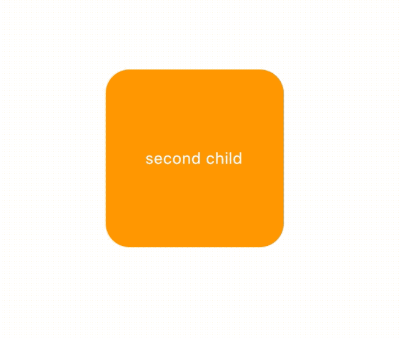
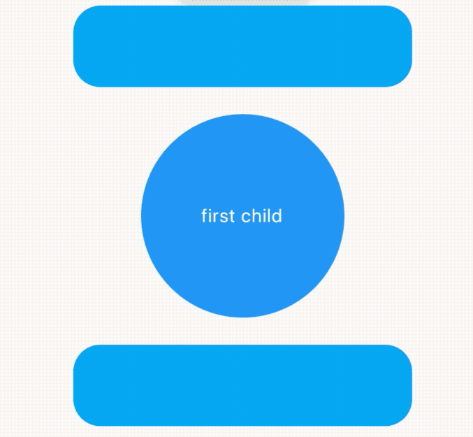
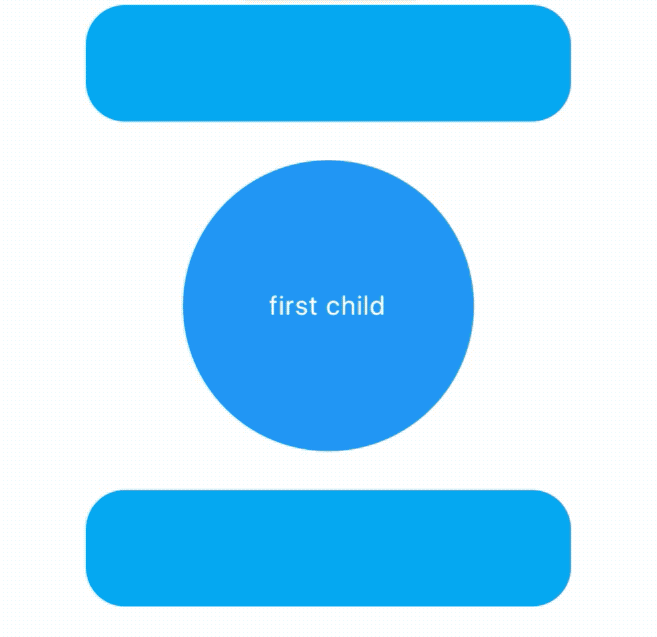

# AnimatedCrossFade

AnimatedCrossFade组件让2个组件在切换时出现交叉渐入的效果，因此AnimatedCrossFade需要设置2个子控件、动画时间和显示第几个子控件，用法如下：

```dart
AnimatedCrossFade(
  duration: Duration(seconds: 1),
  crossFadeState:
      _showFirst ? CrossFadeState.showFirst : CrossFadeState.showSecond,
  firstChild: Container(
    height: 150,
    width: 150,
    alignment: Alignment.center,
    decoration: BoxDecoration(shape: BoxShape.circle, color: Colors.blue),
    child: Text('first child',style: TextStyle(color: Colors.white),),
  ),
  secondChild: Container(
    height: 150,
    width: 150,
    alignment: Alignment.center,
    decoration:
        BoxDecoration(shape: BoxShape.rectangle, color: Colors.orange,borderRadius:BorderRadius.circular(20)),
    child: Text('second child',style: TextStyle(color: Colors.white),),
  ),
)
```

`_showFirst`参数由一个按钮按住，代码如下：

```dart
 bool _showFirst = true;
RaisedButton(
  child: Text('切换'),
  onPressed: () {
    setState(() {
      _showFirst = !_showFirst;
    });
  },
),
```

效果如下：



AnimatedCrossFade不仅支持同尺寸，还支持不同尺寸的控件进行切换，效果如下：



当矩形过渡到圆形时有一个抖动，矩形直接变为圆形直径，解决抖动问题使用`layoutBuilder`，用法如下：

```dart
AnimatedCrossFade(
  layoutBuilder: (child1, key1, child2, key2) {
    return Stack(
      overflow: Overflow.visible,
      alignment: Alignment.center,
      children: <Widget>[
        Positioned(
          top: 0,
          bottom: 0,
          key: key2,
          child: child2,
        ),
        Positioned(
          key: key1,
          child: child1,
        ),
      ],
    );
  },
  )
```

效果如下：




我们还可以设置尺寸和子组件的动画曲线，用法如下：

```dart
AnimatedCrossFade(
  firstCurve: Curves.bounceIn,
  secondCurve: Curves.bounceInOut,
  sizeCurve: Curves.easeIn,
  )
```


