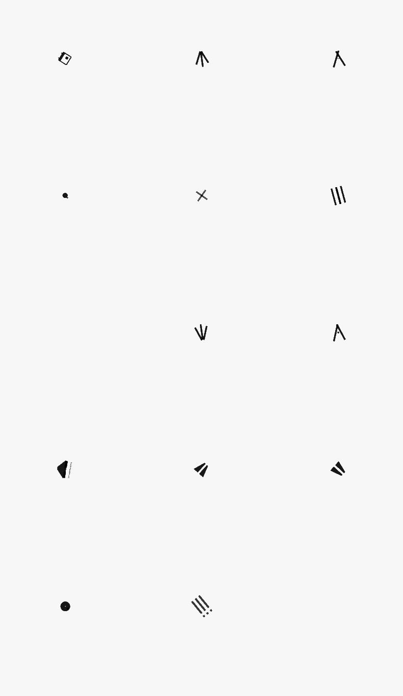

# AnimatedIcon

我们都知道Flutter系统中提供了大量的图标，但你是否知道Flutter还提供了很多动画图标，想要使用这些动画图标需要使用AnimatedIcon控件，首先需要设置图标，代码如下：

```dart
AnimatedIcon(
  icon: AnimatedIcons.view_list,
  ...
)
```

还需要设置`progress`，`progress`用于图标的动画，设置如下：

```dart
import 'package:flutter/material.dart';

class Test extends StatefulWidget {
  @override
  State<StatefulWidget> createState() => _TestState();
}

class _TestState extends State<Test> with TickerProviderStateMixin {
  AnimationController animationController;

  @override
  void initState() {
    super.initState();
    animationController =
        AnimationController(duration: Duration(seconds: 1), vsync: this)
          ..addStatusListener((AnimationStatus status) {
            if (status == AnimationStatus.completed) {
              animationController.reverse();
            } else if (status == AnimationStatus.dismissed) {
              animationController.forward();
            }
          });
    animationController.forward();
  }

  @override
  Widget build(BuildContext context) {
    return Container(
      height: 100,
      width: 100,
      alignment: Alignment.center,
      child: AnimatedIcon(
        icon: AnimatedIcons.view_list,
        progress: animationController,
      ),
    );
  }

  @override
  dispose() {
    super.dispose();
    animationController.dispose();
  }
}

```

上面的代码同时对动画的状态进行了监听使动画往复运动，动画效果：


系统提供的图标样式如下：



