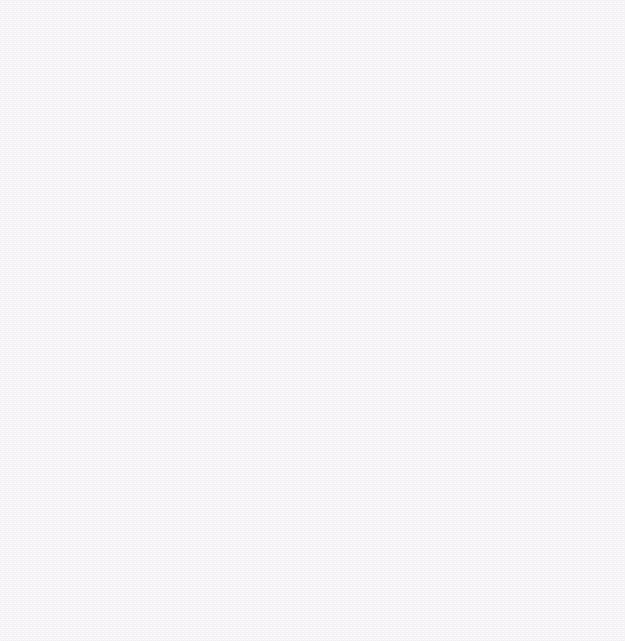

# AnimatedList

AnimatedList提供了一种简单的方式使列表数据发生变化时加入过渡动画，

下面是一种动画效果：


AnimatedList主要属性如下表。

| 属性 | 说明 |
|--|--|
| itemBuilder | 一个函数，列表的每一个索引会调用，这个函数有一个animation参数，可以设置成任何一个动画 |
| initialItemCount | item的个数  |
| scrollDirection | 滚动方向，默认垂直 |
| controller | scroll控制器 |
列表数据的插入和删除有进出场动画需要调用AnimatedListState指定的方法，只删除原数据并调用setState方法是没有动画效果的，对应方法如下：
>AnimatedListState.insertItem
  AnimatedListState.removeItem

AnimatedListState是AnimatedList的状态类，获取AnimatedListState有两个方法：
1)	通过AnimatedList.of(context)方法，代码如下：

```
AnimatedList.of(context).insertItem(index);
AnimatedList.of(context).removeItem(index, (context,animation)=>{});
```
2） 通过设置key，用法如下：
```
final GlobalKey<AnimatedListState> _listKey = GlobalKey<AnimatedListState>();
AnimatedList(
        key: _listKey,
        initialItemCount: _list.length,
        itemBuilder: (BuildContext context, int index, Animation animation) {
          return _buildItem(_list[index].toString(), animation);
        },
      )
```
调用如下：
```
_listKey.currentState.insertItem(_index);
```
需要注意的是AnimatedListState.insertItem或者AnimatedListState.removeItem并不会更新实际数据，需要手动处理。
下面的代码实现了“左进右出”的动画效果：
```
class AnimatedListDemo extends StatefulWidget {
  @override
  State<StatefulWidget> createState() => _AnimatedListDemo();
}

class _AnimatedListDemo extends State<AnimatedListDemo>
    with SingleTickerProviderStateMixin {
  List<int> _list = [];
  final GlobalKey<AnimatedListState> _listKey = GlobalKey<AnimatedListState>();

  void _addItem() {
    final int _index = _list.length;
    _list.insert(_index, _index);
    _listKey.currentState.insertItem(_index);
  }

  void _removeItem() {
    final int _index = _list.length - 1;
    var item = _list[_index].toString();
    _listKey.currentState.removeItem(
        _index, (context, animation) => _buildItem(item, animation));
    _list.removeAt(_index);

  }

  Widget _buildItem(String _item, Animation _animation) {
    return SlideTransition(
      position: _animation.drive(CurveTween(curve: Curves.easeIn)).drive(Tween<Offset>(begin: Offset(1,1),end: Offset(0,1))),
      child: Card(
        child: ListTile(
          title: Text(
            _item,
          ),
        ),
      ),
    );
  }

  @override
  Widget build(BuildContext context) {
    return Scaffold(
      body: AnimatedList(
        key: _listKey,
        initialItemCount: _list.length,
        itemBuilder: (BuildContext context, int index, Animation animation) {
          return _buildItem(_list[index].toString(), animation);
        },
      ),
      floatingActionButton: Row(
        mainAxisAlignment: MainAxisAlignment.center,
        crossAxisAlignment: CrossAxisAlignment.center,
        children: <Widget>[
          FloatingActionButton(
            onPressed: () => _addItem(),
            child: Icon(Icons.add),
          ),
          SizedBox(
            width: 60,
          ),
          FloatingActionButton(
            onPressed: () => _removeItem(),
            child: Icon(Icons.remove),
          ),
        ],
      ),
    );
  }
}
```
实现从上掉落的效果，只需将_buildItem方法代码修改如下即可：
```
  Widget _buildItem(String _item, Animation _animation) {
    return SizeTransition(
      sizeFactor: _animation,
      child: Card(
        child: ListTile(
          title: Text(
            _item,
          ),
        ),
      ),
    );
  }
```

