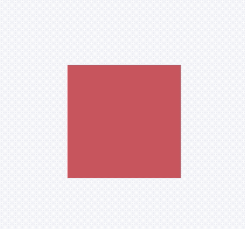

## AnimatedModalBarrier

对ModalBarrier控件的颜色进行动画，用法如下：

```dart
class AnimationDemo extends StatefulWidget {
  @override
  State<StatefulWidget> createState() => _AnimationDemo();
}

class _AnimationDemo extends State<AnimationDemo>
    with SingleTickerProviderStateMixin {
  AnimationController _animationController;
  Animation _animation;

  @override
  void initState() {
    _animationController =
        AnimationController(duration: Duration(seconds: 2), vsync: this);

    _animation = ColorTween(
            begin: Colors.red,
            end: Colors.blue)
        .animate(_animationController);

    //开始动画
    _animationController.forward();
    super.initState();
  }

  @override
  Widget build(BuildContext context) {
    return Center(
      child: Container(
        height: 100,
        width: 100,
        child: AnimatedModalBarrier(
          color: _animation,
        ),
      ),
    );
  }

  @override
  void dispose() {
    _animationController.dispose();
    super.dispose();
  }
}
```

效果如下：



