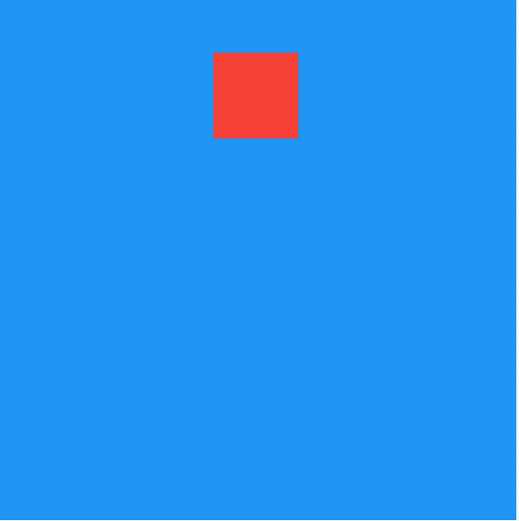

# AnimatedPositioned

AnimatedPositioned是一个隐式的动画组件，提供动态改变位置的动画组件，用法如下：

```dart
var _top = 30.0;
Stack(
      alignment: Alignment.center,
      children: <Widget>[
        AnimatedPositioned(
          top: _top,
          duration: Duration(seconds: 2),
          child: Container(height: 50, width: 50, color: Colors.red),
        )
      ],
    )
```

相关参数说：

- `duration`参数是动画执行的时间。

- AnimatedPositioned提供`left`、`top`、`right`、`bottom`四种定位属性，和 Positioned组件用相同。
- AnimatedPositioned只能用于Stack组件中。
- `left`、`right`和`width`3个参数只能设置其中2个，因为设置了其中2个，第三个已经确定了，同理`top`、`bottom`和`height`也只能设置其中2个。

仅仅是构建这样一个组件是不会有动画效果，需要让`_top`参数发生变化，点击按钮设置新的`_top`值：

```dart
RaisedButton(
          onPressed: () {
            setState(() {
              _top = 180;
            });
          },
        )
```

效果如下：



通过`curve`参数设置动画执行的曲线，默认直线执行，系统提供了很多中动画执行曲线，比如加速、减速、弹簧等，用法如下：

```dart
AnimatedOpacity(
  curve: Curves.easeIn,
  ...
)
```

如果想要在动画执行结束时处理一些事情，可以在`onEnd`回调中处理，用法如下：

```dart
AnimatedOpacity(
  onEnd: (){
    //动画执行结束回调
  },
  ...
)
```

