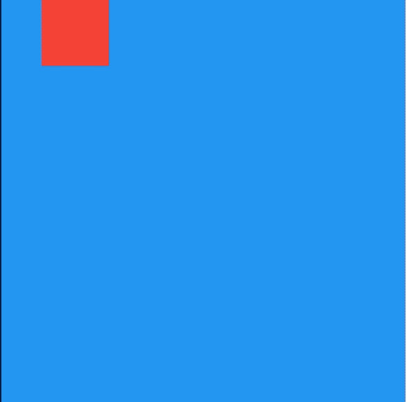

# AnimatedPositionedDirectional

AnimatedPositionedDirectional是一个隐式的动画组件，提供动态改变位置的动画组件，用法如下：

```dart
Stack(
      children: <Widget>[
        AnimatedPositionedDirectional(
          start: _start,
          width: 50,
          height: 50,
          duration: Duration(seconds: 2),
          child: Container(color: Colors.red),
        ),
      ],
    )
```

相关参数说：

- `duration`参数是动画执行的时间。

- 提供`top`、`bottom`、`start`、`end`四种定位属性，分别表示距离上、下、开始、结尾的距离。
- 只能用于Stack组件中。
- `start`、`end`和`width`3个参数只能设置其中2个，因为设置了其中2个，第三个已经确定了，同理`top`、`bottom`和`height`也只能设置其中2个。

仅仅是构建这样一个组件是不会有动画效果，需要让`_start`参数发生变化，点击按钮设置新的`_start`值：

```dart
RaisedButton(
          onPressed: () {
            setState(() {
              _start = 180;
            });
          },
        )
```

效果如下：



通过`curve`参数设置动画执行的曲线，默认直线执行，系统提供了很多中动画执行曲线，比如加速、减速、弹簧等，用法如下：

```dart
AnimatedOpacity(
  curve: Curves.easeIn,
  ...
)
```

如果想要在动画执行结束时处理一些事情，可以在`onEnd`回调中处理，用法如下：

```dart
AnimatedOpacity(
  onEnd: (){
    //动画执行结束回调
  },
  ...
)
```

