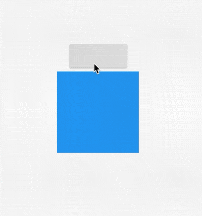

# AnimatedSize

AnimatedSize是一个动画组件，当指定子组件的尺寸发生变化时，它就会在给定的时间内自动变换其尺寸。

用法如下：

```dart
class _WidgetsDemo extends State<WidgetsDemo>
    with SingleTickerProviderStateMixin {
  var _height = 100.0;
  var _width = 100.0;
  var _color = Colors.red;

  @override
  Widget build(BuildContext context) {
    return Center(
      child: Column(
        mainAxisAlignment: MainAxisAlignment.center,
        children: <Widget>[
          RaisedButton(
            onPressed: () {
              setState(() {
                _height = 200.0;
                _width = 200.0;
                _color = Colors.blue;
              });
            },
          ),
          AnimatedSize(
            vsync: this,
            duration: Duration(seconds: 1),
            child: Container(
              height: _height,
              width: _width,
              color: _color,
            ),
          )
        ],
      ),
    );
  }
}
```

效果如下：



