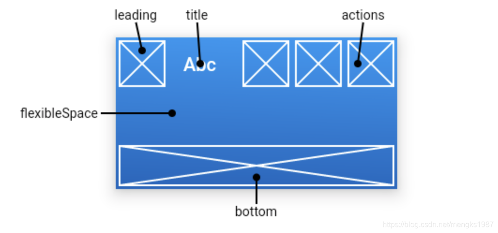

## AppBar

AppBar是material风格的应用程序栏，结构图如下：



`leading`属性通常设置返回按钮，用法如下：

```dart
Scaffold(
  appBar: AppBar(
    leading: BackButton(),
    title: Text('老孟'),
  ),
)
```

效果如下：


如果`leading`属性未设置，且Scaffold设置了Drawer则显示打开Drawer的图标，用法如下：

```dart
Scaffold(
  appBar: AppBar(
    title: Text('老孟'),
  ),
  drawer: Drawer(),
)
```

效果如下：


如果`leading`属性未设置，Scaffold也未设置Drawer，此时如果有前一个路由，则显示BackButton，设置如下：

```dart
@override
Widget build(BuildContext context) {
  return Scaffold(
    appBar: AppBar(
      title: Text('老孟'),
    ),
    body: Center(
      child: RaisedButton(
        onPressed: () {
          Navigator.push(context, MaterialPageRoute(builder: (context) {
            return Scaffold(
              appBar: AppBar(
                title: Text('老孟1'),
              ),
            );
          }));
        },
      ),
    ),
  );
}
```

效果如下：


通过`automaticallyImplyLeading`属性改变其行为，设置为false将不会自动设置控件，用法如下：

```dart
AppBar(
  automaticallyImplyLeading: false,
  ...
)
```

`title`属性是应用栏上的标题，一般设置Text文本，用法如下：

```dart
AppBar(
  title: Text('老孟'),
)
```

注意`title`不一定是居中的，在Android平台默认是靠左的，设置居中代码如下：

```dart
AppBar(
  title: Text('老孟'),
  centerTitle: true,
)
```

`actions`在程序栏的右边，可以设置多个功能按钮，用法如下：

```dart
Scaffold(
  appBar: AppBar(
    title: Text('老孟'),
    actions: <Widget>[
      IconButton(icon: Icon(Icons.menu),onPressed: (){},),
      IconButton(icon: Icon(Icons.add),onPressed: (){},)
    ],
  )
```

效果如下：


`flexibleSpace`属性在AppBar中一般用不到，此控件和AppBar的`height`保持一致，只有在改变AppBar的尺寸的时候才会出现效果，因此一般用在`SliverAppBar`中。

`bottom`属性通常请求下设置TabBar，用法如下：

```dart
Scaffold(
  appBar: AppBar(
    title: Text('老孟'),
    bottom:TabBar(
      tabs: <Widget>[
        Text('语文'),
        Text('数学'),
        Text('英语'),
        Text('体育'),
        Text('音乐'),
      ],
      controller: TabController(length: 5,vsync: this),
    )
  )
)
```

效果如下：


设置阴影、形状、背景颜色：

```dart
AppBar(
          elevation: 10,
          shape:
              RoundedRectangleBorder(borderRadius: BorderRadius.circular(20)),
          backgroundColor: Colors.red,
  )
```

效果如下：


设置icon样式及文字样式：

```dart
AppBar(
    iconTheme:IconThemeData(size: 24),
    actionsIconTheme: IconThemeData(size: 24),
    textTheme: TextTheme(title: TextStyle(color: Colors.red)),
    title: Text('老孟'),
  )
```

