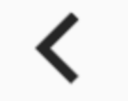

# BackButtonIcon

看名字你以为这是一个Button，其实是一个Icon，没有点击效果，具有点击效果的组件是[BackButton](http://laomengit.com/flutter/widgets/Button.html#backbutton)

用法如下：

```dart
BackButtonIcon()
```

此在不同平台上显示的效果不同，iOS效果如下：



android和fuchsia效果如下：


源代码实现也比较简单，如下：

```dart
/// Returns the appropriate "back" icon for the given `platform`.
static IconData _getIconData(TargetPlatform platform) {
  switch (platform) {
    case TargetPlatform.android:
    case TargetPlatform.fuchsia:
      return Icons.arrow_back;
    case TargetPlatform.iOS:
      return Icons.arrow_back_ios;
  }
  assert(false);
  return null;
}

@override
Widget build(BuildContext context) => Icon(_getIconData(Theme.of(context).platform));
```

