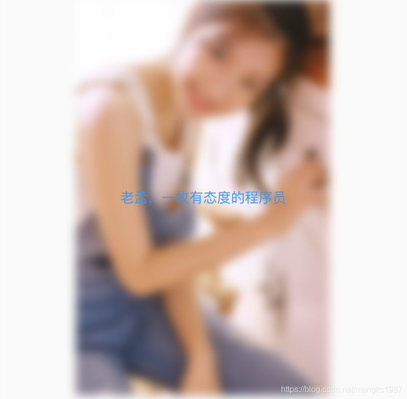

# BackdropFilter

使用BackdropFilter和ImageFilter可以将图片模糊处理。

基本用法如下：

```dart
Stack(
  alignment: Alignment.center,
  children: <Widget>[
    Container(
      width: 300,
      height: 400,
      child: Image.asset('images/1.png'),
    ),
    BackdropFilter(
      filter: ImageFilter.blur(sigmaX: 5.0,sigmaY: 5.0),
      child: Center(
        child: Container(
          color: Colors.red.withOpacity(0),
        ),
      ),
    )
  ],
)
```

效果如下：


BackdropFilter不仅可以模糊图片，还可以模糊任何组件，BackdropFilter只处理它下面的控件，`child`参数的组件不模糊处理，如果想在模糊图片的显示文字，只需修改如下：

```dart
BackdropFilter(
  filter: ImageFilter.blur(sigmaX: 5.0,sigmaY: 5.0),
  child: Center(
    child: Container(
      color: Colors.red.withOpacity(0),
      child: Text('老孟，一枚有态度的程序员',style: TextStyle(color: Colors.blue),),
    ),
  ),
)
```

效果如下：



