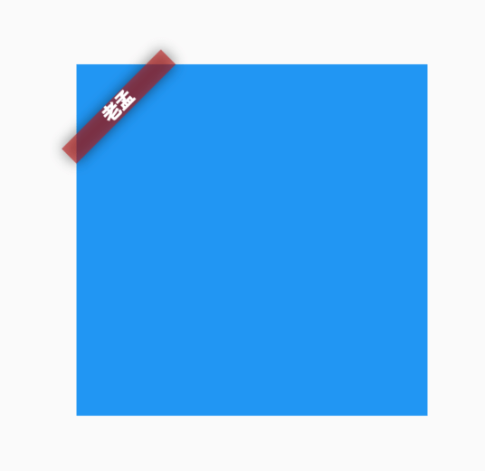
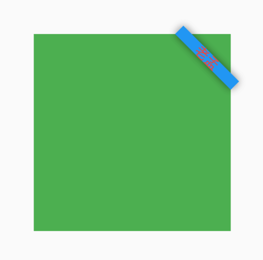

## Banner

在父组件的角上显示一个对角线的消息的控件，比如debug模式下，显示在App右上角的`DEBUG`就是此组件实现的。

用法如下：

```dart
Banner(
  message: '老孟',
  location: BannerLocation.topStart,
)
```

效果如下：



默认情况下Banner超出了父控件的范围，可以使用`ClipRect`截取超出的部分。

设置背景颜色、消息样式及位置：

```dart
Banner(
  message: '老孟',
  location: BannerLocation.topEnd,
  color: Colors.blue,
  textStyle: TextStyle(color: Colors.red),
)
```

效果如下：



设置`child`参数，child显示在消息后面：

```dart
Banner(
  message: '老孟',
  child: Container(color: Colors.yellow,),
  location: BannerLocation.topEnd,
)
```


## CheckedModeBanner

封装了`Banner`，`MaterialApp`使用此控件在右上角显示`DEBUG`标签，源代码如下：

```dart
@override
Widget build(BuildContext context) {
  Widget result = child;
  assert(() {
    result = Banner(
      child: result,
      message: 'DEBUG',
      textDirection: TextDirection.ltr,
      location: BannerLocation.topEnd,
    );
    return true;
  }());
  return result;
}
```

