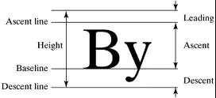
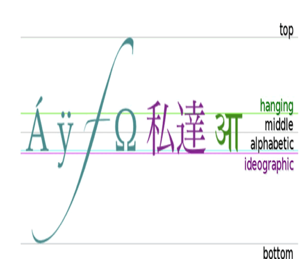
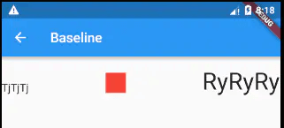

## Baseline

基准线布局，是指将所有的元素都统一的放在一条水平线上，是根据child的baseline，来调整child的位置，即在不同的child都处在规定的基准线位置，多用文字排版中的时候，就算是不同大小的文字处于同一水平线上，基本用法：

```dart
Baseline({
    Key key,
    @required this.baseline,
    @required this.baselineType,
    Widget child
})
```



属性说明:

- baseline    基准线位置，是以像素为基本的单位，从顶部算.
- baselineType    bseline类型，定位child的基准线类型，分为两种：

​           baselineType.alphabetic       对齐字符底部的水平线.

​           baselineType.ideographic     表意字符的水平线.



案例

```dart
Row(
  mainAxisAlignment: MainAxisAlignment.spaceBetween,
  children: <Widget>[
    Baseline(
      baseline: 50.0,
      baselineType: TextBaseline.alphabetic,
      child: Text(
        'TjTjTj',
        style: new TextStyle(
          fontSize: 20.0,
          textBaseline: TextBaseline.alphabetic,
        ),
      ),
    ),
    Baseline(
      baseline: 50.0,
      baselineType: TextBaseline.alphabetic,
      child: Container(
        width: 30.0,
        height: 30.0,
        color: Colors.red,
      ),
    ),
    Baseline(
      baseline: 50.0,
      baselineType: TextBaseline.alphabetic,
      child: Text(
        'RyRyRy',
        style: TextStyle(
          fontSize: 35.0,
          textBaseline: TextBaseline.alphabetic,
        ),
      ),
    ),
  ],
)
```


上述运行结果是左右两个文本跟中间的Container底部在一个水平线上，这也印证了Baseline的布局行为。

效果:




本文由[**Rock**]()提供。


