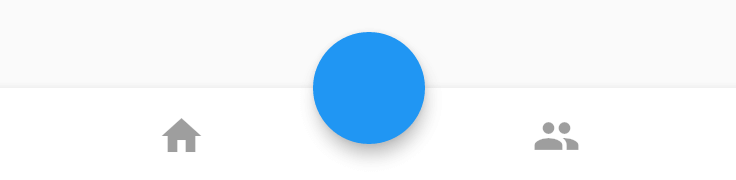
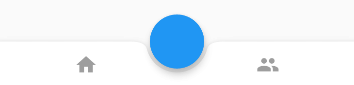
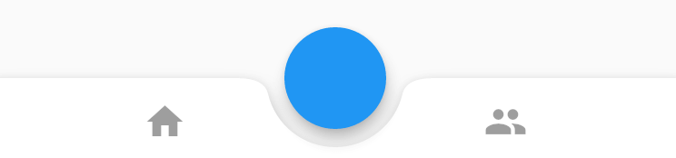
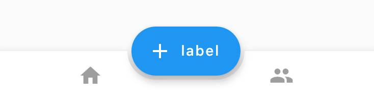
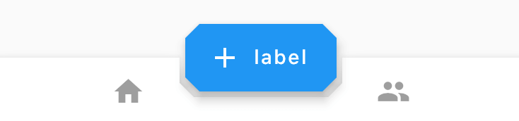
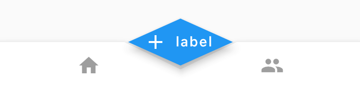

# BottomAppBar

BottomAppBar通常用于`Scaffold.bottomNavigationBar`，并且可以在其顶部留出一个缺口给`floatingActionButton`使用。

用法如下：

```dart
Scaffold(
        bottomNavigationBar: BottomAppBar(
          child: Row(
            mainAxisAlignment: MainAxisAlignment.spaceAround,
            children: <Widget>[
              IconButton(
                icon: Icon(Icons.home),
              ),
              IconButton(
                icon: Icon(Icons.people),
              )
            ],
          ),
        ),
        floatingActionButton: FloatingActionButton(),
        floatingActionButtonLocation: FloatingActionButtonLocation.centerDocked,
  )
```

效果如下：



`FloatingActionButton`是悬浮在BottomAppBar上面，并没有嵌入里面，嵌入里面用法如下：

```dart
BottomAppBar(
  shape: CircularNotchedRectangle(),
  ...
)
```

增加BottomAppBar的形状，效果如下：



`elevation`参数为阴影值：

```dart
BottomAppBar(
  elevation: 8.0,
  ...
)
```

`notchMargin`参数表示缺口外边距：

```dart
BottomAppBar(
  notchMargin: 10,
  ...
)
```

效果如下：



改变`FloatingActionButton`的形状为`足球场`形状，切嵌入的形状随之变化，代码如下：

```dart
Scaffold(
        bottomNavigationBar: BottomAppBar(
          shape: AutomaticNotchedShape(
              RoundedRectangleBorder(), StadiumBorder(side: BorderSide())),
          child: Row(
            mainAxisAlignment: MainAxisAlignment.spaceAround,
            children: <Widget>[
              IconButton(
                icon: Icon(Icons.home),
              ),
              IconButton(
                icon: Icon(Icons.people),
              )
            ],
          ),
        ),
        floatingActionButton: FloatingActionButton.extended(
          onPressed: () {},
          icon: new Icon(Icons.add),
          label: const Text("label"),
        ),
        floatingActionButtonLocation: FloatingActionButtonLocation.centerDocked,
      )
```

效果如下：



改为多边形：

```dart
Scaffold(
        bottomNavigationBar: BottomAppBar(
          shape: AutomaticNotchedShape(
              RoundedRectangleBorder(), BeveledRectangleBorder(borderRadius: BorderRadius.circular(10))),
          child: Row(
            mainAxisAlignment: MainAxisAlignment.spaceAround,
            children: <Widget>[
              IconButton(
                icon: Icon(Icons.home),
              ),
              IconButton(
                icon: Icon(Icons.people),
              )
            ],
          ),
        ),
        floatingActionButton: FloatingActionButton.extended(
          onPressed: () {},
          shape: BeveledRectangleBorder(borderRadius: BorderRadius.circular(10)),
          icon: new Icon(Icons.add),
          label: const Text("label"),
        ),
        floatingActionButtonLocation: FloatingActionButtonLocation.centerDocked,
      )
```

效果如下：



当然也可以改为棱形：

```dart
Scaffold(
        bottomNavigationBar: BottomAppBar(
          shape: AutomaticNotchedShape(
              RoundedRectangleBorder(), BeveledRectangleBorder(borderRadius: BorderRadius.circular(100))),
          ...
        floatingActionButton: FloatingActionButton.extended(
          onPressed: () {},
          shape: BeveledRectangleBorder(borderRadius: BorderRadius.circular(100)),
          icon: new Icon(Icons.add),
          label: const Text("label"),
        ),
        ...
      )
```

效果如下：



我们可以通过此控件定义任何我们想要的效果。

