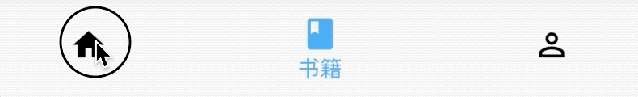
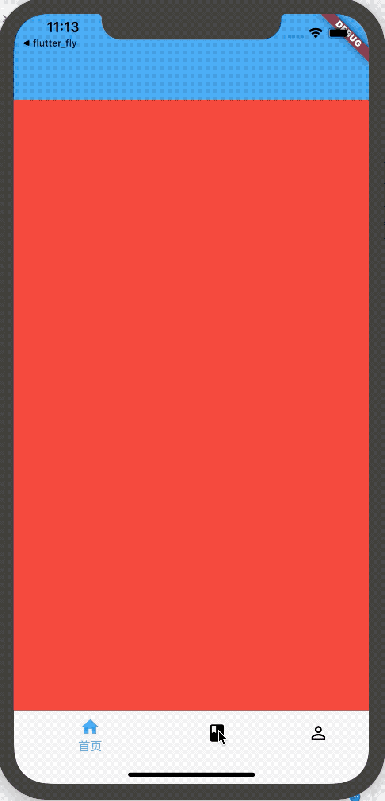

## BottomNavigationBar

BottomNavigationBar 和 BottomNavigationBarItem配合Scaffold控件使用可以实现底部导航效果，类似于微信底部的导航效果，下面是一个简单的底部导航案例：

```
Scaffold(
      bottomNavigationBar: BottomNavigationBar(
        items: <BottomNavigationBarItem>[
          BottomNavigationBarItem(title: Text('首页'),icon: Icon(Icons.home)),
          BottomNavigationBarItem(title: Text('书籍'),icon: Icon(Icons.book)),
          BottomNavigationBarItem(title: Text('我的'),icon: Icon(Icons.perm_identity)),
        ],
      ),
    );
```

效果：


点击其他2个item时没有反应，添加切换效果：
```
int _currentIndex = 0;
BottomNavigationBar(
	onTap: (int index) {
    	setState(() {
        	_currentIndex = index;
        });
    },
    currentIndex: _currentIndex,
	...
```

`currentIndex`代表当前显示导航的索引，当前切换时调用`onTap`，在`onTap`回调中调用`setState`方法改变_currentIndex的值达到切换的效果。

效果如下：


BottomNavigationBar有2种显示模式，其中一种是`fixed`效果，前面的展示就是`fixed`效果，这也是默认值，另一种是`shifting`效果，
```
BottomNavigationBar(
	type:BottomNavigationBarType.shifting,
    selectedItemColor: Theme.of(context).primaryColor,
    unselectedItemColor: Colors.black,
	...
}
```
设置`shifting`时需要设置`selectedItemColor`和	`unselectedItemColor`，效果如下：




我们还可以设置其背景颜色（`backgroundColor`）、图标大小（`iconSize`）、选中和未选中图标、字体的颜色，大小等。

## BottomNavigationBarItem

如果导航的图标是自己设计的图标，这时仅仅通过BottomNavigationBar是无法实现我们想要的效果的，比如微信的导航的效果，虽然选中和未选中也是颜色的区别，但图标不是Icons自带的图标，想要实现切换2个图标需要`BottomNavigationBarItem`控件的支持，其中的`icon`和`activeIcon`分别代表未选中和选中。

通过切换导航而改变页面是App中最常用的方式，开始构建页面的切换：
```
int _currentIndex = 0;

Widget _currBody = HomePage();

_onTap(int index) {
    switch (index) {
      case 0:
        _currBody = HomePage();;
        break;
      case 1:
        _currBody = BookPage();
        break;
      case 2:
        _currBody = MyPage();
        break;
    }
    setState(() {
      _currentIndex = index;
    });
  }

Scaffold(
      body: _currBody,
      bottomNavigationBar: BottomNavigationBar(
        onTap: _onTap,
        type: BottomNavigationBarType.shifting,
        selectedItemColor: Theme.of(context).primaryColor,
        unselectedItemColor: Colors.black,
        currentIndex: _currentIndex,
        items: <BottomNavigationBarItem>[
          BottomNavigationBarItem(title: Text('首页'), icon: Icon(Icons.home)),
          BottomNavigationBarItem(title: Text('书籍'), icon: Icon(Icons.book)),
          BottomNavigationBarItem(
              title: Text('我的'), icon: Icon(Icons.perm_identity)),
        ],
      ),
    );

```
Scaffold控件的`body`表示导航上面，AppBar下面的页面，`HomePage `,`BookPage `,`MyPage `对应3个导航的页面，背景分别是红、蓝、黄色，效果如下：




