# Button

Flutter内置了10多种Button（按钮）类控件供我们使用，了解这些控件有助于提高我们的开发速度。

## RaisedButton

RaisedButton是一个material风格”凸起“的按钮，基本用法：

```dart
RaisedButton(
  child: Text('Button'),
  onPressed: (){
  },
)
```

效果：


`onPressed`为null或不设置时，按钮是禁用状态。

`onHighlightChanged`为高亮变化回调，按下时处于高亮状态，抬起处于不高亮状态，用法如下：

```dart
RaisedButton(
  onHighlightChanged: (high){
  },
  ...
)
```

按钮可以设置字体及各种状态颜色，总结如下：

| 属性              | 说明                               |
| ----------------- | ---------------------------------- |
| textColor         | 字体颜色                           |
| disabledTextColor | 禁用状态下字体颜色                 |
| color             | 背景颜色                           |
| disabledColor     | 禁用状态下背景颜色                 |
| highlightColor    | 高亮颜色，按下时的颜色             |
| splashColor       | 水波纹颜色，按下松开会有水波纹效果 |

以textColor为例，用法如下：

```dart
RaisedButton(
  textColor: Colors.red,
  ...
)
```

也可以通过textTheme设置字体样式，用法如下：

```dart
RaisedButton(
  textTheme: ButtonTextTheme.primary,
  ...
)
```

ButtonTextTheme的值介绍如下：

- normal：黑色或者白色字体，依赖于`ThemeData.brightness`
- accent：字体颜色依赖于`ThemeData.accentColor`
- primary ：字体颜色依赖于`ThemeData.primaryColor`

这3个值在MaterialApp控件中进行全局设置，设置如下：

```dart
MaterialApp(
  title: 'Flutter Demo',
  theme: ThemeData(
    primaryColor: Color(0xFF42A5F5),
    accentColor: Colors.yellow,
    brightness: Brightness.light
  ),
  ...
)
```

设置按钮阴影、高亮阴影、禁用阴影，用法如下：

```dart
RaisedButton(
  elevation: 5.0,
  highlightElevation: 5.0,
  disabledElevation: 5.0,
  ...
)
```

`shape`设置按钮的形状，比如设置为圆形，代码如下：

```dart
RaisedButton(
  shape: CircleBorder(),
  ...
)
```

效果如下：

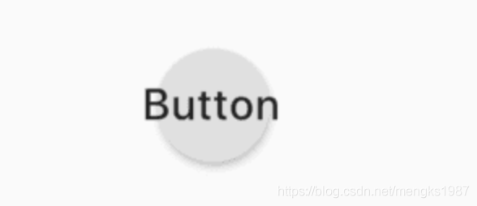


和`hover`相关的属性是指鼠标悬停时的状态，移动端没有效果，`focus`相关的属性为获取焦点时的状态。


## FlatButton

FlatButton是一个扁平的按钮，用法和RaisedButton一样，代码如下：

```dart
FlatButton(
  child: Text('Button'),
  color: Colors.blue,
  onPressed: () {},
)
```

效果如下：


 

## OutlineButton

OutlineButton 是一个带边框的按钮，用法和RaisedButton一样，代码如下：

```dart
OutlineButton(
  child: Text('Button'),
  onPressed: () {},
)
```

效果如下：


设置其边框样式，代码如下：

```dart
OutlineButton(
  borderSide: BorderSide(color: Colors.blue,width: 2),
  disabledBorderColor: Colors.black,
  highlightedBorderColor: Colors.red,
  child: Text('Button'),
  onPressed: () {},
)
```

效果如下：
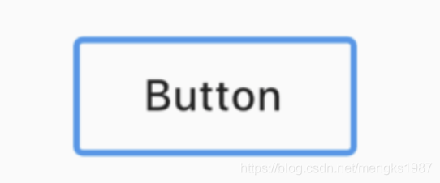


## DropdownButton

DropdownButton为下拉选择按钮，基本用法如下：

```dart
var _dropValue = '语文';

_buildButton() {
  return DropdownButton(
    value: _dropValue,
    items: [
      DropdownMenuItem(child: Text('语文'),value: '语文',),
      DropdownMenuItem(child: Text('数学'),value: '数学'),
      DropdownMenuItem(child: Text('英语'),value: '英语'),
    ],
    onChanged: (value){
      setState(() {
        _dropValue = value;
      });
    },
  );
}
```

`items`是点击时弹出选项，`onChanged`选项发生变化时回调。效果如下：

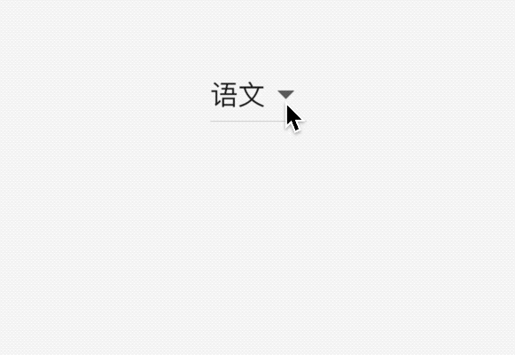


如果你对选中的选项的样式不满意，可以自定义，用法如下：

```dart
DropdownButton(
  selectedItemBuilder: (context){
    return [
      Text('语文',style: TextStyle(color: Colors.red),),
      Text('数学',style: TextStyle(color: Colors.red),),
      Text('英语',style: TextStyle(color: Colors.red),)
    ];
  },
  ...
)
```

selectedItemBuilder返回的组件要和`items`中一一对应，选中样式如下：

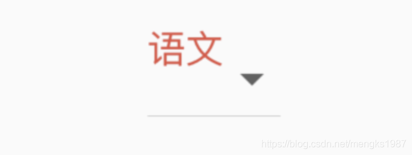


当用户未选中时，即value 为null，显示''请选中"，用法如下：

```dart
DropdownButton(
  hint: Text('请选择'),
  value: null,
  ...
)
```

效果如下：

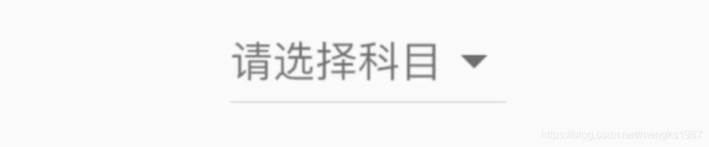

默认情况下，下拉选项的图标是倒立的三角，也可以进行自定义，用法如下：

```dart
DropdownButton(
  icon: Icon(Icons.add),
  iconSize: 24,
  iconDisabledColor: Colors.red,
  iconEnabledColor: Colors.red,
  ...
)
```

效果如下：

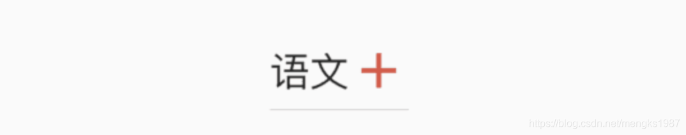


## RawMaterialButton

RawMaterialButton是基于`Semantics`, `Material`和`InkWell`创建的组件，它不使用当前的系统主题和按钮主题，用于自定义按钮或者合并现有的样式，而RaisedButton和FlatButton都是基于RawMaterialButton配置了系统主题和按钮主题，相关属性可以参考RaisedButton，参数基本一样，基本用法如下：

```dart
RawMaterialButton(
  onPressed: (){},
  fillColor: Colors.blue,
  child: Text('Button'),
)
```

效果如下：


## PopupMenuButton

PopupMenuButton是一个菜单选中控件，用法如下：

```dart
PopupMenuButton<String>(
  itemBuilder: (context) {
    return <PopupMenuEntry<String>>[
      PopupMenuItem<String>(
        value: '语文',
        child: Text('语文'),
      ),
      PopupMenuItem<String>(
        value: '数学',
        child: Text('数学'),
      ),
      PopupMenuItem<String>(
        value: '英语',
        child: Text('英语'),
      ),
      PopupMenuItem<String>(
        value: '生物',
        child: Text('生物'),
      ),
      PopupMenuItem<String>(
        value: '化学',
        child: Text('化学'),
      ),
    ];
  },
)
```

效果如下：

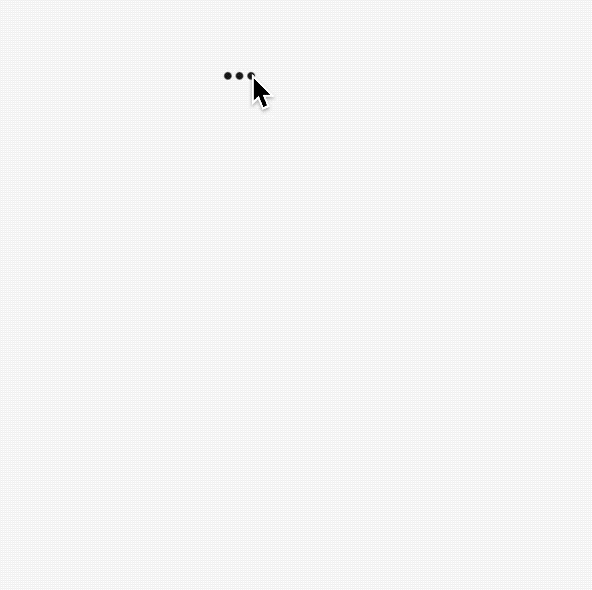

设置其初始值：

```dart
PopupMenuButton<String>(
  initialValue: '语文',
  ...
)
```

设置初始值后，打开菜单后，设置的值将会高亮，效果如下：

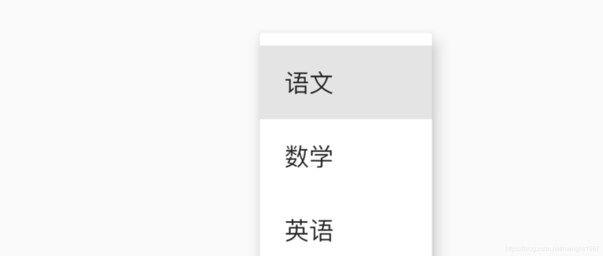

获取用户选择了某一项的值，或者用户未选中，代码如下：

```dart
PopupMenuButton<String>(
  onSelected: (value){
    print('$value');
  },
  onCanceled: (){
    print('onCanceled');
  },
  ...
)
```

`tooltip`是长按时弹出的提示，用法如下：

```
PopupMenuButton<String>(
  tooltip: 'PopupMenuButton',
  ...
)
```

效果如下：


设置其阴影值、内边距和弹出菜单的背景颜色：

```dart
PopupMenuButton<String>(
  elevation: 5,
  padding: EdgeInsets.all(5),
  color: Colors.red,
  ...
)
```

默认情况下，PopupMenuButton显示3个小圆点，我们也可以对齐进行设置，设置文字如下：

```dart
PopupMenuButton<String>(
  child: Text('学科'),
  ...
)
```

`child`组件将会被InkWell包裹，点击弹出菜单，效果如下：

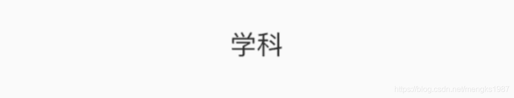

也可以设置其他图标：

```dart
PopupMenuButton<String>(
	icon: Icon(Icons.add),
	...
)
```

效果如下：


设置弹出菜单边框：

```dart
PopupMenuButton<String>(
  shape: RoundedRectangleBorder(
    side: BorderSide(
      color: Colors.red
    ),
    borderRadius: BorderRadius.circular(10)
  ),
	...
)
```

效果如下：

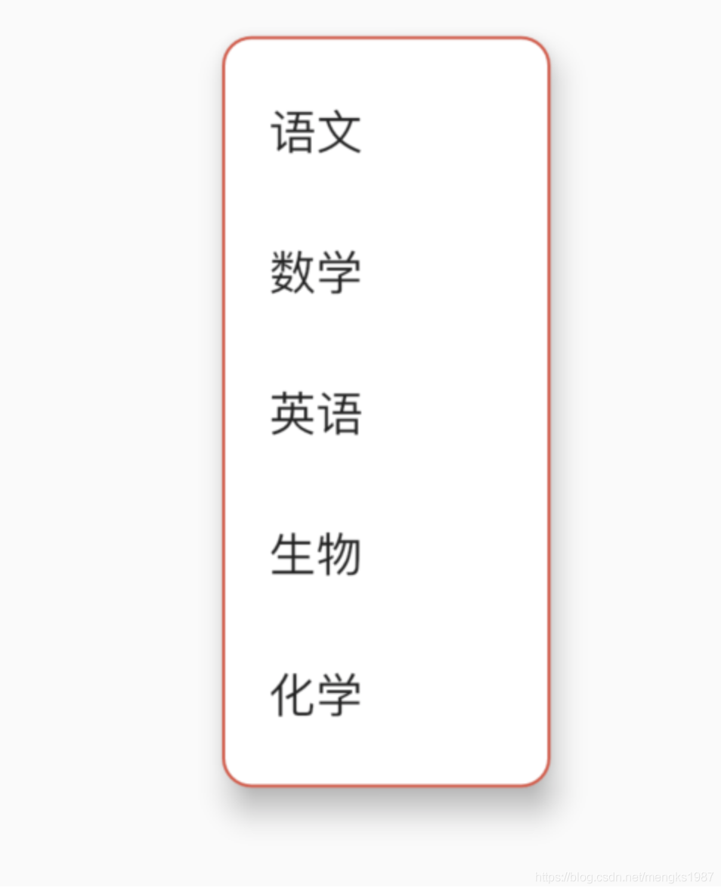


## IconButton

IconButton是一个图标按钮，用法如下：

```dart
IconButton(
  icon: Icon(Icons.person),
  iconSize: 30,
  color: Colors.red,
  onPressed: () {},
)
```

设置提示属性：

```dart
IconButton(
  tooltip: '这是一个图标按钮',
  icon: Icon(Icons.person),
  iconSize: 30,
  color: Colors.red,
  onPressed: () {},
)
```

当长按时显示提示，效果如下：


## BackButton

BackButton是一个material风格的返回按钮，本身是一个IconButton，点击时默认执行`Navigator.maybePop`即如果路由栈有上一页则返回到上一页。

```dart
BackButton()
```

Android和IOS平台显示的图标是不一样的，ios效果如下：


Android效果如下：


## CloseButton

CloseButton是一个material风格的关闭按钮，本身是一个IconButton，点击时默认执行`Navigator.maybePop`即如果路由栈有上一页则返回到上一页。

和BackButton适用场景不同，BackButton适用于全屏的页面，而CloseButton适用于弹出的Dialog。

用法如下：

```dart
CloseButton()
```

效果如下：


## ButtonBar

ButtonBar并不是一个单独的按钮控件，而是末端对齐的容器类控件，当在水平方向上没有足够空间时候，按钮将整体垂直排列，而不是换行。基本用法如下：

```dart
ButtonBar(
  children: <Widget>[
    RaisedButton(),
    RaisedButton(),
    RaisedButton(),
    RaisedButton(),
  ],
)
```

效果如下：

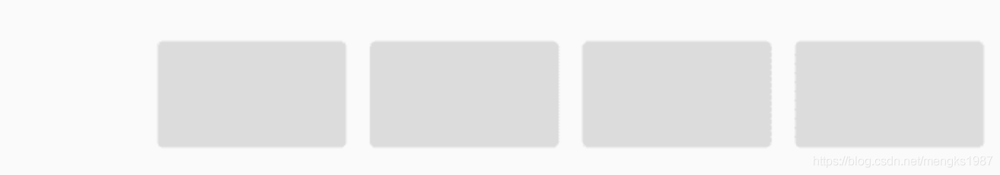

设置主轴的对齐方式及主轴的尺寸：

```dart
ButtonBar(
  alignment: MainAxisAlignment.center,
  mainAxisSize: MainAxisSize.max,
  ...
)
```

效果如下：


## CupertinoButton

CupertinoButton ios风格的按钮，基本用法如下：

```dart
CupertinoButton(
  child: Text('ios 风格按钮'),
  onPressed: (){},
)
```

效果如下：

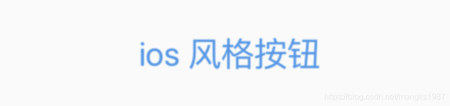


设置背景色及按下时透明度：

```dart
CupertinoButton(
  child: Text('ios 风格按钮'),
  onPressed: (){},
  color: Colors.blue,
  pressedOpacity: .5,
)
```

效果如下：

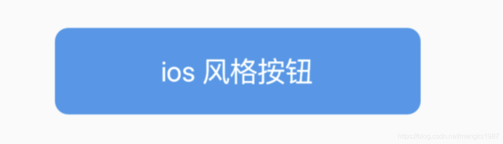

设置圆角半径：

```dart
CupertinoButton(
  borderRadius: BorderRadius.circular(40),
  ...
)
```

效果如下：


