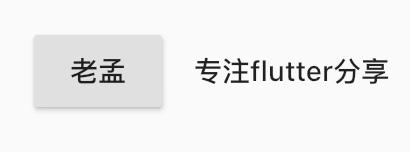
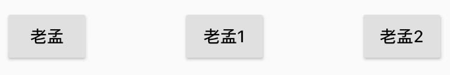

# ButtonBarTheme

继承关系 
Object> DiagnosticableTree> Widget> ProxyWidget> InheritedWidget> ButtonBarTheme

# 构造函数

```
const ButtonBarTheme({
  Key key,
  @required this.data,
  Widget child,
}) : assert(data != null), super(key: key, child: child);
```

- key 组件的唯一标示。
- data 主题的数据来源ButtonBarThemeData，详细的配置信息。
- child 通常ButtonBar组件，默认继承ButtonBarThemeData的配置，设置局部主题时使用。


ButtonBarTheme通常用于ButtonBar的主题使用，它有一套默认主题，在你没有做变更的前提下，作为ThemeData构造函数的参数，你可以轻松做到全局改主题样式。

配置全局样式在中设置：

```
MaterialApp(
  theme: ThemeData(
      buttonBarTheme:
          ButtonBarThemeData(buttonTextTheme: ButtonTextTheme.normal)),
  ...
)
```

使用ButtonBar时采用此主题：

```dart
ButtonBar(
  children: <Widget>[
    RaisedButton(child: Text('老孟'),onPressed: (){

    },),
    FlatButton(child: Text('专注flutter分享'),onPressed: (){

    },)
  ],
)
```



局部用法，主题和全局主题不一致，用法如下：

```dart
ButtonBarTheme(
  data: ButtonBarThemeData(buttonTextTheme: ButtonTextTheme.accent),
  child: ButtonBar(
    children: <Widget>[
      FlatButton(
        onPressed: () {},
        child: Text("局部用法测试"),
      )
    ],
  ),
)
```


## ButtonBarThemeData

ButtonBarThemeData 是ButtonBarTheme样式属性，属性如下：

```dart
const ButtonBarThemeData({
  this.alignment,//主轴对其方式，具体可查看MainAxisAlignment
  this.mainAxisSize,//主轴方向尺寸，min：尽可能小，max：尽可能大
  this.buttonTextTheme,//按钮文本样式
  this.buttonMinWidth,//按钮最小宽度
  this.buttonHeight,//按钮高度
  this.buttonPadding,//按钮内边距
  this.buttonAlignedDropdown,//当DropdownButton内包含ButtonBar时，true表示DropdownButton宽度和ButtonBar匹配
  this.layoutBehavior,//按钮高度，constrained：最小高度52，padded：根据按钮主题计算
  this.overflowDirection, //按钮一行放不开时，垂直方向布局方式，up：开始位置对其， down：结束位置对其
})
```

用法如下：

```dart
ButtonBarTheme(
  data: ButtonBarThemeData(
      alignment: MainAxisAlignment.spaceBetween,
      mainAxisSize: MainAxisSize.max),
  child: ButtonBar(
    children: <Widget>[
      RaisedButton(
        onPressed: () {},
        child: Text("老孟"),
      ),
      RaisedButton(
        onPressed: () {},
        child: Text("老孟1"),
      ),
      RaisedButton(
        onPressed: () {},
        child: Text("老孟2"),
      ),
    ],
  ),
)
```




# 总结
ButtonBarTheme 是一个InheritedWidget组件，它可以高效的将数据在Widget树中向下传递、共享，所有才有了全局主题和局部主题的用法。


本文由[ **i校长**](https://www.jianshu.com/u/77699cd41b28)提供。