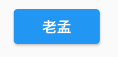

# ButtonTheme

用于控制**Button**类控件的样式。

`textTheme`表示按钮文本的样式：

- `ButtonTextTheme.normal`：按钮文本的颜色是黑色或者白色，依赖于`ThemeData.brightness`
- `ButtonTextTheme.accent`：按钮文本的颜色是`ThemeData.accentColor`
- `ButtonTextTheme.primary`：按钮文本的颜色是`ThemeData.primaryColor`

```dart
ButtonTheme(
  textTheme: ButtonTextTheme.primary,
  child: RaisedButton(
    child: Text('老孟'),
    onPressed: () {},
  ),
)
```




`layoutBehavior`：控制控件尺寸

-  constrained：高最小52
-  padded：根据样式样式计算内边距


`minWidth`：最小宽度

`height`：高度

`padding`：内边距

`shape`：形状，所有形状查看[ShapeBorder](http://laomengit.com/flutter/widgets/ShapeBorder.html)

`buttonColor`：按钮颜色

`disabledColor`：禁用状态下颜色

`focusColor`：获取焦点颜色

`hoverColor`：鼠标悬浮其上时的颜色

`highlightColor`：高亮颜色

`splashColor`：水波纹颜色

`materialTapTargetSize`：配置组件点击区域大小，具体查看[MaterialTapTargetSize](http://laomengit.com/flutter/widgets/MaterialTapTargetSize.html)

