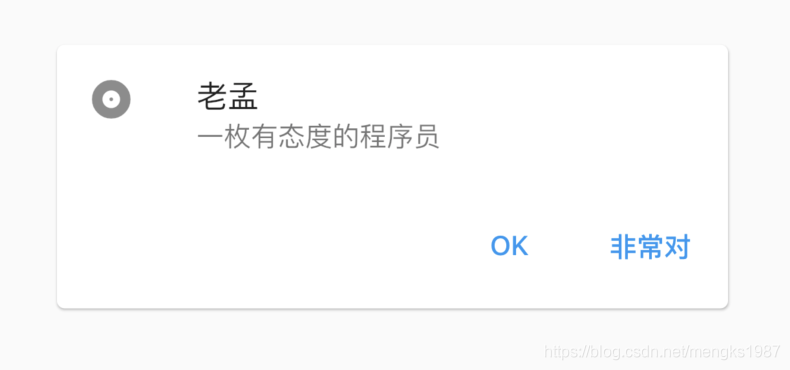
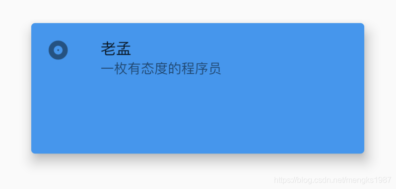
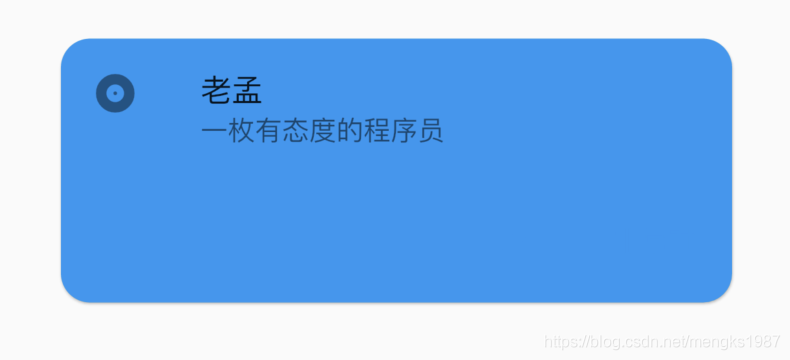

# Card

Card是material风格的卡片控件，Card有较小的圆角和阴影。Card通常用于展示一组信息，比如相册、位置信息等。

基本用法如下：

```dart
Card(
  child: Column(
    mainAxisSize: MainAxisSize.min,
    children: <Widget>[
      const ListTile(
        leading: Icon(Icons.album),
        title: Text('老孟'),
        subtitle: Text('一枚有态度的程序员'),
      ),
      ButtonBar(
        children: <Widget>[
          FlatButton(
            child: const Text('OK'),
            onPressed: () {

            },
          ),
          FlatButton(
            child: const Text('非常对'),
            onPressed: () {

            },
          ),
        ],
      ),
    ],
  ),
)
```

子控件可以是任何Widget，效果如下：



设置其背景颜色及阴影值：

```dart
Card(
  color: Colors.blue,
  elevation: 10,
  ...
)
```

效果如下：



设置控件的形状为圆角矩形：

```dart
Card(
  shape: RoundedRectangleBorder(borderRadius: BorderRadius.circular(15)),
  ...
)
```

效果如下：



