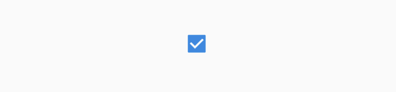
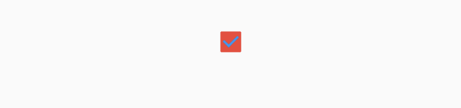
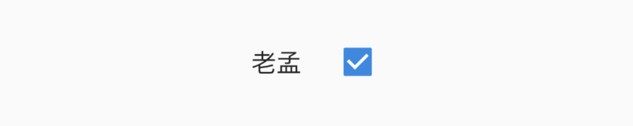
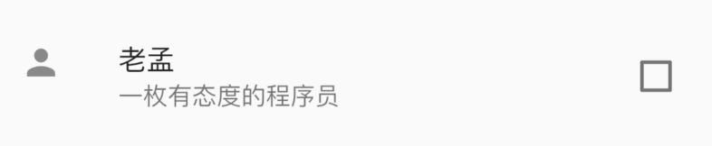

## Checkbox

Checkbox是勾选框控件，本身不包含任何状态，改变状态需要通过改变value的值改变。基本用法如下：

```dart
var _checkValue = false;
_buildCheckbox(){
  return Checkbox(
    value: _checkValue,
    onChanged: (value){
      setState(() {
        _checkValue = value;
      });
    },
  );
}
```

效果如下：



`value`值为bool类型，true表示选择状态。

`onChanged`为发生变化时回调，即点击控件时回调，方法内的参数为新的值。

`activeColor`为激活状态下颜色，是矩形区域内的颜色，`checkColor`是选中后“对勾”的颜色，用法如下：

```dart
Checkbox(
  activeColor: Colors.red,
  checkColor: Colors.blue,
  ...
)
```

效果如下：




## CheckboxListTile

通常情况下，我们不直接使用Checkbox，而是使用CheckboxListTile，因为我们需要Checkbox后面添加说明，用法如下：

```dart
Container(
  width: 120,
  child: CheckboxListTile(
    title: Text('老孟'),
    value: _checkValue,
    onChanged: (value){
      setState(() {
        _checkValue = value;
      });
    },
  ),
)
```

CheckboxListTile默认是充满父组件的，因此需要Container限制其宽度，效果如下：



一般的习惯是将勾选框放在前面，用法如下：

```dart
CheckboxListTile(
  controlAffinity: ListTileControlAffinity.leading,
  ...
)
```

ListTileControlAffinity取值范围说明如下：

- leading：勾选框在开头位置。
- trailing：勾选框在结尾位置，
- platform：根据平台确定

还可以设置其子标题和第二图标，用法如下：

```dart
CheckboxListTile(
  subtitle: Text('一枚有态度的程序员'),
  secondary: Icon(Icons.person),
  ...
)
```

`secondary`一般放置一个图标，位于勾选框的另一边。效果如下：



`selected`参数设置true，`secondary`、`title`和`subtitle`都会被渲染为`activeColor`的颜色。


