# Chip

## RawChip

Material风格标签控件，此控件是其他标签控件的基类，通常情况下，不会直接创建此控件，而是使用如下控件：

-  Chip
-  InputChip
-  ChoiceChip
-  FilterChip
-  ActionChip

如果你想自定义标签类控件时通常使用此控件。

RawChip可以通过设置`onSelected`被选中，设置`onDeleted`被删除，也可以通过设置`onPressed`而像一个按钮，它有一个`label`属性，有一个前置（`avatar`）和后置图标（`deleteIcon`）。

基本用法如下：

```dart
RawChip(
  label: Text('老孟'),
)
```

效果如下：

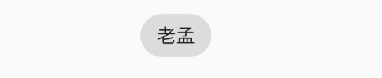

禁用状态设置：

```dart
RawChip(
  label: Text('老孟'),
  isEnabled: false,
)
```

效果如下：

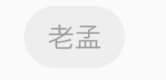

设置左侧控件，一般是图标：

```dart
RawChip(
  avatar: CircleAvatar(
    child: Text('孟'),
  ),
  label: Text('老孟'),
)
```

效果如下：

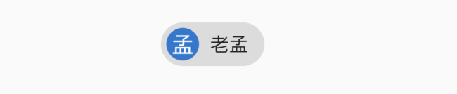


设置label的样式和内边距：

```dart
RawChip(
  label: Text('老孟'),
  labelStyle: TextStyle(color: Colors.blue),
  labelPadding: EdgeInsets.symmetric(horizontal: 10),
)
```

效果如下：

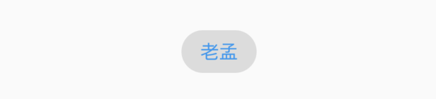

设置删除相关属性：

```dart
RawChip(
  label: Text('老孟'),
  onDeleted: (){
    print('onDeleted');
  },
  deleteIcon: Icon(Icons.delete),
  deleteIconColor: Colors.red,
  deleteButtonTooltipMessage: '删除',
)
```

效果如下：

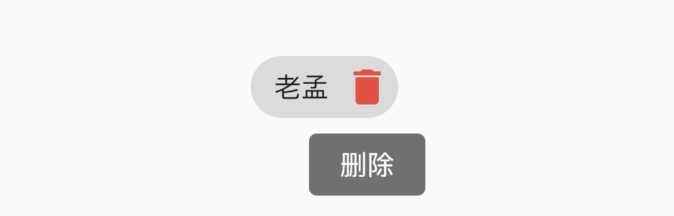

点击删除图标，回调`onDeleted`。

设置形状、背景颜色及内边距：

```dart
RawChip(
  label: Text('老孟'),
  shape: RoundedRectangleBorder(borderRadius: BorderRadius.circular(10)),
  backgroundColor: Colors.blue,
  padding: EdgeInsets.symmetric(vertical: 10),
)
```

效果如下：

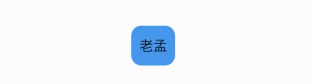

设置阴影：

```dart
RawChip(
  label: Text('老孟'),
  elevation: 8,
  shadowColor: Colors.blue,
)
```

效果如下：

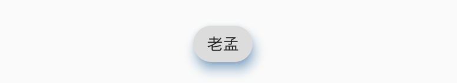

`materialTapTargetSize`属性控制最小点击区域，详情查看：[MaterialTapTargetSize](http://laomengit.com/flutter/widgets/MaterialTapTargetSize.html)


设置选中状态、颜色：

```dart
bool _selected = false;
RawChip(
  label: Text('老孟'),
  selected: _selected,
  onSelected: (v){
    setState(() {
      _selected = v;
    });
  },
  selectedColor: Colors.blue,
  selectedShadowColor: Colors.red,
)
```

效果如下：

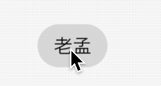

设置选中状态下“前置对勾”图标：

```dart
RawChip(
  label: Text('老孟'),
  selected: true,
  showCheckmark: true,
  checkmarkColor: Colors.red,
)
```

效果如下：

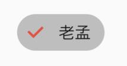

`showCheckmark`为false时，无“前置对勾”图标。

设置点击属性：

```dart
RawChip(
  label: Text('老孟'),
  onPressed: (){
    print('onPressed');
  },
  pressElevation: 12,
)
```

效果如下：

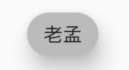

点击时有水波纹效果。


## Chip

Chip是一个简单的标签控件，仅显示信息和`删除`相关属性，是一个简化版的RawChip，用法和RawChip一样。源代码如下：

```dart
@override
Widget build(BuildContext context) {
  assert(debugCheckHasMaterial(context));
  return RawChip(
    avatar: avatar,
    label: label,
    labelStyle: labelStyle,
    labelPadding: labelPadding,
    deleteIcon: deleteIcon,
    onDeleted: onDeleted,
    deleteIconColor: deleteIconColor,
    deleteButtonTooltipMessage: deleteButtonTooltipMessage,
    tapEnabled: false,
    shape: shape,
    clipBehavior: clipBehavior,
    focusNode: focusNode,
    autofocus: autofocus,
    backgroundColor: backgroundColor,
    padding: padding,
    materialTapTargetSize: materialTapTargetSize,
    elevation: elevation,
    shadowColor: shadowColor,
    isEnabled: true,
  );
}
```


## InputChip

以紧凑的形式表示一条复杂的信息，例如实体（人，地方或事物）或对话文本。

InputChip 本质上也是RawChip，用法和RawChip一样。源代码如下：

```dart
@override
Widget build(BuildContext context) {
  assert(debugCheckHasMaterial(context));
  return RawChip(
    avatar: avatar,
    label: label,
    labelStyle: labelStyle,
    labelPadding: labelPadding,
    deleteIcon: deleteIcon,
    onDeleted: onDeleted,
    deleteIconColor: deleteIconColor,
    deleteButtonTooltipMessage: deleteButtonTooltipMessage,
    onSelected: onSelected,
    onPressed: onPressed,
    pressElevation: pressElevation,
    selected: selected,
    tapEnabled: true,
    disabledColor: disabledColor,
    selectedColor: selectedColor,
    tooltip: tooltip,
    shape: shape,
    clipBehavior: clipBehavior,
    focusNode: focusNode,
    autofocus: autofocus,
    backgroundColor: backgroundColor,
    padding: padding,
    materialTapTargetSize: materialTapTargetSize,
    elevation: elevation,
    shadowColor: shadowColor,
    selectedShadowColor: selectedShadowColor,
    showCheckmark: showCheckmark,
    checkmarkColor: checkmarkColor,
    isEnabled: isEnabled && (onSelected != null || onDeleted != null || onPressed != null),
    avatarBorder: avatarBorder,
  );
}
```


## ChoiceChip

允许从一组选项中进行单个选择，创建一个类似于单选按钮的标签，本质上ChoiceChip也是一个RawChip，ChoiceChip本身不具备单选属性。

单选demo如下：

```dart
int _selectIndex = 0;
Wrap(
  spacing: 15,
  children: List.generate(10, (index) {
    return ChoiceChip(
      label: Text('老孟 $index'),
      selected: _selectIndex == index,
      onSelected: (v) {
        setState(() {
          _selectIndex = index;
        });
      },
    );
  }).toList(),
)
```

效果如下：

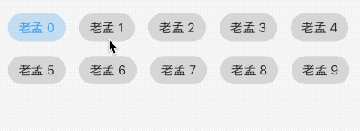


本控件由[普通程序员](https://juejin.im/user/5e2741925188254baf6c4cb1)提供。


## FilterChip

FilterChip可以作为过滤标签，本质上也是一个RawChip，用法如下：

```dart
List<String> _filters = [];

Column(
  children: <Widget>[
    Wrap(
      spacing: 15,
      children: List.generate(10, (index) {
        return FilterChip(
          label: Text('老孟 $index'),
          selected: _filters.contains('$index'),
          onSelected: (v) {
            setState(() {
              if(v){
                _filters.add('$index');
              }else{
                _filters.removeWhere((f){
                  return f == '$index';
                });
              }
            });
          },
        );
      }).toList(),
    ),
    Text('选中：${_filters.join(',')}'),
  ],
)
```

效果如下：

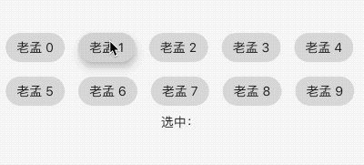

## ActionChip

显示与主要内容有关的一组动作，本质上也是一个RawChip，用法如下：

```dart
ActionChip(
    avatar: CircleAvatar(
      backgroundColor: Colors.grey.shade800,
      child: Text('孟'),
    ),
    label: Text('老孟'),
    onPressed: () {
      print("onPressed");
    })
```

效果如下：

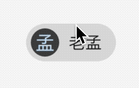

效果很像按钮类控件。