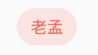

# ChipTheme

用于**Chip**类组件样式，比如`Chip`、`InputChip`、`ChoiceChip`、`FilterChip`、`ActionChip`等。

用法如下：

```dart
ChipTheme(
  data: ChipThemeData.fromDefaults(
      primaryColor: Colors.red,
      secondaryColor: Colors.blue,
      labelStyle: TextStyle()),
  child: RawChip(
    label: Text('老孟'),
  ),
)
```




## ChipThemeData

ChipTheme 中就是设置ChipThemeData的各种属性，查看其构造函数：

```dart
const ChipThemeData({
  @required this.backgroundColor, //背景颜色
  this.deleteIconColor, //删除图标颜色
  @required this.disabledColor,// 禁用背景颜色
  @required this.selectedColor,//选中颜色
  @required this.secondarySelectedColor,
  this.shadowColor,//阴影颜色
  this.selectedShadowColor,//选中阴影颜色
  this.showCheckmark,//是否显示“前置对勾”图标
  this.checkmarkColor,//“前置对勾”图标颜色
  @required this.labelPadding,//label内边距
  @required this.padding,//内边距
  @required this.shape,//形状
  @required this.labelStyle,//label文本样式
  @required this.secondaryLabelStyle,
  @required this.brightness,//主题的亮度
  this.elevation,//阴影值
  this.pressElevation,//按压时的阴影值
}) 
```

这些属性看起名字就知道其作用了。