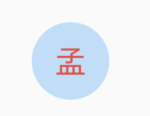

# CircleAvatar

代表用户的圆圈的控件，通常与用户的个人资料图片一起使用，或者在没有此类图片的情况下与用户的姓名缩写一起使用。 为了保持一致，给定用户的姓名缩写应始终与相同的背景色配对。


用法如下：

```dart
CircleAvatar(
  child: Text('孟'),
)
```

效果如下：


设置背景颜色：

```dart
CircleAvatar(
  child: Text('孟'),
  backgroundColor: Colors.blue,
)
```

效果如下：


设置文字颜色：

```dart
CircleAvatar(
  child: Text('孟'),
  foregroundColor: Colors.red,
)
```

效果如下：



设置背景图片：

```dart
CircleAvatar(
  child: Text('孟'),
  backgroundImage: AssetImage('images/1.png'),
)
```

效果如下：


设置半径：

```dart
CircleAvatar(
  child: Text('孟'),
  radius: 40,
)
```

效果如下：

