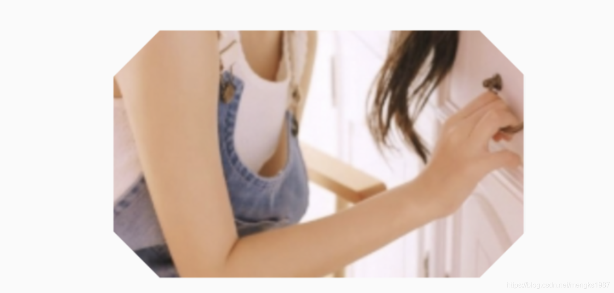
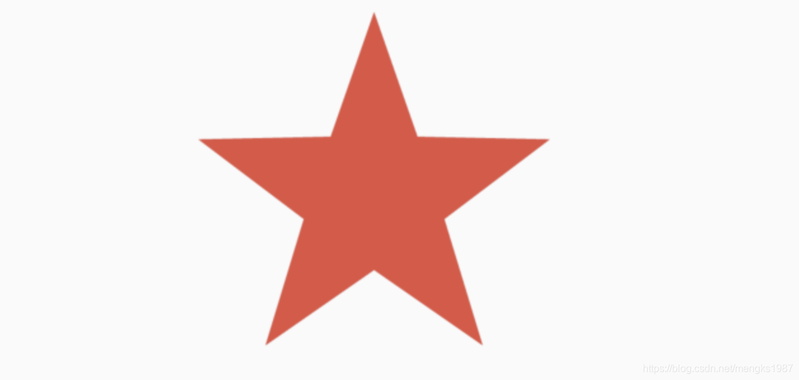

## ClipRect

ClipRect组件使用矩形裁剪子组件，通常情况下，ClipRect作用于`CustomPaint` 、 `CustomSingleChildLayout` 、 `CustomMultiChildLayout` 、 `Align` 、 `Center` 、 `OverflowBox` 、 `SizedOverflowBox`组件，例如ClipRect作用于Align，可以仅显示上半部分，代码如下：

```dart
ClipRect(
  child: Align(
    alignment: Alignment.topCenter,
    heightFactor: 0.5,
    child: Container(
      height: 150,
      width: 150,
      child: Image.asset(
        'images/1.png',
        fit: BoxFit.cover,
      ),
    ),
  ),
)
```

全图效果：


裁剪效果：


`clipper`参数定义裁剪规则，下面具体介绍。

`clipBehavior`参数定义了裁剪的方式，只有子控件超出父控件的范围才有裁剪的说法，各个方式说明如下：

-  none：不裁剪，系统默认值，如果子组件不超出边界，此值没有任何性能消耗。
-  hardEdge：裁剪但不应用抗锯齿，速度比`none`慢一点，但比其他方式快。
-  antiAlias：裁剪而且抗锯齿，此方式看起来更平滑，比`antiAliasWithSaveLayer`快，比`hardEdge`慢，通常用于处理圆形和弧形裁剪。
-  antiAliasWithSaveLayer：裁剪、抗锯齿而且有一个缓冲区，此方式很慢，用到的情况比较少。


## ClipRRect

ClipRRect组件可以对子组件进行圆角裁剪，默认圆角半径为0，注意ClipRRect有2个R，不是上面介绍的ClipRect。

用法如下：

```dart
ClipRRect(
  borderRadius: BorderRadius.circular(20),
  child: Container(
    height: 150,
    width: 150,
    child: Image.asset(
      'images/1.png',
      fit: BoxFit.cover,
    ),
  ),
)
```

效果如图：


## ClipOval

 ClipOval裁剪为椭圆形，椭圆形的大小为正切父组件，因此如果父组件为正方形，切出来是圆形，用法如下：

```dart
ClipOval(
  child: Container(
    height: 150,
    width: 250,
    child: Image.asset(
      'images/1.png',
      fit: BoxFit.cover,
    ),
  ),
)
```

效果如下：


## ClipPath 

ClipPath组件根据路径进行裁剪，我们自定义裁剪路径也可以使用系统提供的，用法如下：

```dart
ClipPath.shape(
  shape: StadiumBorder(),
  child: Container(
    height: 150,
    width: 250,
    child: Image.asset(
      'images/1.png',
      fit: BoxFit.cover,
    ),
  ),
)
```

`shape`参数是ShapeBorder类型，系统已经定义了很多形状，介绍如下：

-  RoundedRectangleBorder：圆角矩形

-  ContinuousRectangleBorder：直线和圆角平滑连续的过渡，和RoundedRectangleBorder相比，圆角效果会小一些。

-  StadiumBorder：类似于足球场的形状，两端半圆。

-  BeveledRectangleBorder：斜角矩形。效果如图：

  

-  CircleBorder：圆形。

## CustomClipper

CustomClipper并不是一个组件，而是一个`abstract`(抽象)类，使用CustomClipper可以绘制出任何我们想要的形状，比如三角形，代码如下：

```dart
@override
Widget build(BuildContext context) {
  return Center(
    child: ClipPath(
      clipper: TrianglePath(),
      child: Container(
        height: 150,
        width: 250,
        child: Image.asset(
          'images/1.png',
          fit: BoxFit.cover,
        ),
      ),
    ),
  );
}
```

自定义TrianglePath代码如下：

```dart
class TrianglePath extends CustomClipper<Path>{
  @override
  Path getClip(Size size) {
    var path = Path();
    path.moveTo(size.width/2, 0);
    path.lineTo(0, size.height);
    path.lineTo(size.width, size.height);
    return path;
  }

  @override
  bool shouldReclip(CustomClipper<Path> oldClipper) {
    return true;
  }
}
```

效果如下：


我们还可以绘制五角星，代码如下：

```dart
class StarPath extends CustomClipper<Path> {
  StarPath({this.scale = 2.5});

  final double scale;

  double perDegree = 36;

  /// 角度转弧度公式
  double degree2Radian(double degree) {
    return (pi * degree / 180);
  }

  @override
  Path getClip(Size size) {
    var R = min(size.width / 2, size.height / 2);
    var r = R / scale;
    var x = size.width / 2;
    var y = size.height / 2;

    var path = Path();
    path.moveTo(x, y - R);
    path.lineTo(x - sin(degree2Radian(perDegree)) * r,
        y - cos(degree2Radian(perDegree)) * r);
    path.lineTo(x - sin(degree2Radian(perDegree * 2)) * R,
        y - cos(degree2Radian(perDegree * 2)) * R);
    path.lineTo(x - sin(degree2Radian(perDegree * 3)) * r,
        y - cos(degree2Radian(perDegree * 3)) * r);
    path.lineTo(x - sin(degree2Radian(perDegree * 4)) * R,
        y - cos(degree2Radian(perDegree * 4)) * R);
    path.lineTo(x - sin(degree2Radian(perDegree * 5)) * r,
        y - cos(degree2Radian(perDegree * 5)) * r);
    path.lineTo(x - sin(degree2Radian(perDegree * 6)) * R,
        y - cos(degree2Radian(perDegree * 6)) * R);
    path.lineTo(x - sin(degree2Radian(perDegree * 7)) * r,
        y - cos(degree2Radian(perDegree * 7)) * r);
    path.lineTo(x - sin(degree2Radian(perDegree * 8)) * R,
        y - cos(degree2Radian(perDegree * 8)) * R);
    path.lineTo(x - sin(degree2Radian(perDegree * 9)) * r,
        y - cos(degree2Radian(perDegree * 9)) * r);
    path.lineTo(x - sin(degree2Radian(perDegree * 10)) * R,
        y - cos(degree2Radian(perDegree * 10)) * R);
    return path;
  }

  @override
  bool shouldReclip(StarPath oldClipper) {
    return oldClipper.scale != this.scale;
  }
}
```

`scale`参数表示间隔的点到圆心的缩放比例，五角星效果如下：



下面用动画动态设置`scale`，代码如下：

```dart
class StartClip extends StatefulWidget {
  @override
  State<StatefulWidget> createState() => _StartClipState();
}

class _StartClipState extends State<StartClip>
    with SingleTickerProviderStateMixin {
  AnimationController _controller;
  Animation _animation;

  @override
  void initState() {
    _controller =
        AnimationController(duration: Duration(seconds: 2), vsync: this)
          ..addStatusListener((status) {
            if (status == AnimationStatus.completed) {
              _controller.reverse();
            } else if (status == AnimationStatus.dismissed) {
              _controller.forward();
            }
          });
    _animation = Tween(begin: 1.0, end: 4.0).animate(_controller);
    _controller.forward();
    super.initState();
  }

  @override
  Widget build(BuildContext context) {
    return Center(
      child: AnimatedBuilder(
          animation: _animation,
          builder: (context, child) {
            return ClipPath(
              clipper: StarPath(scale: _animation.value),
              child: Container(
                height: 150,
                width: 150,
                color: Colors.red,
              ),
            );
          }),
    );
  }
}
```

效果如下：


