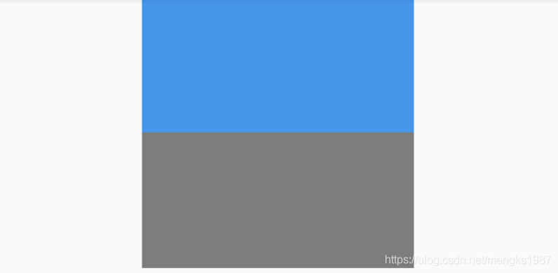

# ColorFiltered

Flutter中大部分多组件都有`color`属性，可以方便的改变颜色，但如果想改变图片颜色就不是那么容易了，虽然Image组件也有color属性，但设置的`color`属性会覆盖整个组件，这并不是我们想要的，而ColorFiltered组件可以帮我们解决这个问题。

假设我们有这么一种图片，图片只有一段文字，其他地方透明：

```dart
Container(
        color: Colors.grey, child: Image.asset('images/content.png'));
```

效果如下：


由于字体是白色的，所以将背景设置为灰色，这时来了一个需求根据系统样式改变字体颜色，大部分人第一个想法就是让UI切处所有颜色的图片，虽然效果可以实现，但问题太大了，第一：样式比较多的话必然会有大量的图片，导致App的体积较大。第二：如果允许用户自定义主题颜色，按照上面的方式基本无法实现。

我们可以使用ColorFiltered来实现上面的效果：

```dart
Container(
        child: ColorFiltered(
          colorFilter: ColorFilter.mode(Colors.blue, BlendMode.modulate),
          child: Image.asset('images/content.png'),
        ));
```

效果如下：


想要什么颜色直接改变颜色值即可。

ColorFiltered还可以实现类似“滤镜”效果，让一张图片和color进行融合：

```dart
Row(
      children: <Widget>[
        Expanded(
          child: Image.asset('images/1.png'),
        ),
        Expanded(
            child: ColorFiltered(
          colorFilter: ColorFilter.mode(Colors.pink[200], BlendMode.modulate),
          child: Image.asset('images/1.png'),
        ))
      ],
    )
```

原始图片和融合后图片效果对比：


可以作用于任何组件，如果想让某一个区域变为灰色，用法如下：

```
ColorFiltered(
          colorFilter: ColorFilter.mode(Colors.grey, BlendMode.saturation),
          child: Container(
            height: 100,
            width: 200,
            color: Colors.blue,
          ),
        )
```

对比效果如下：




ColorFiltered用法比较简单，其中的`blendMode`非常重要，系统为我们提供了非常多的融合模式，关于`blendMode`可以查看如下文章：

- [英文官方介绍]( https://docs.flutter.io/flutter/dart-ui/BlendMode-class.html)
- [中文 不错的翻译](https://blog.csdn.net/chenlove1/article/details/84574237)

