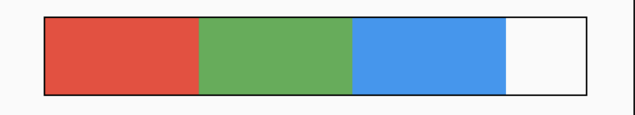
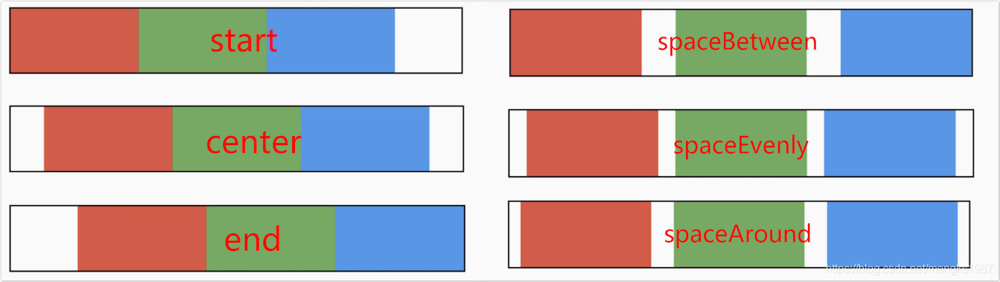
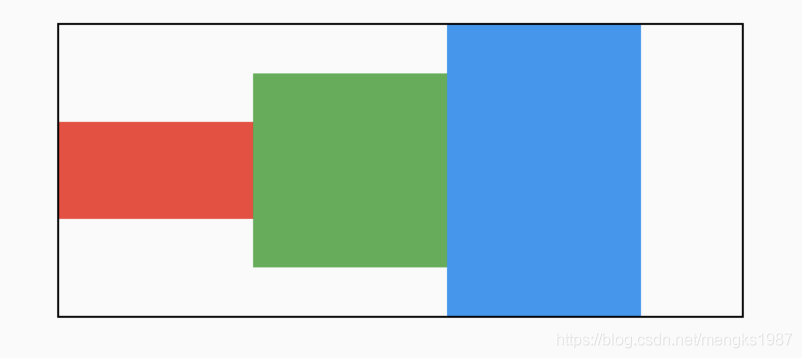
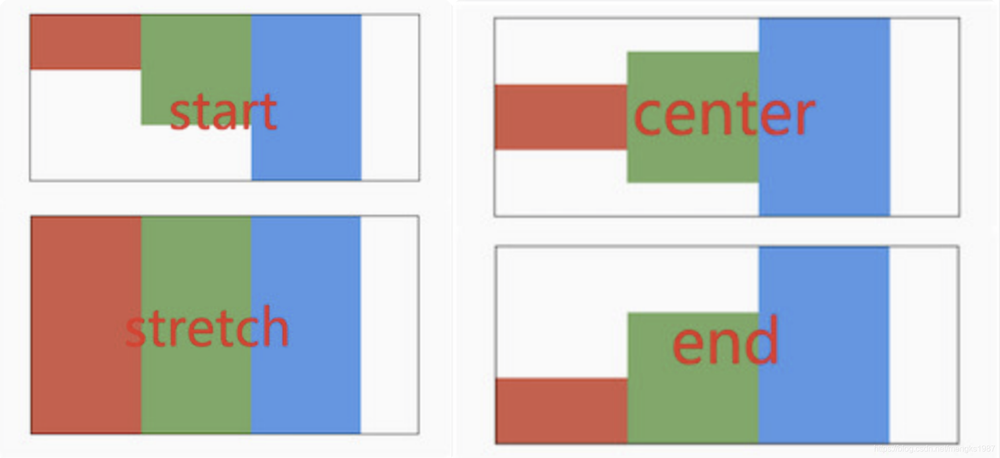
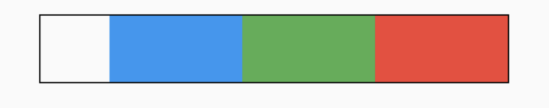
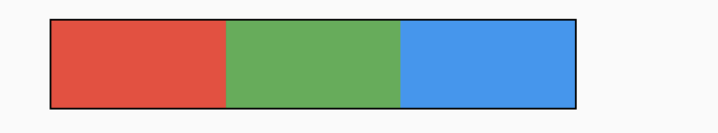

# Row Column

在Row和Column中有一个非常重要的概念：MainAxisAlignment（主轴）和CrossAxisAlignment（交叉轴），简单来说，MainAxisAlignment（主轴）就是与当前控件方向一致的轴，而CrossAxisAlignment（交叉轴）就是与当前控件方向垂直的轴，比如Row的主轴是水平方向，交叉轴是垂直方向，而Column的主轴是垂直方向，交叉轴是水平方向。

Row和Column是多子控件的容器类控件，Row控件水平布局，Column控件垂直布局。

### 主轴对齐方式
Row控件的主轴`mainAxisAlignment`对齐方式默认值是`MainAxisAlignment.start`，即子控件从开始处排列，这个开始处不一定是屏幕的左边，是从左到右还是从右到左排列取决于文本方向`textDirection`属性，比如阿拉伯文本方向是从右到左的。

3个颜色块水平排列，代码如下：
```
Row(
        children: <Widget>[
          Container(
            height: 50,
            width: 100,
            color: Colors.red,
          ),
          Container(
            height: 50,
            width: 100,
            color: Colors.green,
          ),
          Container(
            height: 50,
            width: 100,
            color: Colors.blue,
          ),
        ],
      )
```
效果如图：

黑色边框是Row控件的范围，默认情况下Row铺满父组件。主轴的对齐方式设置代码如下：

```
Row(
	mainAxisAlignment: MainAxisAlignment.center,
	...
)
```
主轴对齐方式有6种，效果如下图：



>spaceAround和spaceEvenly区别是：
> - spaceAround：第一个子控件距开始位置和最后一个子控件距结尾位置是其他子控件间距的一半。
> - spaceEvenly：所有间距一样。


### 交叉轴对齐方式
和主轴相对应的就是交叉轴`crossAxisAlignment`，交叉轴对齐方式默认是居中。Row控件的高度是依赖子控件高度，因此子控件高都一样时，Row的高和子控件高相同，此时是无法体现交叉轴对齐方式，修改3个颜色块高分别为50，100，150，这样Row的高是150，代码如下：
```
Row(
        children: <Widget>[
          Container(
            height: 50,
            width: 100,
            color: Colors.red,
          ),
          Container(
            height: 100,
            width: 100,
            color: Colors.green,
          ),
          Container(
            height: 150,
            width: 100,
            color: Colors.blue,
          ),
        ],
      )
```
效果如下：


交叉轴属性设置代码如下：
```
Row(
	crossAxisAlignment: CrossAxisAlignment.center,
	...
)
```
交叉轴对齐方式介绍如下：


`CrossAxisAlignment.stretch` 表示使子控件填满交叉轴。

### textDirection和verticalDirection

属性`textDirection`控制水平方向布局，值包含`TextDirection.ltr`(从左到右)和`TextDirection.rtl`(从右到左)，`verticalDirection`控制垂直方向布局，值包含`VerticalDirection.up`(从上到下)和`VerticalDirection.down`(从下到上),用法如下：
```
Row(
	textDirection: TextDirection.rtl,
	...
)
```
效果如下：

想一想这种效果完全可以通过主轴的方式实现，那么为什么还要有`textDirection`和`verticalDirection`这2个属性，官方API文档已经解释了这个问题：

> This is also used to disambiguate `start` and `end` values (e.g. [MainAxisAlignment.start] or [CrossAxisAlignment.end]).

用于消除“start”和“end”值的歧义的。


### 主轴尺寸
主轴尺寸由`mainAxisSize`属性控制，仅有`min`和`max`两种方式，默认是`max`方法。`min`表示尽可能小，而`max`表示尽可能大，设置`min`的代码如下：
```
Row(
	mainAxisSize: MainAxisSize.min,
	...
)
```
效果如下：

黑色边框是Row的边框。


