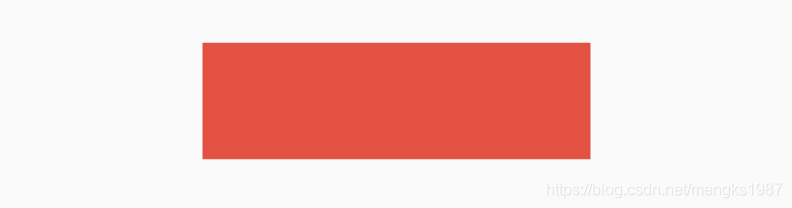
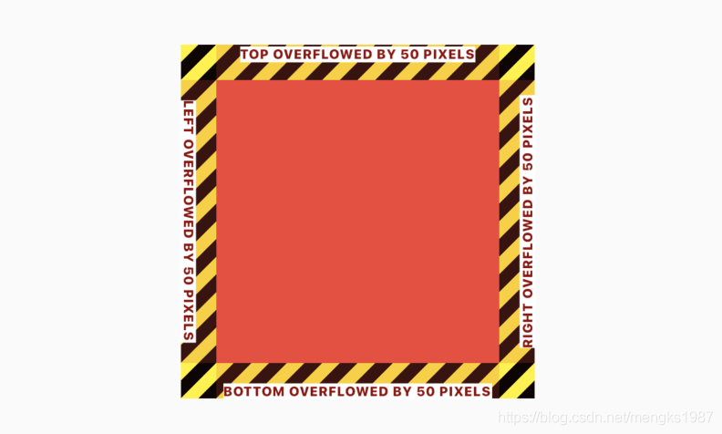
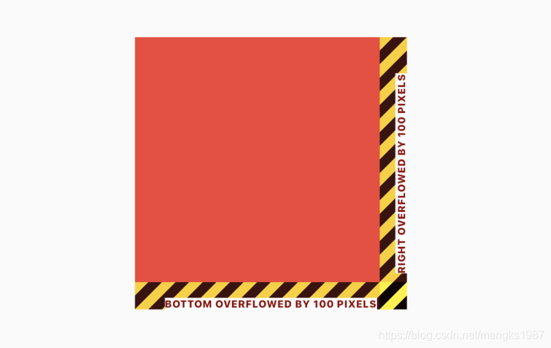
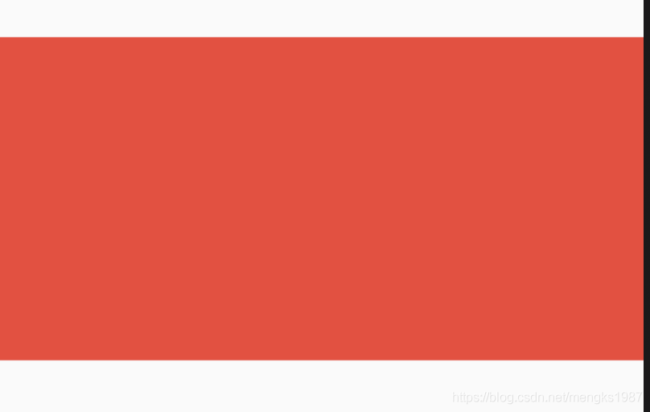
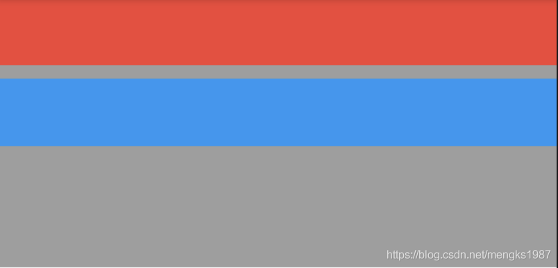
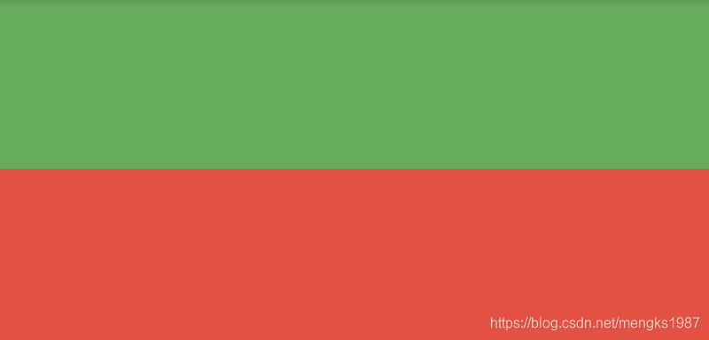

# ConstrainedBox

Flutter中尺寸限制类容器组件包括ConstrainedBox、UnconstrainedBox、SizedBox、AspectRatio、FractionallySizedBox、LimitedBox、Container。这些组件可以约束子组件的尺寸，下面一一介绍。


## ConstrainedBox

ConstrainedBox组件约束子组件的最大宽高和最小宽高，假如一个组件宽高都是300，包裹在ConstrainedBox中，并给ConstrainedBox添加最大宽高约束，用法如下：

```dart
ConstrainedBox(
  constraints: BoxConstraints(maxHeight: 60, maxWidth: 200),
  child: Container(height: 300, width: 300, color: Colors.red),
)
```

这时子组件是无法突破BoxConstraints设置的最大宽高，效果如下：



BoxConstraints的默认值如下：

```dart
const BoxConstraints({
  this.minWidth = 0.0,
  this.maxWidth = double.infinity, //无限大
  this.minHeight = 0.0,
  this.maxHeight = double.infinity, //无限大
});
```

BoxConstraints提供了便捷的构建函数，方便开发者调用，如`BoxConstraints.tight(Size size)`和`BoxConstraints.expand()`等。

如果BoxConstraints嵌套使用，有2个ConstrainedBox，如下：

```dart
ConstrainedBox(
  constraints: BoxConstraints(maxHeight: 60, maxWidth: 200),
  child: ConstrainedBox(
    constraints: BoxConstraints(maxHeight: 100, maxWidth: 240),
    child: Container(height: 300, width: 300, color: Colors.red),
  ),
)
```

以最大宽为例，第一个BoxConstraints的`maxHeight`值是60，也就是约束其子控件最大高是60，第二个BoxConstraints的`maxHeight`值是100，由于第二个BoxConstraints也受第一个的约束，所以第二个BoxConstraints最大高也只能是60，最终子组件的最大高是60，同理最大宽是200，因此多级BoxConstraints嵌套约束最大值最终值等于多个BoxConstraints约束中的最小值。同理嵌套约束最小值等于多个BoxConstraints约束中的最大值。


##  UnconstrainedBox

UnconstrainedBox组件不对子组件做任何约束，比如有一个父组件大小是200x200，子组件是UnconstrainedBox，UnconstrainedBox包裹一个300x300的组件，代码如下：

```dart
Container(
  height: 200,
  width: 200,
  child: UnconstrainedBox(
    child: Container(height: 300, width: 300, color: Colors.red),
  ),
)
```

效果如下：



注意：黄色区域表示子控件超出父控件的区域了，黄色区域只会在debug模式下存在，在release模式下，只有红色区域。

UnconstrainedBox虽然不限制其子控件的大小，但仍然受父控件的约束，超出父控件的区域将会截取。

UnconstrainedBox允许设置对齐方式，用法如下：

```dart
UnconstrainedBox(
  alignment: Alignment.topLeft,
  ...
)
```

效果如下：



和上一个图对比，这次左边和上边没有超出区域，右边和下边各超出100px。


## SizedBox

SizedBox是具有固定宽高的组件，直接指定具体的宽高，用法如下：

```dart
SizedBox(
  height: 60,
  width: 200,
  child: RaisedButton(
    child: Text('this is SizedBox'),
  ),
)
```

我们也可以设置尺寸无限大，如下：

```dart
SizedBox(
  height: double.infinity,
  width: double.infinity,
  ...
)
```

虽然设置了无限大，子控件是否会无限长呢？不，不会，子控件依然会受到父组件的约束，会扩展到父组件的尺寸，还有一个便捷的方式设置此方式：

```dart
SizedBox.expand(
  child: RaisedButton(
    child: Text('this is SizedBox'),
  ),
)
```

SizedBox可以没有子组件，但仍然会占用空间，所以SizedBox非常适合控制2个组件之间的空隙，用法如下：

```dart
Column(
  children: <Widget>[
    Container(height: 30,),
    SizedBox(height: 10,),
    Container(height: 30,),
  ],
)
```


## AspectRatio

AspectRatio组件是固定宽高比的组件，如果组件的宽度固定，希望高是宽的1/2，可以用AspectRatio实现此效果，用法如下：

```dart
AspectRatio(
  aspectRatio: 2 / 1,
  child: Container(color: Colors.red),
)
```

`aspectRatio`参数是宽高比，可以直接写成分数的形式，也可以写成小数的形式，但建议写成分数的形式，可读性更高。效果如下：




## FractionallySizedBox

当我们需要一个控件的尺寸是相对尺寸时，比如当前按钮的宽度占父组件的70%，可以使用FractionallySizedBox来实现此效果。

使用FractionallySizedBox包裹子控件，设置`widthFactor`宽度系数或者`heightFactor`高度系数，系数值的范围是0-1，0.7表示占父组件的70%，用法如下：

```
FractionallySizedBox(
  widthFactor: .7,
  child: RaisedButton(
    child: Text('button'),
  ),
)
```

通过`alignment`参数控制子组件显示的位置，默认为`center`，用法如下：

```
FractionallySizedBox(
  alignment: Alignment.centerLeft,
  ...
)
```

如果想让2个控件之间的间隔是当前父控件的10%，可以使用无子控件的FractionallySizedBox，用法如下：

```
Container(
  height: 200,
  color: Colors.grey,
  child: Column(
    children: <Widget>[
      Container(
        height: 50,
        color: Colors.red,
      ),
      Flexible(
        child: FractionallySizedBox(
          heightFactor: .1,
        ),
      ),
      Container(
        height: 50,
        color: Colors.blue,
      ),
    ],
  ),
)
```

效果如下：




## LimitedBox

LimitedBox组件是当不受父组件约束时限制它的尺寸，什么叫不受父组件约束？就像这篇文章介绍的其他组件，它们都会对子组件约束，没有约束的父组件有ListView、Row、Column等，如果LimitedBox的父组件受到约束，此时LimitedBox将会不做任何操作，我们可以认为没有这个组件，代码如下：

```dart
Container(
  height: 100,
  width: 100,
  child: LimitedBox(
    maxHeight: 50,
    maxWidth: 100,
    child: Container(color: Colors.green,),
  ),
)
```

效果如下：

 

LimitedBox设置的宽高不是正方形，此时效果时正方形，说明LimitedBox没有起作用。

在ListView中直接添加Container组件，如下：

```dart
ListView(
  children: <Widget>[
    Container(
      color: Colors.green,
    ),
    Container(
      color: Colors.red,
    ),
  ],
)
```

这时你会发现什么也没有，因为在容器不受约束时，大小将会设置0，只需将Container包裹在LimitedBox中即可：

```dart
ListView(
  children: <Widget>[
    LimitedBox(
      maxHeight: 100,
      child: Container(
        color: Colors.green,
      ),
    ),
    LimitedBox(
      maxHeight: 100,
      child: Container(
        color: Colors.red,
      ),
    ),
  ],
)
```

效果：




## Container


Container组件应该是最常用的组件之一，Container组件可以直接设置其宽高，用法如下：

```dart
Container(
  height: 100,
  width: 100,
  ...
)
```

Container组件是这些组件里面属性最多的一个，当然也是用法最复杂的一个，这里重点介绍Container对子组件的约束，我在前面的文章中已经详细的介绍了Container，这里不在介绍，奉上跳转地址：[https://blog.csdn.net/mengks1987/article/details/104388393](https://blog.csdn.net/mengks1987/article/details/104388393)


## 总结

这么多约束类的容器组件，到底要使用哪一个组件呢？总结如下：

- ConstrainedBox：适用于需要设置最大/小宽高，组件大小以来子组件大小，但不能超过设置的界限。
- UnconstrainedBox：用到情况不多，当作ConstrainedBox的子组件可以“突破”ConstrainedBox的限制，超出界限的部分会被截取。
- SizedBox：适用于固定宽高的情况，常用于当作2个组件之间间隙组件。
- AspectRatio：适用于固定宽高比的情况。
- FractionallySizedBox：适用于占父组件百分比的情况。
- LimitedBox：适用于没有父组件约束的情况。
- Container：适用于不仅有尺寸的约束，还有装饰（颜色、边框、等）、内外边距等需求的情况。


