# Container

Container将会是我们以后最常用的控件之一，Container是单容器类控件，即只包含一个子控件。Container可以装饰和定位子控件，例如设置背景颜色、形状等。

### 无任何参数设置
如果只用Container包装子控件而没有任何其他参数的设置，代码如下：
```
Container(
	child: Text('老孟'),
 )
```
Container内的子控件不会发生任何外观上的变化，效果如下：


### 设置背景颜色
如果想要给子控件添加背景颜色可以使用color属性，代码如下：
```
Container(
	color: Colors.blue,
    child: Text('老孟'),
)
```
效果如下：
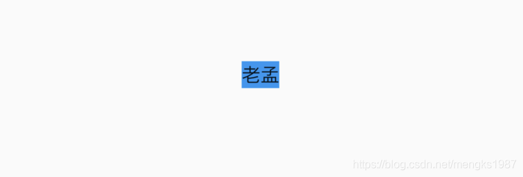
没有其他参数设置时，Container将会根据子控件自行调整大小。

### padding 和 margin
如果想在Container和子元素之间添加空白可以使用padding属性，代码如下：
```
Container(
	color: Colors.blue,
    child: Text('老孟'),
    padding: EdgeInsets.all(20),
)
```
效果如下：
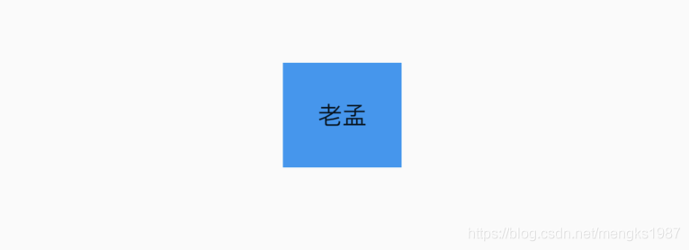
margin的用法和padding一样，padding表示内边距，margin表示外边距。

### Decoration 装饰
decoration属性可以设置子控件的背景颜色、形状等。设置背景为圆形，颜色为蓝色，代码如下：
```
Container(
	child: Text('老孟，一个有态度的程序员'),
    decoration: BoxDecoration(
    	shape: BoxShape.circle,
        color: Colors.blue
	),
)
```
效果如下：
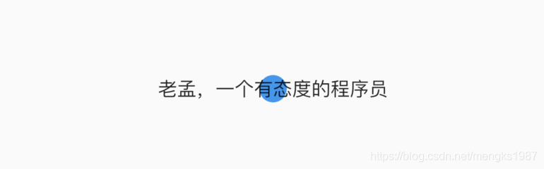
默认情况下，圆形的直径等于Container的窄边长度，相当于在矩形内绘制内切圆。

上面的情况明显不是我们希望看到了，太丑了，我们希望背景是圆角矩形，代码如下：
```
Container(
        child: Text('老孟，一个有态度的程序员'),
        padding: EdgeInsets.symmetric(horizontal: 10),
        decoration: BoxDecoration(
          shape: BoxShape.rectangle,
          borderRadius: BorderRadius.all(Radius.circular(20)),
          color: Colors.blue
        ),
      )
```
效果如下：
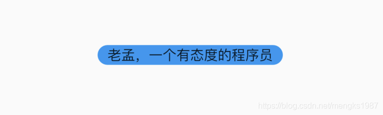
这就好看多了吗。

除了背景我们可以设置边框效果，代码如下：
```
Container(
        child: Text('老孟，一个有态度的程序员'),
        padding: EdgeInsets.symmetric(horizontal: 10),
        decoration: BoxDecoration(
          borderRadius: BorderRadius.circular(12),
          border: Border.all(
            color: Colors.blue,
            width: 2,
          ),
        ),
      )
```
效果如下：
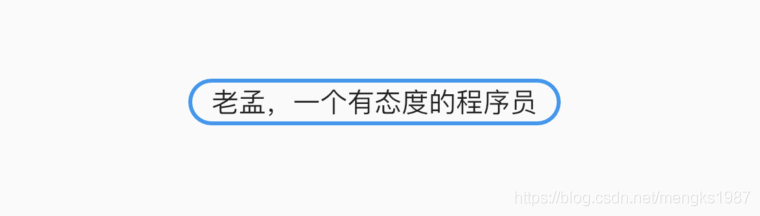
我们也可以通过此方式创建圆角图片和圆形图片，代码如下：

```
Container(
      height: 200,
      width: 200,
      decoration: BoxDecoration(
        image:  DecorationImage(
          image: NetworkImage(
              'https://flutter.github.io/assets-for-api-docs/assets/widgets/owl-2.jpg'),
          fit: BoxFit.cover,
        ),
        border: Border.all(
          color: Colors.blue,
          width: 2,
        ),
        borderRadius: BorderRadius.circular(12),
      ),
    )
```
效果如图：
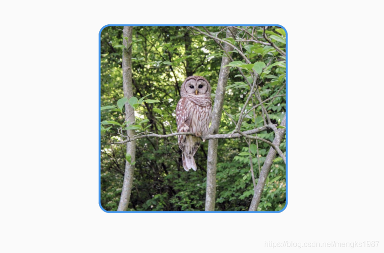
修改其形状为圆形，代码如下：

```
Container(
      height: 200,
      width: 200,
      decoration: BoxDecoration(
        image: DecorationImage(
          image: NetworkImage(
              'https://flutter.github.io/assets-for-api-docs/assets/widgets/owl-2.jpg'),
          fit: BoxFit.cover,
        ),
        border: Border.all(
          color: Colors.blue,
          width: 2,
        ),
        shape: BoxShape.circle,
      ),
    )
```
效果如图：
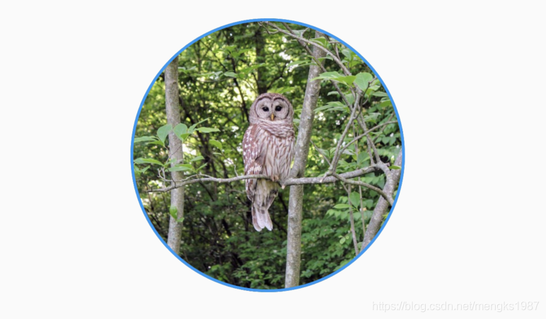

### Alignment 对齐方式

<font color='red'>注意：设置对齐方式后，Container将会充满其父控件，相当于Android中match_parent,不在是根据子控件调整大小</font>

设置对齐方式为居中，背景色为蓝色，代码如下：
```
Container(
        color: Colors.blue,
        child: Text('老孟，一个有态度的程序员'),
        alignment: Alignment.center,
      )
```
效果如下：
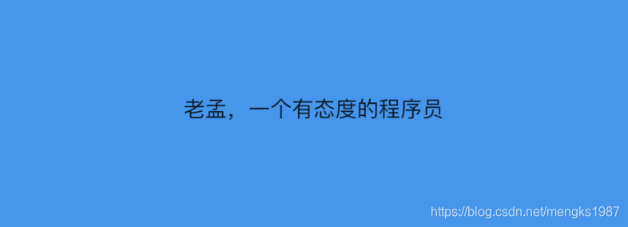
通过背景色可以看出Container充满其父控件。

### 宽、高、约束宽高
我们也可以设置固定的宽高属性，代码如下：
```
Container(
        color: Colors.blue,
        child: Text('老孟，一个有态度的程序员'),
        alignment: Alignment.center,
        height: 60,
        width: 200,
      )
```
效果如图：
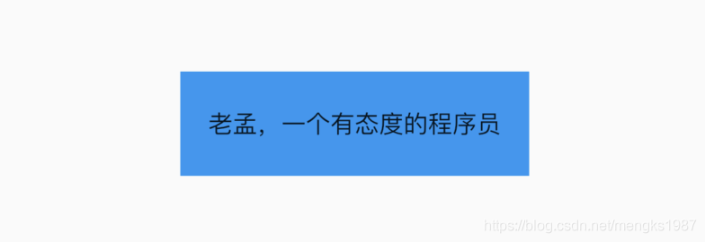

还可以通过constraints属性设置最大/小宽、高来确定大小，constraints如果不设置，默认最小宽高是0，最大宽高是无限大（double.infinity），约束width代码如下：
```
Container(
        color: Colors.blue,
        child: Text('老孟，一个有态度的程序员'),
        alignment: Alignment.center,
        constraints: BoxConstraints.tightForFinite(
          width: 200
        ),
      )
```
效果如图：
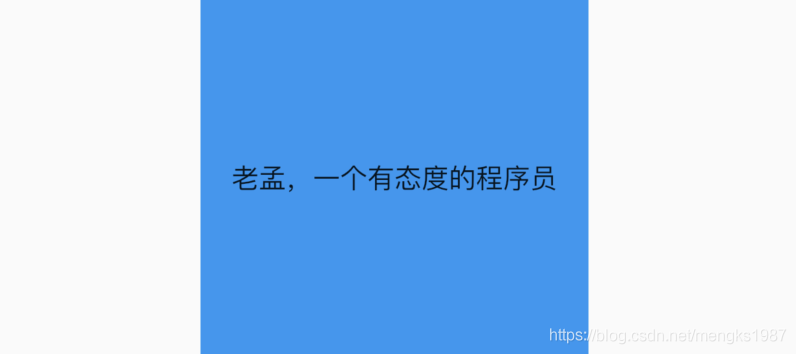

### transform 变换
通过transform可以旋转、平移、缩放Container，旋转代码如下：
```
Container(
        color: Colors.blue,
        child: Text('老孟，一个有态度的程序员'),
        alignment: Alignment.center,
        height: 60,
        width: 200,
        transform: Matrix4.rotationZ(0.5),
      )
```
<font color='red'>注意：Matrix4.rotationZ()参数的单位是弧度而不是角度</font>

效果如图：
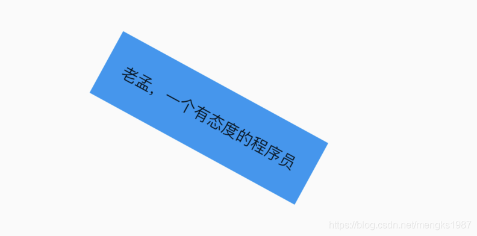


