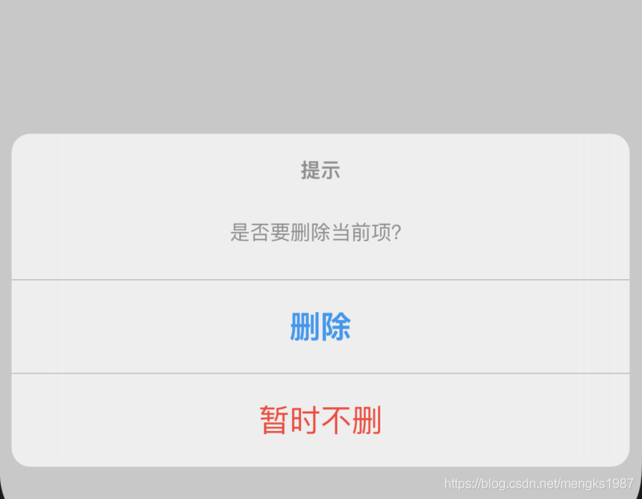
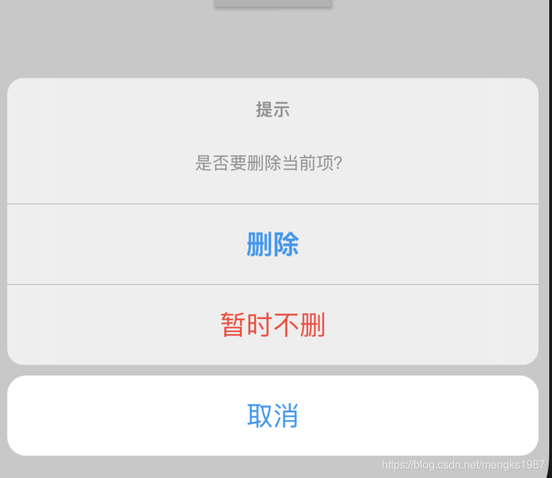

## CupertinoActionSheet

CupertinoActionSheet组件是Cupertino（ios）风格底部弹出的提示框，一般情况下点击按钮弹出：

```
RaisedButton(
      child: Text('点我'),
      onPressed: () {
        showCupertinoModalPopup(...);
      },
    )
```
`showCupertinoModalPopup`方法是系统方法，其中的builder参数就是构建CupertinoActionSheet，用法如下：
```
showCupertinoModalPopup(
        context: context,
        builder: (context) {
          return CupertinoActionSheet();
		}
)
```
CupertinoActionSheet组件的actions属性提供给用户几个选项，
```
CupertinoActionSheet(
            title: Text('提示'),
            message: Text('是否要删除当前项？'),
            actions: <Widget>[
              CupertinoActionSheetAction(
                child: Text('删除'),
                onPressed: () {},
                isDefaultAction: true,
              ),
              CupertinoActionSheetAction(
                child: Text('暂时不删'),
                onPressed: () {},
                isDestructiveAction: true,
              ),
            ],
)
```
## CupertinoActionSheetAction

actions的子组件一般使用CupertinoActionSheetAction组件，CupertinoActionSheetAction组件向按钮组件一样，提供了子控件和onPressed回调，`isDefaultAction`属性设置为true时，文字加粗，`isDestructiveAction`属性设置为true时，文字颜色变为红色，效果如下：



如果想要一个和其他选项分开的组件，可以使用`cancelButton`属性，用法如下：
```
CupertinoActionSheet(
	cancelButton: CupertinoActionSheetAction(
              child: Text('取消'),
              onPressed: () {},
            ),
)
```
效果如下：



那我们如何知道用户选择了哪个选项呢，我们需要在onPressed回调中返回不同的值，如下：
```
onPressed: () {
	Navigator.of(context).pop('delete');
}
```
showCupertinoModalPopup方法是Future方法，用户点击了某一项时返回，完整代码如下：
```
@override
  Widget build(BuildContext context) {
    return Center(
        child: RaisedButton(
      child: Text('点我'),
      onPressed: () {
        _showCupertinoActionSheet();
      },
    ));
  }

  _showCupertinoActionSheet() async{
    var result = await showCupertinoModalPopup(
        context: context,
        builder: (context) {
          return CupertinoActionSheet(
            title: Text('提示'),
            message: Text('是否要删除当前项？'),
            actions: <Widget>[
              CupertinoActionSheetAction(
                child: Text('删除'),
                onPressed: () {
                  Navigator.of(context).pop('delete');
                },
                isDefaultAction: true,
              ),
              CupertinoActionSheetAction(
                child: Text('暂时不删'),
                onPressed: () {
                  Navigator.of(context).pop('not delete');
                },
                isDestructiveAction: true,
              ),
            ],
            cancelButton: CupertinoActionSheetAction(
              child: Text('取消'),
              onPressed: () {
                Navigator.of(context).pop('cancel');
              },
            ),
          );
        });
    print('$result');
  }

```

通过result不同的值判断用户选择了哪一项。


