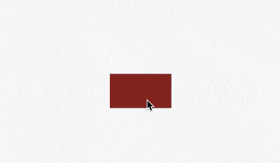
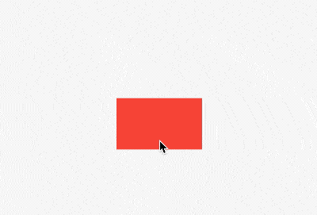
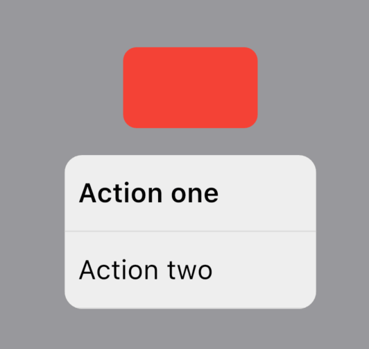
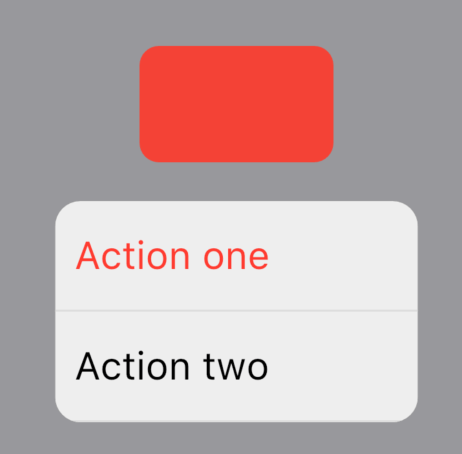

# CupertinoContextMenu


CupertinoContextMenu 效果类似以iOS 3D Touch，长按弹出菜单，用法如下：

```dart
CupertinoContextMenu(
  child: Container(
    color: Colors.red,
    height: 60,
    width: 100,
  ),
  actions: <Widget>[
    CupertinoContextMenuAction(
      child: const Text('Action one'),
      onPressed: () {
        Navigator.pop(context);
      },
    ),
    CupertinoContextMenuAction(
      child: const Text('Action two'),
      onPressed: () {
        Navigator.pop(context);
      },
    ),
  ],
)
```




`previewBuilder`如果不指定则显示`child`，此属性展示打开状态下的样式，比如上面的红色框打开时变为圆角：

```dart
CupertinoContextMenu(
  child: Container(
    color: Colors.red,
    height: 60,
    width: 100,
  ),
  previewBuilder: (
    BuildContext context,
    Animation<double> animation,
    Widget child,
  ) {
    return Container(
      decoration: BoxDecoration(
        borderRadius: BorderRadius.circular(10 * animation.value),
        color: Colors.red,
      ),
      height: 60,
      width: 100,
    );
  },
  actions: <Widget>[
    CupertinoContextMenuAction(
      child: const Text('Action one'),
      onPressed: () {
        Navigator.pop(context);
      },
    ),
    CupertinoContextMenuAction(
      child: const Text('Action two'),
      onPressed: () {
        Navigator.pop(context);
      },
    ),
  ],
)
```




## CupertinoContextMenuAction

CupertinoContextMenuAction 用于CupertinoContextMenu组件中，当作`actions`，用法如下：

```dart
CupertinoContextMenuAction(
  child: const Text('Action one'),
  onPressed: () {
    Navigator.pop(context);
  },
)
```

`onPressed`表示点击回调。

设置`isDefaultAction`为true，字体变为加粗：

```dart
CupertinoContextMenuAction(
  isDefaultAction: true,
  child: const Text('Action one'),
  onPressed: () {
    Navigator.pop(context);
  },
)
```



设置`isDestructiveAction`为true，字体变为红色：

```dart
CupertinoContextMenuAction(
  isDestructiveAction: true,
  child: const Text('Action one'),
  onPressed: () {
    Navigator.pop(context);
  },
)
```




