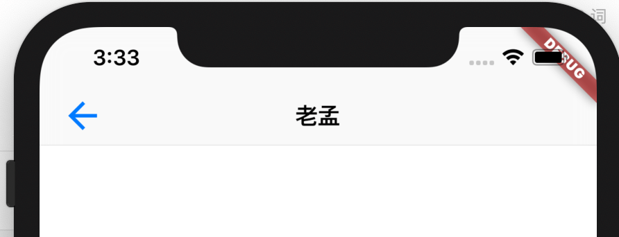

## CupertinoNavigationBar

ios风格的导航条，对应Material风格的AppBar，用法如下：

```dart
CupertinoNavigationBar(
  middle: Text('老孟'),
)
```

`middle`表示中间的控件，效果如下：


导航条左边的控件：

```dart
CupertinoPageScaffold(
  navigationBar: CupertinoNavigationBar(
    leading: Icon(Icons.arrow_back),
    middle: Text('老孟'),
  ),
  child: FirstPage(),
)
```

效果如下：



`leading`为null而且`automaticallyImplyLeading`设置true(默认就是true)

- 在`fullscreenDialog`上显示一个“关闭”图标。
- 如果`previousPageTitle`不为null，显示一个“返回”图标+`previousPageTitle`的值。
- 如果当前路由和前一个路由都是`CupertinoPageRoute`类型，显示“返回”图标+上一个路由的title。

第二张情况的第一个页面：

```dart
@override
Widget build(BuildContext context) {
  return Center(
    child: RaisedButton(
      child: Text('去下一个页面'),
      onPressed: () {
        Navigator.of(context).push(CupertinoPageRoute(builder: (context) {
          return SecondPage();
        });
      },
    ),
  );
}
```

第二个页面：

```dart
class SecondPage extends StatelessWidget {
  @override
  Widget build(BuildContext context) {
    return CupertinoPageScaffold(
      navigationBar: CupertinoNavigationBar(
        previousPageTitle: '返回',
        middle: Text('老孟'),
      ),
      child: Center(
        child: RaisedButton(
          child: Text('to third'),
          onPressed: () {
            Navigator.of(context).push(CupertinoPageRoute(builder: (context) {
              return ThirdPage();
            }));
          },
        ),
      ),
    );
  }
}
```

效果如下：


`middle`和`trailing`分别表示中间和末尾的控件，用法如下：

```dart
CupertinoNavigationBar(
  middle: Text('老孟'),
  trailing: Icon(Icons.timer),
)
```

设置背景颜色和padding：

```dart
CupertinoNavigationBar(
  middle: Text('老孟'),
  backgroundColor: Colors.red,
  padding: EdgeInsetsDirectional.only(start: 10),
)
```


## CupertinoSliverNavigationBar


CupertinoSliverNavigationBar的属性CupertinoNavigationBar基本一样，比CupertinoNavigationBar多了一个`largeTitle`属性，而且CupertinoSliverNavigationBar是Sliver控件，通常用于CustomScrollView中。

```dart
CustomScrollView(
  slivers: <Widget>[
    CupertinoSliverNavigationBar(
      largeTitle: Text('老孟'),
    ),
  ],
)
```


