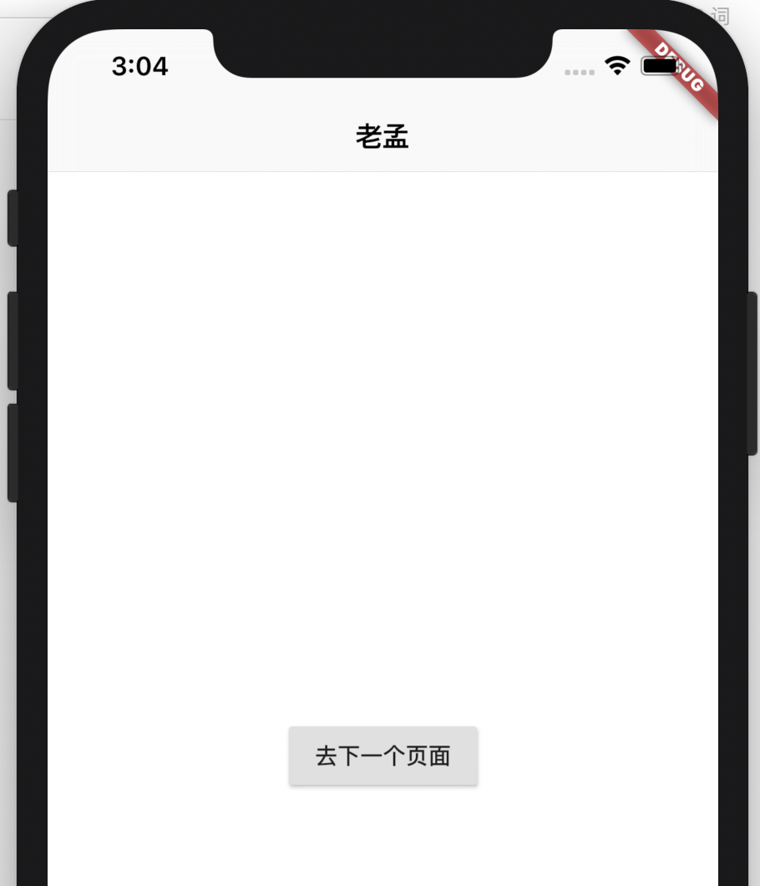

## CupertinoPageScaffold

`CupertinoPageScaffold`和Material 风格的`Scaffold`的作用是一样的，是应用程序整体布局的控件，但比`Scaffold`的功能要少的多，为什么呢？嗯，我猜，Google想让你使用`Scaffold`。


`CupertinoPageScaffold`只有顶部的导航条和内容区域（导航条下面的部分）两部分，用法如下：

```dart
CupertinoApp(
  home: CupertinoPageScaffold(
    navigationBar: CupertinoNavigationBar(
      middle: Text('老孟'),
    ),
    child: FirstPage(),
  ),
)
```

CupertinoNavigationBar 是导航控件，效果如下：



`child`属性表示导航条下面的部分，系统并没有提供类似`Scaffold`的抽屉控件和底部导航控件。

