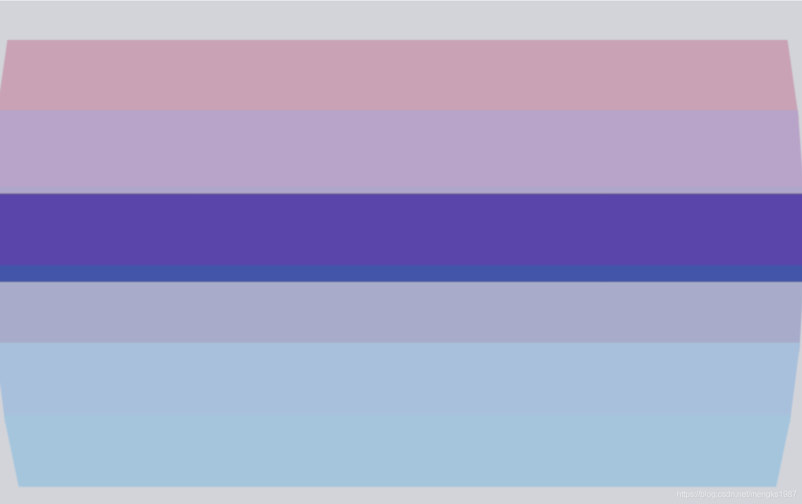

# CupertinoPicker

ios风格的选择器，和ListWheelScrollView类似。

基本用法如下：

```dart
CupertinoPicker(
  itemExtent: 45,
  onSelectedItemChanged: (index){
	},
  children: <Widget>[
    Container(color: Colors.primaries[1],),
    Container(color: Colors.primaries[2],),
    Container(color: Colors.primaries[3],),
    Container(color: Colors.primaries[4],),
    Container(color: Colors.primaries[5],),
    Container(color: Colors.primaries[6],),
  ],
)
```

效果如下：



`itemExtent`每个子控件的高度。

`onSelectedItemChanged`：选择的选项发生变化回调。

