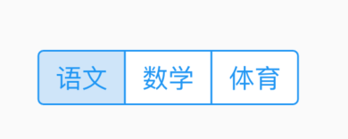
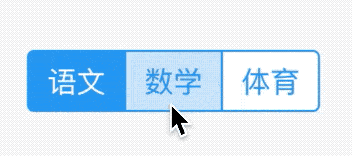
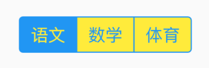
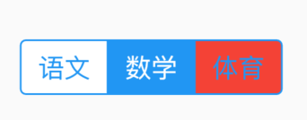
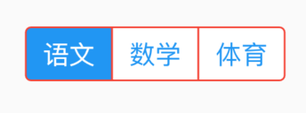

# CupertinoSegmentedControl

iOS样式的分段控制组件，用法如下：

```dart
CupertinoSegmentedControl(
  children: {
    '语文':Container(child: Text('语文'), padding: EdgeInsets.symmetric(vertical: 5,horizontal: 10),),
    '数学':Container(child: Text('数学'), padding: EdgeInsets.symmetric(vertical: 5,horizontal: 10),),
    '体育':Container(child: Text('体育'), padding: EdgeInsets.symmetric(vertical: 5,horizontal: 10),)
  },
  onValueChanged: (value){
    print(value);
  },
)
```



`groupValue`表示当前选中的值，

```dart
String _value = '语文';

@override
Widget build(BuildContext context) {
  return Center(
    child: CupertinoSegmentedControl(
      children: {
        '语文':Container(child: Text('语文'), padding: EdgeInsets.symmetric(vertical: 5,horizontal: 10),),
        '数学':Container(child: Text('数学'), padding: EdgeInsets.symmetric(vertical: 5,horizontal: 10),),
        '体育':Container(child: Text('体育'), padding: EdgeInsets.symmetric(vertical: 5,horizontal: 10),)
      },
      groupValue: _value,
      onValueChanged: (value){
        setState(() {
          _value = value;
        });
      },
    ),
  );
}
```




`unselectedColor`表示未选中的背景颜色和选中的字体颜色：

```
CupertinoSegmentedControl(
  unselectedColor: Colors.yellow,
  ...
)
```



`selectedColor`表示选中的背景颜色和未选中的字体颜色：

```dart
CupertinoSegmentedControl(
  selectedColor: Colors.red,
  ...
)
```


`pressedColor`表示按住时的颜色：

```dart
CupertinoSegmentedControl(
  pressedColor: Colors.red,
  ...
) 
```



`borderColor`表示边框颜色：

```dart
CupertinoSegmentedControl(
  borderColor: Colors.red,
  ...
) 
```



