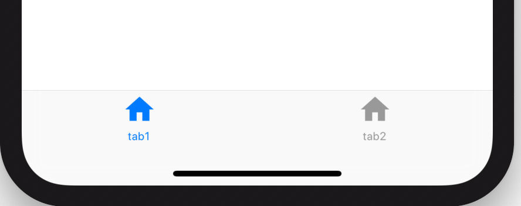
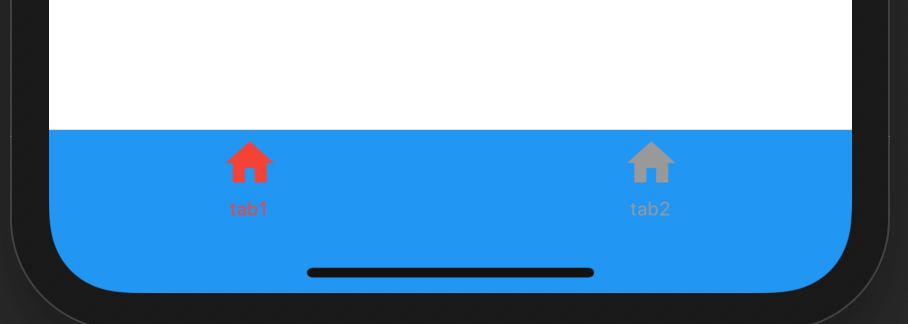

## CupertinoTabBar

CupertinoTaBar并不是对应TabBar，CupertinoTaBar和CupertinoTabScaffold配合使用，是一个底部导航。

基本用法如下：

```dart
CupertinoTabScaffold(
  tabBar: CupertinoTabBar(
    items: [
      BottomNavigationBarItem(icon: Icon(Icons.home), title: Text('tab1')),
      BottomNavigationBarItem(icon: Icon(Icons.home), title: Text('tab2')),
    ],
  )
  ...
)
```

`items`表示每一个tab，类型是BottomNavigationBarItem，效果如下：



`onTap`是点击tab时的回调，背景色、选中状态icon颜色、未选中颜色设置如下：

```dart
CupertinoTabBar(
  items: [
    BottomNavigationBarItem(icon: Icon(Icons.home), title: Text('tab1')),
    BottomNavigationBarItem(icon: Icon(Icons.home), title: Text('tab2')),
  ],
  onTap: (index){
    print('$index');
  },
  currentIndex: 1,
  backgroundColor: Colors.blue,
  activeColor: Colors.red,
)
```

效果如下：




## CupertinoTabView


CupertinoTabView是拥有导航状态和历史的单独控件，用法如下：

```dart
CupertinoTabScaffold(
  tabBar: CupertinoTabBar(
    items: [
      BottomNavigationBarItem(icon: Icon(Icons.home), title: Text('tab1')),
      BottomNavigationBarItem(icon: Icon(Icons.home), title: Text('tab2')),
    ],
  ),
  tabBuilder: (context, index) {
    return CupertinoTabView(
      defaultTitle: '老孟',
      builder: (context){
        return Center(
          child: Text('$index'),
        );
      },
    );
  },
)
```

`builder`构建当前的控件，`defaultTitle`并不是显示在顶部的title，而是路由的title。


`routes`、`onGenerateRoute`、`onUnknownRoute`、`navigatorObservers`的用法和MaterialApp对应参数用法一样。