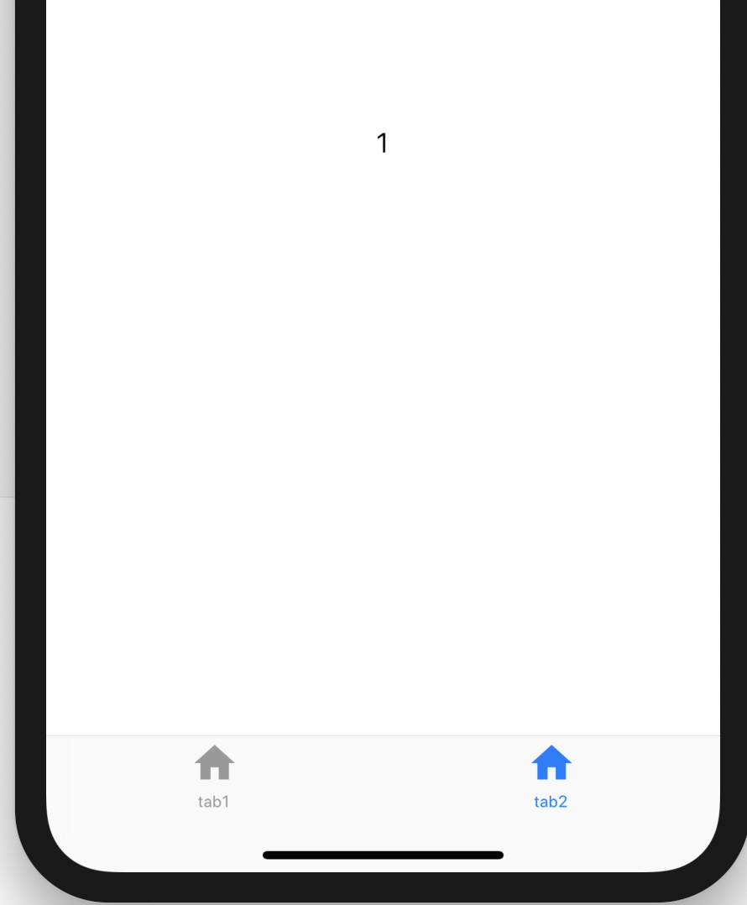
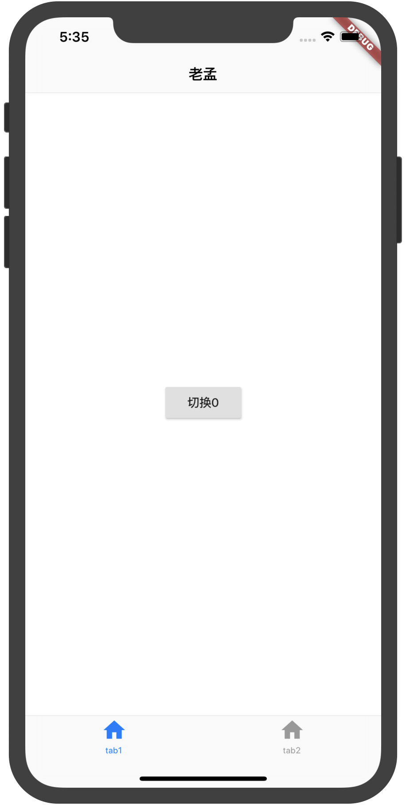

## CupertinoTabScaffold

 CupertinoTabScaffold 提供了类似微信式的底部导航，用法如下：

```dart
@override
Widget build(BuildContext context) {
  return CupertinoTabScaffold(
    tabBar: CupertinoTabBar(
      items: [
        BottomNavigationBarItem(
          icon: Icon(Icons.home),
          title: Text('tab1')
        ),
        BottomNavigationBarItem(
            icon: Icon(Icons.home),
            title: Text('tab2')
        ),
      ],
    ),
    tabBuilder: (context,index){
      return Center(
        child: Text('$index'),
      );
    },
  );
}
```

效果如下：



通过CupertinoTabController实现动态切换tab：

```dart
var _controller = CupertinoTabController();

@override
Widget build(BuildContext context) {
  return CupertinoTabScaffold(
    controller: _controller,
    tabBar: CupertinoTabBar(
      items: [
        BottomNavigationBarItem(icon: Icon(Icons.home), title: Text('tab1')),
        BottomNavigationBarItem(icon: Icon(Icons.home), title: Text('tab2')),
      ],
    ),
    tabBuilder: (context, index) {
      return Center(
        child: RaisedButton(
          child: Text('切换$index'),
          onPressed: () {
            _controller.index = 1;
          },
        ),
      );
    },
  );
}
```


这时你会发现顶部没有导航啊，添加导航的方式是修改其tabBuilder方法：

```dart
tabBuilder: (context, index) {
  return CupertinoPageScaffold(
    navigationBar: CupertinoNavigationBar(
      middle: Text('老孟'),
    ),
    child: Center(
      child: RaisedButton(
        child: Text('切换$index'),
        onPressed: () {
          _controller.index = 1;
        },
      ),
    ),
  );
}
```

效果如下：

