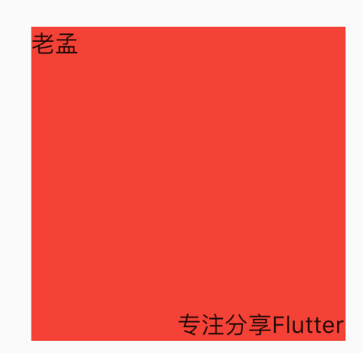

# CustomMultiChildLayout

CustomMultiChildLayout允许我们通过`delegate`自定义子组件的布局约束、位置以及父组件的大小（父组件大小不依赖于子组件的情况下），和CustomSingleChildLayout基本一样，区别就是CustomSingleChildLayout包裹一个子控件，而CustomMultiChildLayout包裹多个。

下面定义一个布局，2个控件分别位于左上角和右下角，delegate定义如下：

```dart
enum FollowTheLeaderId { leader, follower }

class FollowTheLeader extends MultiChildLayoutDelegate {
  @override
  void performLayout(Size size) {
    Size leaderSize = Size.zero;
    if (hasChild(FollowTheLeaderId.leader)) {
      leaderSize =
          layoutChild(FollowTheLeaderId.leader, BoxConstraints.loose(size));
      positionChild(FollowTheLeaderId.leader, Offset.zero);
    }

    if (hasChild(FollowTheLeaderId.follower)) {
      Size followerSize = layoutChild(FollowTheLeaderId.follower, BoxConstraints.loose(size));
      positionChild(
          FollowTheLeaderId.follower,
          Offset(
              size.width - followerSize.width, size.height - followerSize.height));
    }
  }

  @override
  bool shouldRelayout(MultiChildLayoutDelegate oldDelegate) => false;
}
```

用法：

```dart
Container(
  width: 200,
  height: 200,
  color: Colors.red,
  child: CustomMultiChildLayout(
    delegate: FollowTheLeader(),
    children: <Widget>[
      LayoutId(
        id: FollowTheLeaderId.leader,
        child: Text('老孟'),
      ),
      LayoutId(
        id: FollowTheLeaderId.follower,
        child: Text('专注分享Flutter'),
      ),
    ],
  ),
)
```




## LayoutId


用于在[CustomMultiChildLayout]中标识子控件的元数据，**MultiChildLayoutDelegate**中的**hasChild**、**layoutChild**和**positionChild**都会用到此标识。

**注意：这个id并不是key。**

用法参考上面CustomMultiChildLayout的案例。