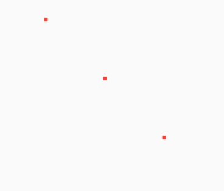
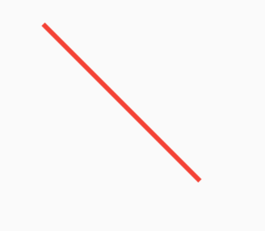
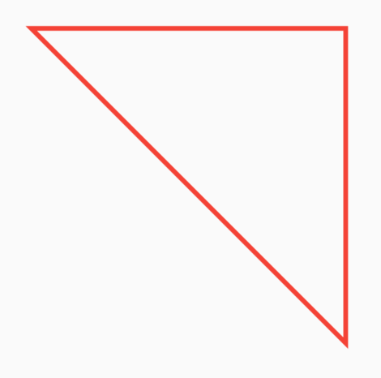
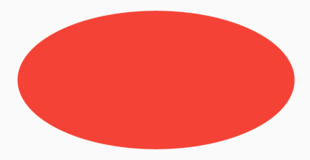
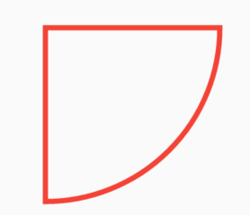
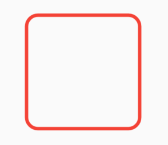

# CustomPaint


CustomPaint可以称之为**自定义动画之父**，CustomPaint可以实现很多酷炫的动画和效果。


## 基本用法

CustomPaint的用法非常简单，如下：

```dart
CustomPaint(
  painter: MyCustomPainter(),
)
```

MyCustomPainter定义如下：

```dart
class MyCustomPainter extends CustomPainter {
  @override
  void paint(Canvas canvas, Size size) {}

  @override
  bool shouldRepaint(MyCustomPainter oldDelegate) {
    return this != oldDelegate;
  }
}
```

上面的MyCustomPainter为了看起来清晰，什么也没有做，通常情况下，在`paint`方法内绘制自定义的效果。`shouldRepaint`方法通常在当前实例和旧实例属性不一致时返回true。


`paint`通过`canvas`绘制，`size`为当前控件的大小，下面看看`canvas`的方法。


### 绘制点：

```dart
Paint _paint = Paint()
    ..color = Colors.red
    ..strokeWidth = 3;

  @override
  void paint(Canvas canvas, Size size) {
    var points = [
      Offset(0, 0),
      Offset(size.width / 2, size.height / 2),
      Offset(size.width, size.height),
    ];
    canvas.drawPoints(PointMode.points, points, _paint);
  }
```




`PointMode`有3种模式：

-  points：点
-  lines：将2个点绘制为线段，如果点的个数为奇数，最后一个点将会被忽略
-  polygon：将整个点绘制为一条线


### 绘制线

```dart
canvas.drawLine(Offset(0, 0),Offset(size.width, size.height), _paint);
```



### 绘制路径

```dart
Paint _paint = Paint()
  ..color = Colors.red
  ..style = PaintingStyle.stroke
  ..strokeWidth = 3;

@override
void paint(Canvas canvas, Size size) {
  print('size:$size');
  var _path = Path()
    ..moveTo(0, 0)
    ..lineTo(size.width, 0)
    ..lineTo(size.width, size.height)
  ..close();
  canvas.drawPath(_path, _paint);
}
```



这里注意`Paint.style`，还可以设置为`PaintingStyle.fill`，效果如下：


此时Path的路径不要在一条直线上，否则会看不到效果。

### 绘制各种形状

绘制圆形

```dart
canvas.drawCircle(Offset(size.width/2, size.height/2), 20, _paint);
```


绘制椭圆

```dart
canvas.drawOval(Rect.fromLTRB(0, 0, size.width, size.height/2), _paint);
```



如果给定的Rect为正方形，那么椭圆将会变为圆形。


绘制弧

```dart
canvas.drawArc(
    Rect.fromLTRB(0, 0, size.width, size.height), 0, pi/2, true, _paint);
```




绘制圆角矩形

```dart
canvas.drawRRect(
    RRect.fromLTRBR(0, 0, size.width, size.height, Radius.circular(10)), _paint)
```




`canvas`还有很多绘制函数，比如贝塞尔曲线、三次贝塞尔曲线、画布的反转等操作，这里不在一一介绍。

**这些函数和Android的Canvas基本一摸一样，如果你有Android基础，直接套用即可。**


最后奉上一个绘制玫瑰的动画效果：


这个效果是不是很酷炫，我们看下绘制花骨朵代码：

```dart
///
/// 绘制花骨朵
///
_drawFlower(Canvas canvas, Size size) {
  //将花变为红色
  if (flowerPaths.length >= RoseData.flowerPoints.length) {
    var path = Path();
    for (int i = 0; i < flowerPaths.length; i++) {
      if (i == 0) {
        path.moveTo(flowerPaths[i].dx, flowerPaths[i].dy);
      } else {
        path.lineTo(flowerPaths[i].dx, flowerPaths[i].dy);
      }
    }
    _paint.style = PaintingStyle.fill;
    _paint.color = _flowerColor;
    canvas.drawPath(path, _paint);
  }
  //绘制线
  _paint.style = PaintingStyle.stroke;
  _paint.color = _strokeColor;
  //去掉最后2个点，最后2个点为了绘制红色
  var points = flowerPaths.sublist(0, max(0, flowerPaths.length - 2));
  canvas.drawPoints(PointMode.polygon, points, _paint);
}
```

花骨朵的绘制只通过`canvas.drawPath`就实现了，其实整个玫瑰花的绘制都是通过`canvas.drawPath`加上动画控制实现的。

CustomPaint可以实现任何你想要的动画的效果，比如绘画版的实现就可以通过此控件实现。

获取完整代码方式扫码下方二维码回复：rose


