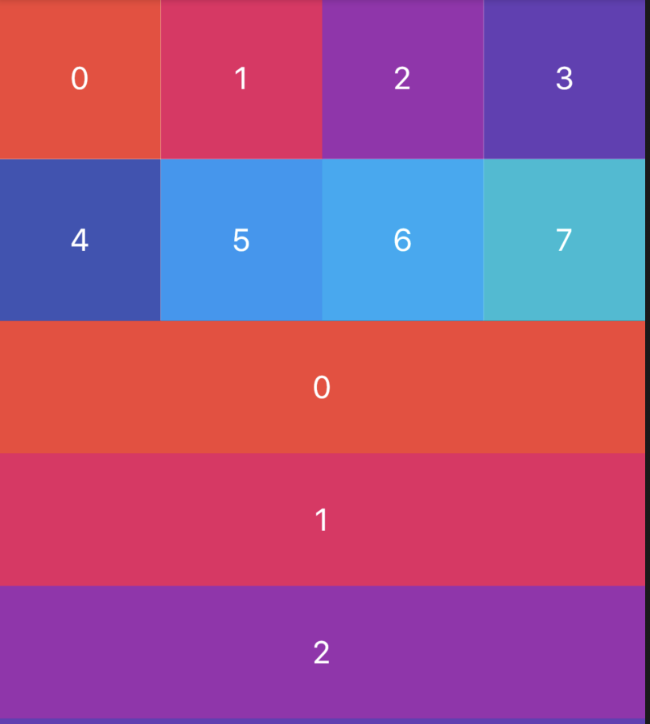
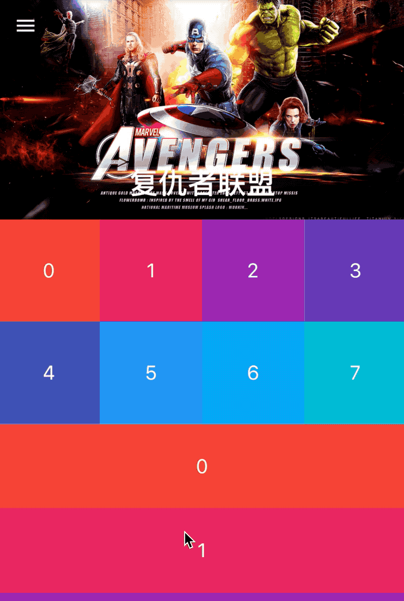

# CustomScrollView

CustomScrollView是使用Sliver组件创建自定义滚动效果的滚动组件。使用场景：

1. ListView和GridView相互嵌套场景，ListView嵌套GridView时，需要给GridView指定高度，但我们希望高度随内容而变化（不指定），ListView和GridView使用同一个滚动效果。
2. 一个页面顶部是AppBar，然后是GridView，最后是ListView，这3个区域以整体来滚动，AppBar具有吸顶效果。

CustomScrollView就像一个粘合剂，将多个组件粘合在一起，具统一的滚动效果。

Sliver系列组件有很多，比如SliverList、SliverGrid、SliverFixedExtentList、SliverPadding、SliverAppBar等。


## 相互嵌套场景

在实际业务场景中经常见到这样的布局，顶部是网格布局（GridView），然后是列表布局（ListView），滚动的时候做为一个整体，此场景是无法使用GridView+ListView来实现的，而是需要使用CustomScrollView+SliverGrid+SliverList来实现，实现代码如下：

```dart
CustomScrollView(
  slivers: <Widget>[
    SliverGrid.count(crossAxisCount: 4,children: List.generate(8, (index){
      return Container(
        color: Colors.primaries[index%Colors.primaries.length],
        alignment: Alignment.center,
        child: Text('$index',style: TextStyle(color: Colors.white,fontSize: 20),),
      );
    }).toList(),),
    SliverList(
      delegate: SliverChildBuilderDelegate((content, index) {
        return Container(
          height: 85,
          alignment: Alignment.center,
          color: Colors.primaries[index % Colors.primaries.length],
          child: Text('$index',style: TextStyle(color: Colors.white,fontSize: 20),),
        );
      }, childCount: 25),
    )
  ],
)
```

效果如下：




## 顶部是AppBar场景

实际项目中页面顶部是AppBar，然后是GridView，最后是ListView，这3个区域以整体来滚动，AppBar具有吸顶效果，此效果也是我们经常遇到的，用法如下：

```dart
CustomScrollView(
  slivers: <Widget>[
    SliverAppBar(
      pinned: true,
      expandedHeight: 230.0,
      flexibleSpace: FlexibleSpaceBar(
        title: Text('复仇者联盟'),
        background: Image.network(
          'http://img.haote.com/upload/20180918/2018091815372344164.jpg',
          fit: BoxFit.fitHeight,
        ),
      ),
    ),
    SliverGrid.count(crossAxisCount: 4,children: List.generate(8, (index){
      return Container(
        color: Colors.primaries[index%Colors.primaries.length],
        alignment: Alignment.center,
        child: Text('$index',style: TextStyle(color: Colors.white,fontSize: 20),),
      );
    }).toList(),),
    SliverList(
      delegate: SliverChildBuilderDelegate((content, index) {
        return Container(
          height: 85,
          alignment: Alignment.center,
          color: Colors.primaries[index % Colors.primaries.length],
          child: Text('$index',style: TextStyle(color: Colors.white,fontSize: 20),),
        );
      }, childCount: 25),
    )
  ],
)
```

效果如下：




通过`scrollDirection`和`reverse`参数控制其滚动方向，用法如下：

```dart
CustomScrollView(
  scrollDirection: Axis.horizontal,
  reverse: true,
  ...
)
```

`scrollDirection`滚动方向，分为垂直和水平方向。

`reverse`参数表示反转滚动方向，并不是垂直转为水平，而是垂直方向滚动时，默认向下滚动，`reverse`设置false，滚动方向改为向上，同理水平滚动改为水平向左。

`primary`设置为true时，不能设置`controller`，因为`primary`true时，`controller`使用PrimaryScrollController，这种机制带来的好处是父组件可以控制子树中可滚动组件的滚动行为，例如，Scaffold正是使用这种机制在iOS中实现了点击导航栏回到顶部的功能。


`controller`为滚动控制器，可以监听滚到的位置，设置滚动的位置等，用法如下：

```dart
_scrollController = ScrollController();

//监听滚动位置
    _scrollController.addListener((){
      print('${_scrollController.position}');
    });
    //滚动到指定位置
    _scrollController.animateTo(20.0);

CustomScrollView(
	controller: _scrollController,
	...
) 
```


`physics`表示可滚动组件的物理滚动特性，具体查看[ScrollPhysics](http://laomengit.com/flutter/widgets/ScrollPhysics.html)


