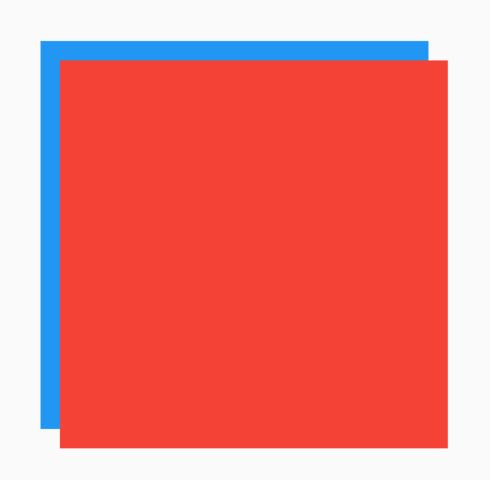

# CustomSingleChildLayout

CustomSingleChildLayout允许我们通过`delegate`自定义子组件的布局约束、位置以及父组件的大小（父组件大小不依赖于子组件的情况下）。

所以CustomSingleChildLayout重点是`delegate`，`delegate`类型是**SingleChildLayoutDelegate**，这是一个抽象类，需要我们重写，源码如下：

```dart
abstract class SingleChildLayoutDelegate {
  /// Creates a layout delegate.
  ///
  /// The layout will update whenever [relayout] notifies its listeners.
  const SingleChildLayoutDelegate({ Listenable relayout }) : _relayout = relayout;

  final Listenable _relayout;
  /// 返回控件的大小，默认是尽可能大。
  Size getSize(BoxConstraints constraints) => constraints.biggest;

  /// 返回子组件的约束条件。
  BoxConstraints getConstraintsForChild(BoxConstraints constraints) => constraints;

  /// 返回子组件的位置
  Offset getPositionForChild(Size size, Size childSize) => Offset.zero;

  /// 是否重新布局，此方法必须重写
  bool shouldRelayout(covariant SingleChildLayoutDelegate oldDelegate);
}
```

我们自定义一个布局，此布局偏移10:

```dart
class MySingleChildLayoutDelegate extends SingleChildLayoutDelegate {
  MySingleChildLayoutDelegate(this.position);

  final Offset position;

  @override
  Offset getPositionForChild(Size size, Size childSize) {
    return Offset(position.dx, position.dy);
  }

  @override
  bool shouldRelayout(MySingleChildLayoutDelegate oldDelegate) {
    return oldDelegate.position != position;
  }
}
```

使用如下：

```dart
Container(
  height: 200,
  width: 200,
  color: Colors.blue,
  child: CustomSingleChildLayout(
    delegate: MySingleChildLayoutDelegate(Offset(10, 10)),
    child: Container(
      color: Colors.red,

    ),
  ),
)
```

