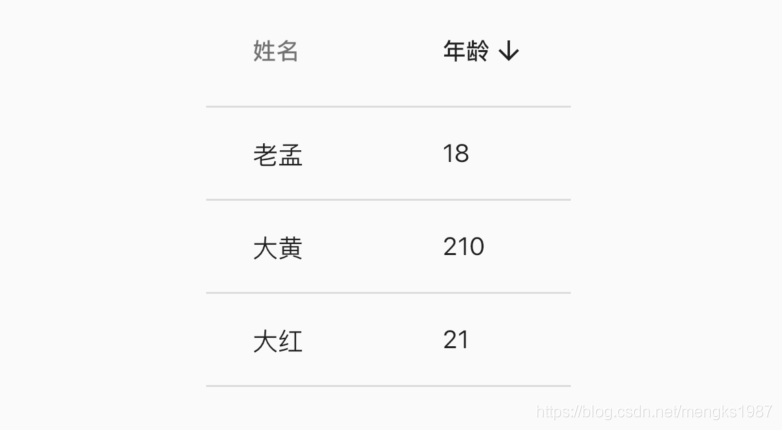
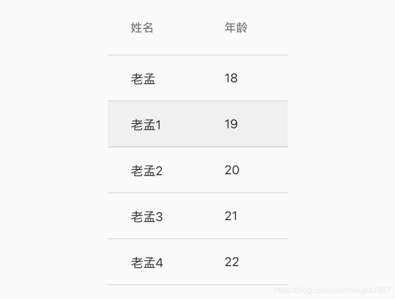
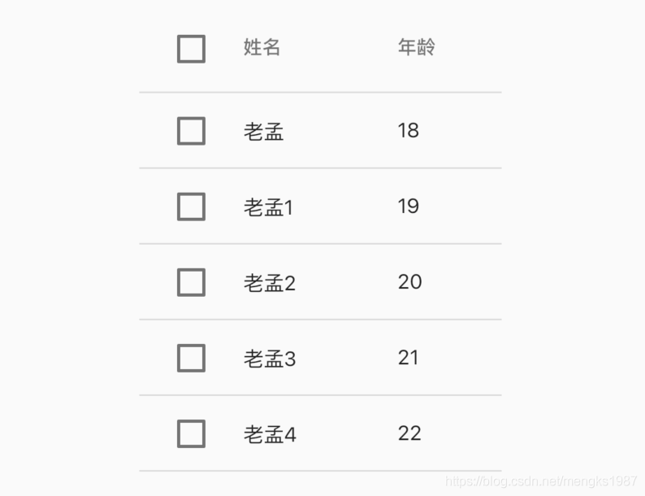
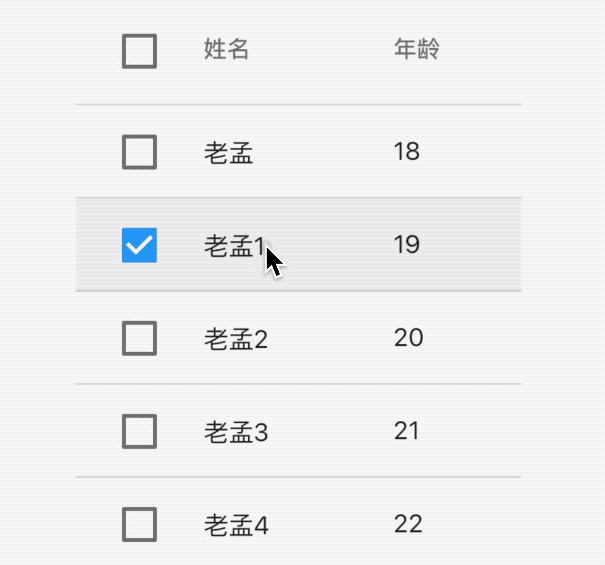
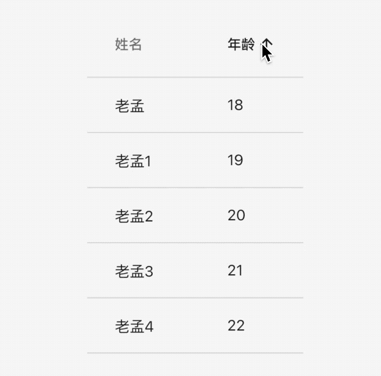
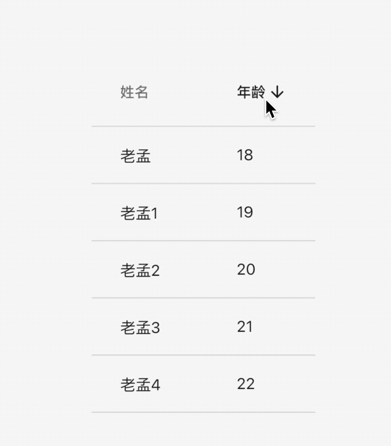
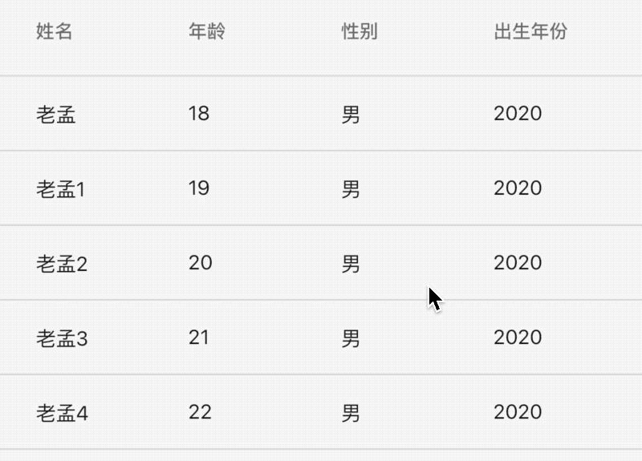

## DataTable

DataTable控件显示表格数据，DataTable需要设置行和列，用法如下：

```dart
DataTable(
  columns: [
    DataColumn(label: Text('姓名')),
    DataColumn(label: Text('年龄')),
  ],
  rows: [
    DataRow(cells: [
      DataCell(Text('老孟')),
      DataCell(Text('18')),
    ]),
    
  ],
)
```

`columns`参数是DataTable的列，`rows`参数是DataTable的每一行数据，效果如下：


在添加一行数据，只需要添加一个DataRow即可，用法如下：

```dart
DataTable(
      ...
      rows: [
        DataRow(cells: [
          DataCell(Text('老孟')),
          DataCell(Text('18')),
        ]),
        DataRow(cells: [
          DataCell(Text('大黄')),
          DataCell(Text('20')),
        ]),
      ],
    )
```

在表头显示排序图标：

```dart
DataTable(
  sortColumnIndex: 1,
  sortAscending: true,
  ...
  )
```

`sortColumnIndex`参数表示表格显示排序图标的索引，`sortAscending`参数表示升序或者降序，效果如下：



这里要注意DataTable本身不能对数据进行排序，这些参数仅仅是外观上的控制。


## DataColumn

默认情况下数据是左对齐的，让某一列右对齐只需设置DataColumn中`numeric`参数true，设置如下：

```dart
 DataTable(
  columns: [
    DataColumn(label: Text('姓名')),
    DataColumn(label: Text('年龄'),numeric: true),
  ],
  ...
  )
```

效果：


设置DataColumn中`tooltip`参数表示当长安此表头时显示提示，用法如下：

```dart
DataColumn(label: Text('姓名'),tooltip: '长按提示')
```

长按提示：


`onSort`回调是用户点击表头（DataColumn）时的回调，`onSort`中第一个参数`columnIndex`表示索引，`ascending`参数表示升序或者降序，用法如下：

```dart
DataColumn(label: Text('年龄'), onSort: (int columnIndex, bool ascending){
	//排序算法
}),
```


## DataRow

可以显示其中一行被选中，设置DataRow中`selected`参数为true，用法如下：

```
DataRow(
  selected: true,
  ...
)
```

效果如下：



`onSelectChanged`参数是点击每一行数据时的回调，用法如下：

```dart
DataRow(
	onSelectChanged: (selected){
	}
	...
)
```

设置了`onSelectChanged`参数，在数据的每一行和表头的前面显示勾选框，效果如下：



当然现在点击还不能显示选中的效果，增加选中效果，修改User model类，增加`selected`属性，表示当前行是否选中：

```dart
class User {
  User(this.name, this.age, {this.selected = false});

  String name;
  int age;
  bool selected;
}
```
修改数据：

```dart
List<User> data = [
  User('老孟', 18),
  User('老孟1', 19,selected: true),
  User('老孟2', 20),
  User('老孟3', 21),
  User('老孟4', 22),
];
```

构建DataTable：

```dart
List<DataRow> dateRows = [];
    for (int i = 0; i < data.length; i++) {
      dateRows.add(DataRow(
        selected: data[i].selected,
        onSelectChanged: (selected){
          setState(() {
            data[i].selected = selected;
          });
        },
        cells: [
          DataCell(Text('${data[i].name}')),
          DataCell(Text('${data[i].age}')),
        ],
      ));
    }
    return DataTable(columns: [
      DataColumn(label: Text('姓名')),
      DataColumn(
        label: Text('年龄'),
      ),
    ], rows: dateRows);
```

效果如下：



我们并没有对表头的全选/取消全选勾选框进行控制，一个很大的疑问：点击全选/取消全选勾选框，如果都勾选了，真实数据是否也发生变化了，对应本示例就是User中的`selected`参数是否全部为true，可以肯定的告诉你User中的`selected`参数已经全部变为true了，那是如何实现的呢？非常简单，每一行的`onSelectChanged`都被回调了一次。


## DataCell

DataCell是DataRow中每一个子控件，DataCell子控件不一定是文本，也可以是图标等任意组件，我们可以给DataCell设置编辑图标：

```dart
DataCell(Text('name'),showEditIcon: true)
```

效果如下：


当然仅仅是一个图标，`placeholder`参数也是一样的，设置为true，仅仅是文字的样式变化了，`onTap`为点击回调，用法如下：

```
DataCell(Text('name'),showEditIcon: true,onTap: (){
  print('DataCell onTap');
},placeholder: true)
```

效果如下：


## 排序

DateTable本身是没有排序功能的，当用户点击表头时对数据按照本列数据进行排序，用法如下，

数据model类：

```dart
class User {
  User(this.name, this.age);

  final String name;
  final int age;
}
```

初始化数据及默认排序：

```dart
List<User> data = [
  User('老孟', 18),
  User('老孟1', 19),
  User('老孟2', 20),
  User('老孟3', 21),
  User('老孟4', 22),
];

var _sortAscending = true;
```

构建DataTable：

```dart
DataTable(
    sortColumnIndex: 1,
    sortAscending: _sortAscending,
    columns: [
      DataColumn(label: Text('姓名')),
      DataColumn(label: Text('年龄'), onSort: (int columnIndex, bool ascending){
        setState(() {
          _sortAscending = ascending;
          if(ascending){
            data.sort((a, b) => a.age.compareTo(b.age));
          }else {
            data.sort((a, b) => b.age.compareTo(a.age));
          }
        });
      }),
    ],
    rows: data.map((user) {
      return DataRow(cells: [
        DataCell(Text('${user.name}')),
        DataCell(Text('${user.age}')),
      ]);
    }).toList())
```


效果如下：



如果想给`姓名`列也加上排序呢，修改如下：

```dart
var _sortAscending = true;
var _sortColumnIndex =0;
DataTable(
        sortColumnIndex: _sortColumnIndex,
        sortAscending: _sortAscending,
        columns: [
          DataColumn(label: Text('姓名'),onSort: (int columnIndex, bool ascending){
            setState(() {
              _sortColumnIndex = columnIndex;
              _sortAscending = ascending;
              if(ascending){
                data.sort((a, b) => a.name.compareTo(b.name));
              }else {
                data.sort((a, b) => b.name.compareTo(a.name));
              }
            });
          }),
          DataColumn(label: Text('年龄'), onSort: (int columnIndex, bool ascending){
            setState(() {
              _sortColumnIndex = columnIndex;
              _sortAscending = ascending;
              if(ascending){
                data.sort((a, b) => a.age.compareTo(b.age));
              }else {
                data.sort((a, b) => b.age.compareTo(a.age));
              }
            });
          }),
        ],
        ...
)
```

效果如下：




## 处理数据显示不全问题

当表格列比较多的时候，可以使用SingleChildScrollView包裹DataTable，显示不全时滚动显示，用法如下：

```dart
List<DataRow> dateRows = [];
for (int i = 0; i < data.length; i++) {
  dateRows.add(DataRow(
    cells: [
      DataCell(Text('${data[i].name}')),
      DataCell(Text('${data[i].age}')),
      DataCell(Text('男')),
      DataCell(Text('2020')),
      DataCell(Text('10')),
    ],
  ));
}
return SingleChildScrollView(
  scrollDirection: Axis.horizontal,
  child: DataTable(columns: [
    DataColumn(label: Text('姓名')),
    DataColumn(
      label: Text('年龄'),
    ),
    DataColumn(
      label: Text('性别'),
    ),
    DataColumn(
      label: Text('出生年份'),
    ),
    DataColumn(
      label: Text('出生月份'),
    ),
  ], rows: dateRows),
);
```

效果如下：




