# 日期选择组件

Flutter系统提供了一些日期选择类组件，比如DayPicker、MonthPicker、YearPicker、showDatePicker、CupertinoDatePicker等，其中前4个为Material风格组件，最后一个为iOS风格组件。本文介绍了控件的基本用法及如何实现国际化，如果系统提供的国际化不满足你的需要，最后也介绍了如何实现自定义国际化。

## DayPicker

显示给定月份的日期，并允许选择一天。这些天以矩形网格排列，一周的每一天都有一列。

DayPicker有几个必填参数，分别如下：

-  selectedDate：选中的日期，选中的日期有圆形背景。
-  currentDate：当前日期，文字高亮。
-  onChanged：用户选择的日期发生变化时回调。
-  firstDate：可选日期的开始值。
-  lastDate：可选日期的结束值。
-  displayedMonth：显示的月份


显示2020年5月，代码如下：

```dart
DateTime _selectedDate = DateTime.now();

DayPicker(
  selectedDate: _selectedDate,
  currentDate: DateTime.now(),
  onChanged: (date) {
    setState(() {
      _selectedDate = date;
    });
  },
  firstDate: DateTime(2020, 5, 1),
  lastDate: DateTime(2020, 5, 31),
  displayedMonth: DateTime(2020, 5),
)
```

效果如下：

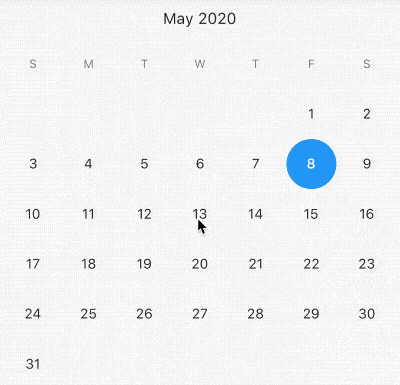

`selectableDayPredicate`参数定义用户的可选日期，返回false表示不可选，例如只可选今天以前的日期：

```dart
DayPicker(
  selectableDayPredicate: (date) {
    return date.difference(DateTime.now()).inMilliseconds < 0;
  },
  ...
)
```

效果如下：

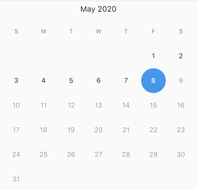

今天以后的日期全部为灰色，不可选状态。


## MonthPicker


可选择的月份选择器，在顶部有一个滚动的月份列表，每个月份下面展示当前月份的天，本质上MonthPicker是滚动的月份列表+ DayPicker，用法如下：

```dart
DateTime _selectedDate = DateTime.now();
MonthPicker(
  selectedDate: _selectedDate,
  onChanged: (date) {
    setState(() {
      _selectedDate = date;
    });
  },
  firstDate: DateTime(2020, 1),
  lastDate: DateTime(2020, 12),
)
```

效果如下：

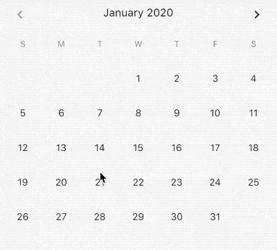


属性和`DayPicker`基本一致。


## YearPicker

年份选择器，用法如下：

```dart
YearPicker(
  selectedDate: _selectedDate,
  onChanged: (date) {
    setState(() {
      _selectedDate = date;
    });
  },
  firstDate: DateTime(2000, 1),
  lastDate: DateTime(2020, 12),
)
```

效果如下：

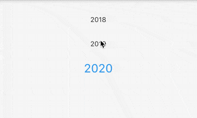

年份选择器和月份选择器略有不同，年份选择器并不包含当前年份下的月份。


不管是YearPicker，还是MonthPicker、DayPicker，"我们都很少直接使用"，而是使用`showDatePicker`，它会创建一个日期选择器对话框。个人觉得`showDatePicker`的样式风格不是很符合国内的审美，我们可能更多的时候是使用YearPicker、MonthPicker和DayPicker自定义日期控件。


## showDatePicker

`showDatePicker`并不是一个新的控件，而是封装了YearPicker和MonthPicker，并进行了联动，用法如下：

```dart
RaisedButton(
  onPressed: () async {
    var result = await showDatePicker(
        context: context,
        initialDate: DateTime.now(),
        firstDate: DateTime(2020),
        lastDate: DateTime(2030));
    print('$result');
  },
)
```

效果如下：


相关参数介绍如下：

- `initialDate`初始化时间，通常情况下设置为当前时间。

- `firstDate`表示开始时间，不能选择此时间前面的时间。

- `lastDate`表示结束时间，不能选择此时间之后的时间。

- `showDatePicker`方法是Future方法，点击日期选择控件的确定按钮后，返回选择的日期。
- `selectableDayPredicate`参数定义用户的可选日期，返回false表示不可选，与DayPicker用法相同。


`builder`参数可用于包装对话框窗口小部件以添加继承的窗口小部件，例如`Theme`，设置深色主题用法如下：

```dart
showDatePicker(
  builder: (context, child) {
    return Theme(
      data: ThemeData.dark(),
      child: child,
    );
  },
	...
)
```

效果如下：

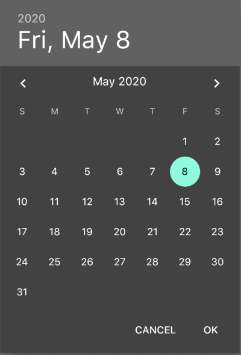


上面是Material风格的日期控件，下面介绍下iOS风格的日期控件。


## CupertinoDatePicker

ios风格的日期选择器，用法如下：

```dart
 var _dateTime = DateTime.now();
CupertinoDatePicker(
  initialDateTime: _dateTime,
  onDateTimeChanged: (date) {
    setState(() {
      _dateTime = date;
    });
  },
)
```

效果如下：

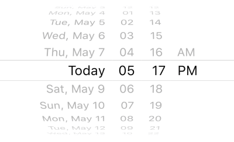

`mode`参数设置日期的格式：

-  time：只显示时间，效果：`4 | 14 | PM `
-  date：只显示日期，效果：`July | 13 | 2012`
-  dateAndTime：时间和日期都显示，效果： `Fri Jul 13 | 4 | 14 | PM `


设置最大日期和最小日期：

```dart
CupertinoDatePicker(
  minimumDate: DateTime.now().add(Duration(days: -1)),
  maximumDate: DateTime.now().add(Duration(days: 1)),
  ...
)
```

效果如下：

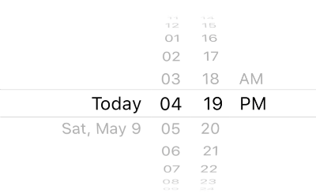

使用24小时制：

```dart
CupertinoDatePicker(
  use24hFormat: true,
	...
)
```


## showTimePicker

时间选择器只能通过`showTimePicker`的方式来调用，用法如下：

```dart
RaisedButton(
  onPressed: () async {
    showTimePicker(
        context: context, initialTime: TimeOfDay.now());
  },
)
```

效果如下：

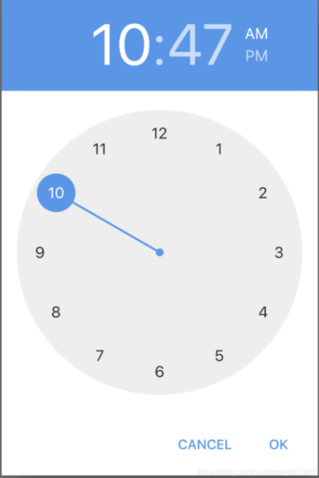

`builder`参数用于控制子控件，可以向DatePicker一样设置深色主题，还可以设置其显示24小时，用法如下：

```dart
showTimePicker(
    context: context,
    initialTime: TimeOfDay.now(),
    builder: (context, child) {
      return MediaQuery(
        data: MediaQuery.of(context)
            .copyWith(alwaysUse24HourFormat: true),
        child: child,
      );
    });
```

效果如下：

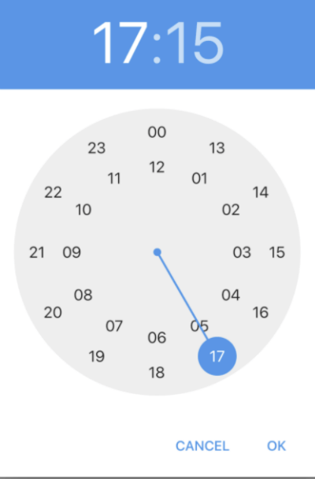

## CupertinoTimerPicker

CupertinoTimerPicker 是ios风格的时间选择器，基本用法如下：

```dart
CupertinoTimerPicker(
  onTimerDurationChanged: (Duration duration){
  },
)
```

效果如下：

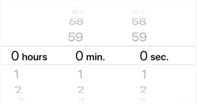

设置只显示小时和分钟：

```dart
CupertinoTimerPicker(
  mode: CupertinoTimerPickerMode.hm,
  ...
)
```

默认情况下，CupertinoTimerPicker显示0:0:0，设置显示当前时间：

```dart
var now = DateTime.now();
return Container(
  height: 200,
  child: CupertinoTimerPicker(
    initialTimerDuration: Duration(hours: now.hour,minutes: now.minute,seconds: now.second),
    onTimerDurationChanged: (Duration duration) {},
  ),
);
```


## 国际化

增加国际化处理，在pubspec.yaml添加支持：

```dart
dependencies:
  flutter_localizations:
    sdk: flutter    
```

在顶级控件MaterialApp添加支持，具体信息可查[MaterialApp控件](http://laomengit.com/flutter/widgets/MaterialApp.html)：

```dart
MaterialApp(
  localeListResolutionCallback:
          (List<Locale> locales, Iterable<Locale> supportedLocales) {
        return Locale('zh');
      },
      localeResolutionCallback:
          (Locale locale, Iterable<Locale> supportedLocales) {
        return Locale('zh');
      },
      localizationsDelegates: [
        GlobalMaterialLocalizations.delegate,
        GlobalWidgetsLocalizations.delegate,
        GlobalCupertinoLocalizations.delegate,
      ],
      supportedLocales: [
        const Locale('zh', 'CH'),
        const Locale('en', 'US'),
      ],
  ...
)
```

以上方式对所有日期控件都有效果，效果如下：

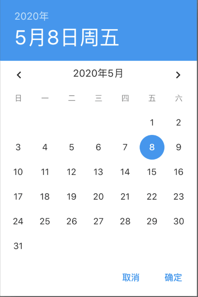

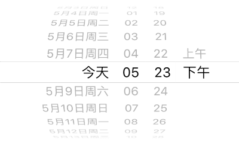

## 自定义国际化

我们对iOS风格的控件自定义国际化为例，新建新的类`MyLocalizationsDelegate`：

```dart
class MyLocalizationsDelegate
    extends LocalizationsDelegate<CupertinoLocalizations> {
  const MyLocalizationsDelegate();

  @override
  bool isSupported(Locale locale) => locale.languageCode == 'zh';

  @override
  Future<CupertinoLocalizations> load(Locale locale) =>
      ZhCupertinoLocalizations.load(locale);

  @override
  bool shouldReload(MyLocalizationsDelegate old) => false;

  @override
  String toString() => 'DefaultCupertinoLocalizations.delegate(zh)';
}
```

`ZhCupertinoLocalizations`定义如下：

```dart
class ZhCupertinoLocalizations implements CupertinoLocalizations {
  const ZhCupertinoLocalizations();

  static const List<String> _shortWeekdays = <String>[
    '自周一',
    '自周二',
    '自周三',
    '自周四',
    '自周五',
    '自周六',
    '自周日',
  ];

  static const List<String> _shortMonths = <String>[
    '1月',
    '2月',
    '3月',
    '4月',
    '5月',
    '6月',
    '7月',
    '8月',
    '9月',
    '10月',
    '11月',
    '12月',
  ];

  static const List<String> _months = <String>[
    '1月',
    '2月',
    '3月',
    '4月',
    '5月',
    '6月',
    '7月',
    '8月',
    '9月',
    '10月',
    '11月',
    '12月',
  ];

  @override
  String datePickerYear(int yearIndex) => yearIndex.toString();

  @override
  String datePickerMonth(int monthIndex) => _months[monthIndex - 1];

  @override
  String datePickerDayOfMonth(int dayIndex) => dayIndex.toString();

  @override
  String datePickerHour(int hour) => hour.toString();

  @override
  String datePickerHourSemanticsLabel(int hour) => hour.toString() + " o'clock";

  @override
  String datePickerMinute(int minute) => minute.toString().padLeft(2, '0');

  @override
  String datePickerMinuteSemanticsLabel(int minute) {
    if (minute == 1) return '1 分';
    return minute.toString() + ' 分';
  }

  @override
  String datePickerMediumDate(DateTime date) {
    return '${_shortWeekdays[date.weekday - DateTime.monday]} '
        '${_shortMonths[date.month - DateTime.january]} '
        '${date.day.toString().padRight(2)}';
  }

  @override
  DatePickerDateOrder get datePickerDateOrder => DatePickerDateOrder.mdy;

  @override
  DatePickerDateTimeOrder get datePickerDateTimeOrder =>
      DatePickerDateTimeOrder.date_time_dayPeriod;

  @override
  String get anteMeridiemAbbreviation => '上午';

  @override
  String get postMeridiemAbbreviation => '下午';

  @override
  String get todayLabel => '今天';

  @override
  String get alertDialogLabel => 'Alert';

  @override
  String timerPickerHour(int hour) => hour.toString();

  @override
  String timerPickerMinute(int minute) => minute.toString();

  @override
  String timerPickerSecond(int second) => second.toString();

  @override
  String timerPickerHourLabel(int hour) => hour == 1 ? '小时' : '小时';

  @override
  String timerPickerMinuteLabel(int minute) => '分.';

  @override
  String timerPickerSecondLabel(int second) => '秒.';

  @override
  String get cutButtonLabel => '剪贴';

  @override
  String get copyButtonLabel => '拷贝';

  @override
  String get pasteButtonLabel => '黏贴';

  @override
  String get selectAllButtonLabel => '选择全部';

  static Future<CupertinoLocalizations> load(Locale locale) {
    return SynchronousFuture<CupertinoLocalizations>(
        const ZhCupertinoLocalizations());
  }

  /// A [LocalizationsDelegate] that uses [DefaultCupertinoLocalizations.load]
  /// to create an instance of this class.
  static const LocalizationsDelegate<CupertinoLocalizations> delegate =
      MyLocalizationsDelegate();
}
```

注意开始的属性`_shortWeekdays`，这个属性表示星期几，故意写成'自周x'，为了和系统的区分，在根控件`MaterialApp`的`localizationsDelegates`属性中增加：`ZhCupertinoLocalizations.delegate`，这个就是上面定义的国际化文件，效果如下：

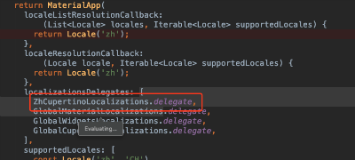

注意：`ZhCupertinoLocalizations.delegate`要放在`GlobalCupertinoLocalizations.delegate,`的前面，系统加载顺序为从上到下。

效果如下：

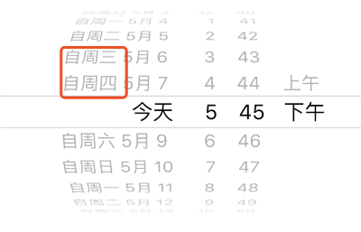

